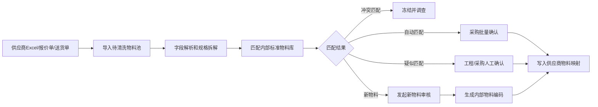

# 03 导入清洗流程

## 1. 总流程

## 2. 匹配规则

### 自动匹配

满足任一条件：

- 供应商料号已存在映射表，并且供应商一致。
- 品牌/MPN 完全一致。
- 品类、封装、规格值、耐压、精度完全一致，且无客户专用限制。

处理方式：允许批量确认。

### 疑似匹配

常见情况：

- 关键规格一致，但品牌不同。
- 供应商名称写法不同，但规格可识别。
- 单位不同，需要换算。
- 缺少环保、材质或精度信息。

处理方式：进入待确认池，由采购或工程确认。

### 冲突匹配

常见情况：

- 同一供应商料号对应多个内部物料。
- 同一原厂型号在系统中被建成多个物料。
- 客户专用料疑似被普通物料引用。

处理方式：禁止直接入库和入 BOM，必须调查后处理。

### 新物料

找不到内部标准物料时，发起新物料申请。

## 3. 日常执行节奏

| 频率 | 工作 |
| --- | --- |
| 每天 | 处理新增供应商导入、采购急用物料 |
| 每周 | 清理待确认池，关闭冲突匹配 |
| 每月 | 检查重复物料、停用长期未使用物料 |
| 每季度 | 审查替代料、客户专用料、供应商映射覆盖率 |

## 4. 数据质量指标

| 指标 | 首期目标 |
| --- | --- |
| 高频物料标准化率 | 90% 以上 |
| 新增物料审核通过前查重率 | 100% |
| 自动匹配率 | 50% 以上，后续逐步提高 |
| 冲突物料未处理数量 | 每周清零 |
| BOM 使用内部编码比例 | 100% |

