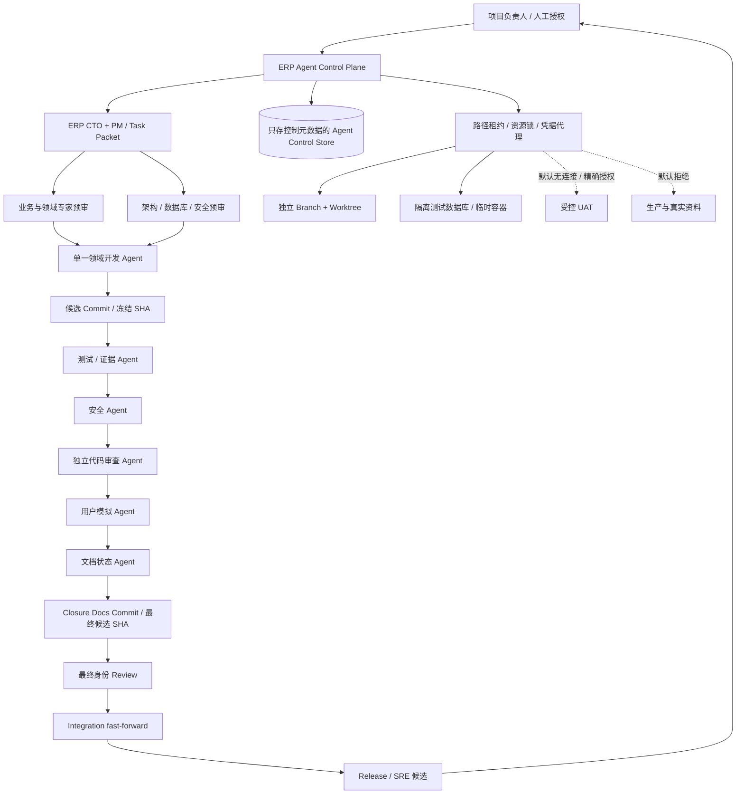
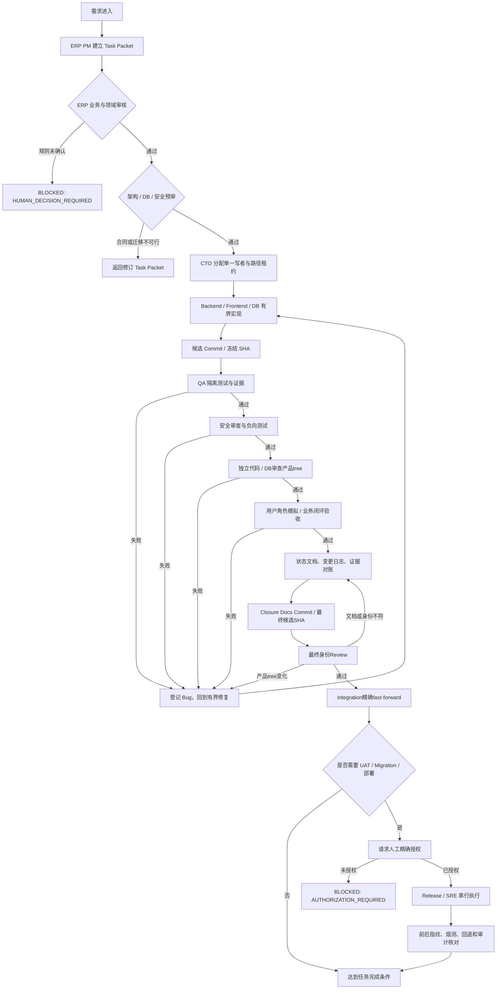

# 晨亿达 ERP 多智能体研发系统设计

> 任务编号：`PM-001`
> 文档状态：`DESIGN COMPLETE / R1 READ-ONLY CONTROLLER COMPLETE / R2-R5 NOT STARTED`
> 设计日期：2026-08-11（Asia/Shanghai）
> 事实基线：`main@0d09cfef140e612d193b42d47497da6fbfa9205f`
> 输入依据：`ERP_CURRENT_STATUS_REPORT.md`、`AGENTS.md`、项目总控、任务台账、项目上下文及 D-040、D-110～D-112
> 实施边界：本文只定义控制面，不创建 Agent 运行服务、不修改业务代码或 Migration，不连接 UAT/生产数据库，不授权部署、真实数据或外部 AI
> 2026-08-11实施注记：项目负责人已接受D-113；`AGENT-R1`只读控制器已完成，`PHASE4-TASK03`继续按`OWNER_PRIORITY_HOLD`暂停，当前零DOING。R1实现不包含R2—R5、UAT/生产、Migration、build、部署或ERP业务变化。

## 1. 设计目标

本系统不是通用“规划—编码—测试”AI Agent 模板，而是晨亿达 ERP 的研发控制面。它必须理解并保护以下项目事实：

- 未来唯一生产方向是 `chenyida_erp_site/` 的 Vinext/React/TypeScript、Node.js、PostgreSQL、本地持久化文件和独立 Worker。
- `chenyida_erp_app/` 的 Python/SQLite 是历史业务行为参考、开发兼容和迁移来源，不得继续演进成第二套生产主系统。
- 历史 Sites/D1 只保留为行为证据和迁移来源，不得恢复为新业务权威。
- 当前源码候选是 `0.1.0-alpha.44` / Migration `0041`；受控公网 UAT 仍是 `0.1.0-alpha.42` / `0040`。
- 当前 UAT 业务事实只推进到一个受控保留的 PO；收货、库存、生产、品质、销售和财务下游均未形成真实 UAT 闭环。
- `PHASE4-TASK03` 当前为 `BLOCKED / OWNER_PRIORITY_HOLD / SOURCE_READY / HOLDOUT_REVALIDATION_REQUIRED / RELEASE_NOT_AUTHORIZED`，本设计与R1控制器均不得自动恢复它或推进其 holdout、build、UAT Migration、部署、TASK04 或 TASK05。

多智能体系统的目标是：

1. 让需求、业务规则、Schema、代码、测试、审查、UAT 和发布形成可恢复、可审计的有界流程。
2. 让多个 Agent 只在无写冲突的子工作上并行，避免同时修改共享主分支、同一 Migration、同一 Service 或共享数据库。
3. 把权限、数据、资源和发布边界做成控制面强制规则，而不是依赖 Prompt 自律。
4. 支持 Agent 在进程或对话结束后从持久检查点继续当前任务，直到任务完成或达到明确阻塞条件。
5. 以 ERP 业务闭环、稳定内部标识、权限、事务、幂等、CAS、审计、冲销和恢复证据作为完成标准，不以“页面存在”或“Agent 回答完成”作为完成标准。

## 2. 非目标

本设计不允许：

- 多个 Agent 自主认领不同正式任务并并发修改 `main`。
- Agent 自己批准业务决策、UAT 写、生产读取、Migration、部署或发布。
- 用真实客户、供应商、价格、生产资料、`shujvbiao/`、备份正文或凭据训练、提示或调用外部模型。
- 把源码完成、隔离测试通过、UAT 接受和发布授权合并为同一个结论。
- 在 Node/PostgreSQL、Python/SQLite 和历史 D1 三个运行面复制新增业务逻辑。
- 为“保持 Agent 持续运行”而无限重试、掩盖失败、占用工作区或在后台遗留重任务。

## 3. 总体架构



控制面由六个组件构成：

| 组件 | 职责 | 权威边界 |
| --- | --- | --- |
| Task Orchestrator | 读取唯一正式任务，选择当前可执行的有界步骤并调度角色 | 不修改 ERP 业务事实，不自动启动下一任务 |
| Policy Engine | 校验 Agent、路径、命令、数据分类、环境和授权 | 默认拒绝；Agent 无权修改自身策略 |
| Lease & Resource Manager | 管理 Task、文件路径、领域、Migration、UAT 和重任务独占锁 | 使用租约、fencing epoch 和心跳防止旧 Agent 回写 |
| Evidence Manager | 保存 Commit、测试、审查、资源和前后指纹引用 | 只保存摘要和引用，不保存秘密或业务正文 |
| Authorization Broker | 按单命令注入短时能力或秘密 | 能力绑定任务、Agent、基线、动作、对象、次数和有效期 |
| State Reconciler | 对账 Git 文档、Task Packet、代码、Migration head 和运行事实 | 派生清单不得反向覆盖人工权威文档 |

建议以后把轻量运行状态放在独立的 `/var/lib/chenyida-erp-agent/control.sqlite3`，权限 `0600`、启用 WAL。它不得放进 ERP PostgreSQL、UAT 或生产数据库，也不得保存客户/供应商正文、密码、Token、Cookie 或数据库连接串。仅靠文件权限和WAL不能证明审计不可改写：运行身份不得拥有DDL，数据库authorizer与触发器拒绝对`state_events`、`capability_grants`、命令和授权审计执行UPDATE/DELETE；事件使用前哈希链，并由独立封存身份周期性把head digest写入只追加、异故障域介质。控制器服务身份不能修改策略、关闭守卫或重签历史。

## 4. Agent 角色定义

以下是逻辑角色，不等于必须同时运行 24 个模型实例。每个任务只启用最少角色；小团队可以复用模型，但不能合并“实现者”和其独立 QA、安全、数据库审核或代码审查身份。

### 4.1 控制与状态角色

| 编号 | Agent | 核心职责 | 主要输出 | 禁止事项 |
| --- | --- | --- | --- | --- |
| A01 | ERP CTO Agent | 确定唯一任务、运行面、依赖、架构边界、风险等级和验收门；裁决跨域冲突 | Task Charter、范围裁决、验收建议 | 不写业务代码，不部署，不批准自己的交付 |
| A02 | ERP PM / Task Agent | 把需求拆成一个正式任务及内部工作项，维护 Task Packet、依赖、负责人和阻塞条件 | Task Packet、计划、交接单 | 不自行改变业务决策，不把下一个 TODO 自动转 DOING |
| A03 | Documentation / State Agent | 对账 MASTER、TASKS、CONTEXT、DECISIONS、STATUS、CHANGELOG、任务文档和真实 Git/运行事实 | 追加式状态记录、证据索引、漂移报告 | 不根据聊天或推测写 DONE，不改业务代码 |

### 4.2 ERP 业务与领域审查角色

这些角色默认只输出审查结论和否决建议，不承担被审实现，也不能代表人工责任人接受新增或未决业务规则。G1只要涉及新规则或现有决定未覆盖，就必须等待指定人工责任人在`DECISIONS.md`中标记`ACCEPTED`。

| 编号 | Agent | 晨亿达 ERP 专属职责 | 必须检查 |
| --- | --- | --- | --- |
| A04 | ERP 业务专家 Agent | 检查市场、项目、计划、采购、仓库、生产、品质、销售和财务的端到端交接 | 单据来源、职责分离、数量/金额守恒、允许和未产生的下游事实 |
| A05 | Material Data Steward Agent | 一物一码、四级分类、类型化属性、单位、导入、匹配、Supplier Mapping、替代候选、客户专用限制 | 稳定 Material ID、正式编码审核时点、ACTIVE/版本、来源与逐字段证据 |
| A06 | BOM / Engineering Expert Agent | Product Version、BOM Version、Routing Version、物料/单位选择和发布不可变 | 只引用 ACTIVE Material、enabled Unit；RELEASED 只能新增版本 |
| A07 | Procurement Expert Agent | PR、RFQ、Quote、Comparison、Award、PO 和供应商映射资格 | 非最低价理由、固定 Mapping 事实、显式 Award→PO、零自动下游 |
| A08 | Warehouse / Inventory Expert Agent | Receipt、Ledger、Balance、Lot、冻结/解冻、领退料、Completion 和 Shipment 过账 | 账本不可变、批次守恒、负库存、冲销/调整、质量职责边界 |
| A09 | Planning Expert Agent | Planning Package、需求计划、净需求公式、Allocation、Production Handoff提交和计划提交时PR事实 | 版本来源、数量/单位、CAS、净采购量；草稿不生成PR、接收不自动RFQ |
| A10 | 生产制造专家 Agent | 接收/退回Production Handoff、WO、Routing Snapshot、Batch、Dispatch、Run、WIP、Report及REWORK执行 | 工单/BOM/工艺快照、数量与单位、Batch genealogy；不代仓库Completion、不自质量放行 |
| A11 | Quality / Rework Expert Agent | IQC/IPQC/FQC、Defect、NCR、返工申请、复检和Release | 异人处置、放行额度、Quality Hold；只提出返工并复检，不执行REWORK Run |
| A12 | Sales Expert Agent | 市场项目、Quote/SO、Delivery、成品订单分配和发货指令 | 稳定订单来源、FQC/库存门禁、sales 不直接发货 |
| A13 | Finance Boundary Expert Agent | AR/AP、Settlement、Reversal 和项目/币种业务子账边界 | 只消费可信 Receipt/Shipment 来源，不宣称 GL、利润、税票或成本会计已完成 |

### 4.3 设计、实现与保障角色

| 编号 | Agent | 核心职责 | 可修改范围 | 独立性要求 |
| --- | --- | --- | --- | --- |
| A14 | Architecture / API Contract Agent | 领域边界、稳定 ID、API、错误码、事务与跨模块合同 | 架构、API 和任务合同文档 | 不实施被审业务代码 |
| A15 | 数据库 Agent | PostgreSQL Schema、仅新增 Migration、约束、索引、回填、snapshot/journal、恢复和迁移测试 | `chenyida_erp_site/db/`、`chenyida_erp_site/drizzle-postgres/`、迁移测试 | 不审核或执行自己编写的共享/UAT/生产 Migration |
| A16 | 开发 Agent（Backend） | 按单一领域租约实现 Handler/Service/Repository/Types/Error 和单元测试 | Task Packet 明确的一个领域路径 | 不改 Migration，不跨运行面复制规则 |
| A17 | 开发 Agent（Frontend） | 原生页面、角色入口、错误/空态/确认/可访问性和 UI 测试 | Task Packet 明确的页面、组件、样式和 UI 测试 | 浏览器不承担权限、编号、余额、状态机或审核最终判断 |
| A18 | 测试 Agent / QA Evidence Agent | 测试矩阵、单元/集成/E2E/Migration/并发/恢复、证据清单 | 测试、夹具、Harness 和测试报告 | 不修改产品代码“适配测试”，不降低断言 |
| A19 | 安全 Agent | RBAC、会话、CSRF、Origin、Idempotency、输入限制、错误净化、秘密扫描、威胁模型 | 安全测试和审查报告；修复由开发身份执行 | 参与修复后必须换另一安全审查者 |
| A20 | 代码审查 Agent | 独立审查范围、业务不变量、代码、SQL、Schema、安全、测试和清理；具备专门`DB_REVIEW`能力时承担独立数据库审查 | 只写 Review 报告 | 不参与被审实现；批准绑定精确候选身份 |
| A21 | 用户模拟 Agent | 以 sales、engineering、planning、purchase、warehouse、production、quality、finance、operations 等真实职责验证流程 | 验收场景、浏览器脚本和去敏证据 | 不用 admin 绕过角色，不默认发送 UAT 业务 POST |
| A22 | Data Migration Steward Agent | 原始资料准入、字段白名单、去敏派生集、试迁移清单和逐行处置 | 去敏 fixture、映射清单、迁移报告 | 默认无 `shujvbiao/`、真实附件或生产数据访问 |
| A23 | AI Governance / Evaluation Agent | 去敏评估集、holdout、阈值、漂移、停用、建议证据和复现 | `chenyida_erp_site/evals/`、`chenyida_erp_site/tools/ai-governance-evaluation/`、相关测试 | 不调外部模型，不写正式业务事实，不宣布发布 |
| A24 | Release / SRE Agent | 可复现 build、镜像、备份/恢复、部署计划、健康、资源、回退 | 部署脚本、Runbook、发布验证工具 | 当前无生产权；不能兼任实现、审查或最终批准 |

## 5. Agent 权限模型

### 5.1 权限不是 Prompt 约定

权限必须由 Unix 身份或受限容器、只读/限定路径挂载、独立 worktree、命令代理、网络策略、数据库指纹和短时 capability token 强制执行。所有 Agent 共享一个 root Shell 再在 Markdown 中写“只读”，不构成权限控制。

能力拆分如下：

| 能力 | 含义 |
| --- | --- |
| `DOC_WRITE` | 写任务、合同、Review 或项目状态文档 |
| `PRODUCT_WRITE` | 写 Task Packet 指定的业务运行代码 |
| `MIGRATION_WRITE` | 写下一编号 Migration、Schema、snapshot/journal |
| `MIGRATION_EXECUTE` | 在指定数据库指纹上执行已审Migration；与作者、审查者职责分离 |
| `TEST_WRITE` | 写测试、fixture、Harness，不含产品代码 |
| `TEST_EXECUTE` | 在批准的隔离环境执行指定测试 |
| `DB_REVIEW` | 独立审查Schema/Migration/查询/恢复证据；不能与作者或执行者同身份 |
| `UAT_METADATA_READ` | 只读去敏health、版本、Migration head、聚合计数和服务状态 |
| `UAT_BUSINESS_READ` | 按表、字段、对象、最大行数和时间窗精确读取去敏业务事实 |
| `UAT_WRITE` | 按角色、对象、方法、请求摘要、次数和时间窗执行精确UAT写 |
| `PROD_READ` / `PROD_WRITE` | 生产读取 / 写入；当前所有 Agent 均为拒绝 |
| `RAW_DATA_READ` | 读取受保护原始资料；默认拒绝 |
| `SECRET_USE` | 向固定executable和参数schema的单一命令短时注入秘密；Agent看不到正文 |
| `GIT_BRANCH_WRITE` | 只写Task专属branch/worktree，不含main |
| `GIT_COMMIT` | 在允许路径和冻结基线上创建候选/Closure Commit |
| `GIT_INTEGRATE` | 非Agent Integration身份把精确已审最终SHA fast-forward到目标分支 |
| `GIT_PUSH` | 把精确SHA推到批准的remote/ref；与本地集成分离 |
| `DEPLOY` | 替换候选运行制品；不等于发布批准 |

短时能力至少绑定：

```text
task_id + agent_id + role + base_sha + action
+ path/environment/object scope + method + max_uses
+ request_digest + approval_policy_id + approval_quorum
+ approvals[] + issued_at + expires_at
```

每个`approvals[]`项包含`principal_id / principal_type=HUMAN / responsibility / decision_id / signed_request_digest / approved_at`。策略声明批准人数、必须角色和批准人互异约束；生产读写、生产Migration和生产部署至少需要项目负责人及另一名指定人类运维/安全责任人，Agent PASS、Reviewer或同一人不同账号都不能充当第二批准。UAT接受只产生`UAT_ACCEPTED`事件；只有独立的人类`RELEASE_AUTHORIZED`事件才能进入发布，二者不能自动转换。

Agent 无权签发、延长、撤销后恢复或修改自己的能力，也无权编辑授权和审计记录。Authorization Broker只能在验证人工签名、quorum、当前Packet/SHA和环境指纹后发放。`SECRET_USE`不得向Agent可控的通用Shell注入秘密，必须同时固定executable摘要、参数schema、工作目录、允许网络目标、输出净化规则和最大时长。

Integration是非Agent服务身份，只持有`GIT_INTEGRATE`。它不能编辑文件、解决冲突、rebase、squash、生成替代Commit或兼任实现/QA/安全/Review；只能在目标分支仍匹配预期head时fast-forward到精确最终候选SHA。发生分叉或冲突即失败关闭，由开发身份产生新候选并重新走受影响门禁。`GIT_PUSH`由另一条精确capability控制remote、ref、SHA和force=false；当前公开origin不在允许列表。

持有`DOC_WRITE / PRODUCT_WRITE / MIGRATION_WRITE / TEST_WRITE`的角色，只能配套取得Task专属worktree上的`GIT_BRANCH_WRITE + GIT_COMMIT`，且Commit path集合必须是其写能力的子集；它们一律没有`GIT_INTEGRATE/GIT_PUSH`。A24只有在独立人工授权后才可为精确remote/ref/SHA取得一次`GIT_PUSH`，该token不附带文件写或冲突处理能力。

### 5.2 默认权限矩阵

符号：`W` 可在限定路径写；`X` 可执行；`H-M`、`H-B`、`H-W`分别需要项目负责人对UAT metadata、业务读取、业务写的一次性精确授权；`—`默认拒绝。所有UAT列默认都是“无连接”，不是“默认只读”。

| Agent 组 | 治理/评审文档 | 产品代码 | Schema/Migration | 测试代码 | 执行隔离测试 | 临时DB/容器 | UAT metadata | UAT业务读 | UAT写 | 生产 |
| --- | --- | --- | --- | --- | --- | --- | --- | --- | --- | --- | --- |
| ERP CTO / PM | W | — | — | — | 只看报告 | — | — | — | — | — |
| Documentation / State | W | — | — | 文档校验脚本W | X（轻量） | — | — | — | — | — |
| ERP/领域专家 | W（规格/审查） | — | — | 验收场景文档W | 只审结果 | — | H-M | H-B | — | — |
| Architecture | W（合同/ADR） | — | — | 合同测试可提案 | X（轻量） | — | — | — | — | — |
| 数据库 Agent | W（DB报告） | Repository SQL适配W | W（仅新增） | W | X | X（隔离DB） | — | — | — | — |
| Backend 开发 | W（交接） | W（单领域） | — | W（专项） | X（专项） | X（隔离） | — | — | — | — |
| Frontend 开发 | W（交接） | W（UI） | — | W（UI） | X（专项） | 受QA协调 | — | — | — | — |
| 测试 Agent | W（证据） | — | — | W | X | X（隔离） | H-M | H-B | — | — |
| 安全 Agent | W（安全报告） | — | — | W（安全负测） | X | X（隔离） | H-M | H-B | — | — |
| 代码/DB审查 Agent | W（Review） | — | `DB_REVIEW` | — | X（选定重跑） | X（隔离） | — | — | — | — |
| 用户模拟 Agent | W（验收证据） | — | — | W（浏览器脚本） | X | X（隔离） | H-M | H-B | H-W | — |
| Data Steward | W（数据处置） | — | — | W（去敏fixture） | X（本地断网） | X（隔离） | H-M | H-B | — | — |
| AI Governance | W（评估报告） | — | — | W（eval/Harness） | X（断网） | X（隔离） | — | — | — | — |
| Release / SRE | W（Runbook） | W（部署路径） | `MIGRATION_EXECUTE` | W（发布工具） | X（串行） | X（隔离） | H-M | H-B | H-W | — |

`UAT_METADATA_READ`只允许去敏health、版本、Migration head、服务状态和预先定义的聚合计数，禁止账号、Session、附件、自由文本和业务对象正文。`UAT_BUSINESS_READ`必须限制允许表/字段、稳定对象ID、行数上限、时间窗、用途和输出净化，身份正文与附件永不随该能力开放。Capability由Authorization Broker在项目负责人签署精确请求后发放；Agent不能自行把`H-M/H-B/H-W`变成连接。

项目负责人是 UAT 写、真实资料、秘密、外部 AI、Migration、备份恢复、部署和发布的必要授权来源；生产能力还满足上述双人quorum。Agent 的 PASS、Reviewer 的批准或 UAT 接受都不能代替人工授权。

### 5.3 路径与运行面所有权

| 资源 | 唯一写者规则 |
| --- | --- |
| `docs/project/TASKS.md`、`docs/project/MASTER.md`、`docs/project/STATUS.md`、`docs/project/CHANGELOG.md` | 同一时间只由 Documentation / State Agent 持有租约 |
| `docs/project/DECISIONS.md` | State Agent 追加，业务/架构专家提供内容；已接受决定不改写原意 |
| `chenyida_erp_site/db/schema.ts`、`chenyida_erp_site/drizzle-postgres/`及其snapshot/journal | 只由数据库 Agent 写，同一时间一个 Migration 租约 |
| `chenyida_erp_site/app/api/`、`chenyida_erp_site/app/lib/`及Task明确的服务端模块 | 一个 Task、一个领域、一个 Backend Agent 写 |
| `chenyida_erp_site/app/`内Task明确的页面、组件和CSS | 一个 Task、一个 Frontend 路径租约；不得同步改服务端规则 |
| `chenyida_erp_site/tests/` | 每个文件一个写租约；QA 与开发不得同时改同一测试 |
| `chenyida_erp_app/` | 只允许明确的兼容、迁移或安全维护任务；禁止新增未来主业务 |
| 历史 D1/Sites 代码 | 默认只读行为证据；禁止恢复为新业务权威 |
| `shujvbiao/`、真实附件、备份和四个持久卷 | 默认不挂载给 Agent |
| UAT | 默认无连接；metadata、业务读取和写入分别使用精确能力，业务读写均需项目负责人签署 |
| 生产 | 当前全部拒绝；未来只允许 Release 身份在双人批准、恢复点和短时凭据下执行 |

策略中的路径全部使用仓库根`/opt/erp`下的规范相对路径。授权前命令代理执行`realpath`并确认目标仍在允许根内，拒绝`..`、绝对路径替换、symlink/hardlink逃逸、inode复用和跨挂载写入；创建文件时使用受控父目录及`openat`类no-follow语义，不能只做字符串前缀比较。

普通 Agent 不得挂载或访问`/var/run/docker.sock`，不得使用privileged、host PID、host network、宿主根目录、设备或四个保护卷。临时DB/容器只能由命令代理按固定镜像digest、网络、mount、CPU/内存/PID、只读根和自动清理schema创建；“可使用临时容器”不等于获得Docker daemon权限。

任何两个 Agent 都不得同时修改同一 Migration、`chenyida_erp_site/db/schema.ts`、同一 Service、`docs/project/TASKS.md` 或共享 UAT 数据。主分支对普通 Agent 只读；开发使用独立 branch/worktree，只有单一 Integration 身份按精确SHA fast-forward集成。

### 5.4 权限结论

- 可修改产品代码：A16 Backend、A17 Frontend；A15只可修改数据库边界、仅新增Migration和关联Repository SQL；A24只可修改部署/恢复工具。全部必须受Task Packet路径租约约束。
- 只能审核产品实现：A01～A14和A20。它们可以写各自的需求、合同、决定、状态或Review文档，但不能改被审产品代码；A19安全Agent、A18 QA、A21用户模拟、A22 Data Steward和A23 AI Governance只能写其专属测试、fixture、评估或报告，不能借修复名义改产品代码。
- 可以执行测试：A15～A24可执行Task Packet批准的隔离专项；A03和A14只执行轻量文档/合同检查。A01、A02及A04～A13只审核证据，默认不启动测试环境。任何角色都不能对生产执行测试写入。
- 同一模型若切换为开发身份参与修复，其原QA、安全、数据库或代码审查资格立即失效，必须换独立审查者。

## 6. ERP Task Packet：Agent 的唯一执行合同

每个正式任务只有一个 Task Packet。聊天消息、Agent 记忆或临时计划不能扩大 Packet 范围；需求变化必须递增 `revision`，重新经过受影响的业务、架构、数据库、安全和验收门。Packet 只保存控制元数据，不保存秘密和真实业务正文。

建议结构如下；这是结构示例，不表示当前已存在可执行 Packet：

```yaml
schema_version: chenyida-erp-agent-task/v1
example_only: true
task:
  id: PHASE4-TASK03
  revision: 1
  ledger_state: DOING
  delivery_stage: SOURCE_READY
  qualifiers:
    - HOLDOUT_REVALIDATION_REQUIRED
    - RELEASE_NOT_AUTHORIZED
  type: ai_governance_suggestion_evidence
  domain: material_master
  objective: "有界、可验收的目标"
  completion_target: "事实、测试、文档和提交全部满足的条件"
  human_owner: project-owner
  active_roles: [A01, A02, A05, A15, A18, A19, A20, A23]

dependencies:
  tasks: []
  decisions: [D-040, D-110, D-111, D-112]

baseline:
  repository: /opt/erp
  base_sha: "精确 Git SHA"
  tasks_blob_sha: "docs/project/TASKS.md 的精确 Git blob SHA"
  expected_branch_head: "状态转换前的精确 branch SHA"
  source_version: 0.1.0-alpha.44
  source_migration_head: "0041"
  uat_version: 0.1.0-alpha.42
  uat_migration_head: "0040"
  context_digests: {}

scope:
  target_runtime: self_hosted_node_postgresql
  allowed_paths: []
  forbidden_paths: []
  allowed_actions: []
  prohibited_actions: []
  business_invariants: []
  acceptance_criteria: []
  required_docs: []

risk:
  changes_schema: false
  changes_permissions: false
  touches_posted_facts: false
  touches_real_data: false
  touches_uat: false
  touches_production: false

authorizations: []

execution:
  run_id: null
  work_item_id: null
  state_transition_id: null
  state_commit_sha: null
  active_slot_epoch: 0
  branch: null
  worktree: null
  base_sha: null
  candidate_sha: null
  integration_sha: null
  lease_id: null
  lease_token_digest: null
  lease_version: 0
  lease_owner: null
  lease_expires_at: null
  hard_deadline_at: null
  max_renewals: 0
  fencing_epoch: 0
  heartbeat_at: null
  next_attempt_at: null
  attempt_count: 0
  max_attempts: 3
  repair_cycle_count: 0
  max_repair_cycles: 3
  no_progress_count: 0
  max_no_progress: 2
  error_fingerprint: null
  checkpoint_id: null
  state_version: 0

checkpoint:
  id: null
  verified: false
  task_id: PHASE4-TASK03
  packet_revision: 1
  work_item_id: null
  base_sha: null
  candidate_sha: null
  integration_sha: null
  state_version: 0
  fencing_epoch: 0
  verified_steps: []
  output_digests: {}
  side_effect_class: NONE
  commit_shas: []
  request_ids: []
  idempotency_keys: []
  temporary_resources: []
  before_fingerprints: {}
  after_fingerprints: {}
  next_safe_action: null

resources:
  class: light
  required_locks: [task:current-doing]
  compose_parallel_limit: 1
  node_max_old_space_mb: 1024
  preflight_required: true
  cleanup_allowlist: []
  protected_volumes:
    - chenyida-erp-parallel_erp_postgres
    - chenyida-erp-parallel_erp_uploads
    - chenyida-erp-parallel_erp_attachments
    - chenyida-erp-parallel_erp_backup_status

verification:
  required_gates: []
  results: []
  product_tree_digest: null
  closure_docs_commit_sha: null
  final_candidate_sha: null
  final_tree_digest: null

evidence:
  commits: []
  reports: []
  runtime_fingerprints: []
  audit_request_ids: []

exit:
  complete_when: []
  block_when: []
  awaited_event: null
  wait_deadline_at: null
  auto_start_next_task: false
```

Task Packet 的 `base_sha`、允许路径和验收条件在开发开始后冻结。若业务合同、Schema、权限模型、接口、基线或已审代码变化，控制器必须增加 `revision`，使受影响的旧审查结论、人工决定引用和测试结果失效；不能把旧 PASS 搬到新版本上。

## 7. Agent 工作流程与门禁

### 7.1 标准流程



实现者先在任务分支冻结`product_tree_digest`；QA、安全、产品代码/DB审查和用户模拟均绑定该产品tree，任何产品、测试Harness或Migration变化都会产生新digest并使受影响审查与测试失效。A03随后只能在租约限制的治理文档路径创建`closure_docs_commit_sha`，不能碰产品tree。A20执行最终身份Review，同时绑定`product_tree_digest + closure_docs_commit_sha + final_candidate_sha + final_tree_digest`；Integration只fast-forward该精确最终SHA。Closure文档变化至少重跑Markdown/敏感信息检查和最终身份Review；若它越界改变产品tree，则重新执行受影响的G6～G9。rebase、squash、冲突处理或main漂移不得由Integration代办，必须形成新候选并重新验证。

### 7.2 必经门禁

| Gate | 责任角色 | 进入条件 | 通过证据 | 拒绝条件 |
| --- | --- | --- | --- | --- |
| G0 需求准入 | A01/A02 | 需求有来源和负责人 | 唯一 Task ID、目标、不做事项 | 同时包含多个正式任务或运行面不明 |
| G1 业务合同 | A04 及相关 A05～A13 + 指定人工责任人 | 单据、状态、数量、角色已定义 | Agent审查结论；新/未决规则另有人工`ACCEPTED`决定 | 用Agent签核代替人工决定、用页面替代规则、生成未授权下游 |
| G2 架构/API | A14 | 业务合同稳定 | 边界、ID、错误码、事务和兼容合同 | 浏览器成为权限/余额权威或跨运行面复制 |
| G3 数据库/Migration | A15作者 + A20（`DB_REVIEW`） | 涉及 Schema/查询/回填 | 新Migration、空库/旧库/重放/失败/核对及独立DB Review | 改旧Migration、启动时迁生产数据、自写自审或无恢复方案 |
| G4 安全预审 | A19 | 涉及写接口、权限、数据或 AI | 威胁模型、RBAC/CSRF/幂等/数据分类清单 | 默认放行、秘密/真实资料暴露 |
| G5 实现完成 | A16/A17/A15 | 写租约和基线有效 | 允许范围内 diff、专项测试、交接 | 越界文件、共享逻辑复制、未声明生成物 |
| G6 QA | A18 | 候选产品tree冻结 | 独立环境的测试矩阵和失败记录 | 降低断言、跳测、连接生产 |
| G7 安全复核 | A19 | QA候选产品tree冻结 | 负向测试、秘密扫描、错误净化证据 | 实现者自审或高危项未闭环 |
| G8 独立代码/DB审查 | A20 | 完整diff、测试、合同和数据库证据可见 | 绑定冻结产品tree digest的Review | 审查者参与被审实现、审批未绑定产品tree |
| G9 用户模拟 | A21 + 领域专家 | 隔离角色账号和夹具可用 | 角色、取消零写入、刷新/回退、闭环清单 | admin 绕过、只验证 happy path |
| G10 最终候选与集成 | A03 + A20 + Integration身份 | 产品tree已通过G6～G9，Closure文档完成 | 四元身份Review、精确最终SHA fast-forward、恢复锚点和授权清单 | Closure越界、main漂移、身份不符或把SOURCE_READY写成UAT_ACCEPTED/RELEASED |

Migration职责必须满足`migration_author_agent_id（A15） != db_reviewer_agent_id（A20且持DB_REVIEW） != migration_executor_agent_id（A24）`。作者可以在命令代理创建的隔离临时库执行开发测试，但不能成为共享、UAT或生产Migration执行者；任何一人参与另一职责后，三方分离重新建立。

以下情况不能被前序 Gate 自动授权：真实资料读取、外部 AI、UAT 业务写、UAT Migration、备份恢复、部署、生产读写、权限变化和发布。它们必须在执行前由项目负责人按对象和时间窗单独授权；`UAT_ACCEPTED`之后仍须收到独立`RELEASE_AUTHORIZED`人工事件，Release/SRE才可领取发布工作项。

### 7.3 并行规则

- 可以并行：只读业务、架构、安全审查；不重叠的文档研究；针对同一冻结 Commit 的独立静态审查。
- 条件并行：Backend 与 Frontend 只有在 API 合同冻结、路径不重叠且不共享重型环境时才可并行。
- 必须串行：Migration、Schema、共享 Service、状态文档合并、Git 集成、Docker build、全量测试、测试数据库、备份恢复、Compose 重启、UAT 和发布。
- 并行 Agent 只提交报告或独立分支；主控制器对结果去重并裁决冲突，不能用“多数票”覆盖业务、安全或数据库否决。

## 8. Agent 状态管理方案

### 8.1 三层状态，不混用含义

`docs/project/TASKS.md` 继续只使用项目既有四态：

| 台账状态 | 含义 | 允许转换 |
| --- | --- | --- |
| `TODO` | 已登记、未成为唯一正式执行任务 | `TODO → DOING`，需项目负责人确认和依赖满足 |
| `DOING` | 当前唯一正式任务 | `DOING → DONE` 或 `DOING → BLOCKED` |
| `BLOCKED` | 任务有明确外部阻塞，不能安全推进 | 阻塞解除后 `BLOCKED → DOING` |
| `DONE` | 完成条件和证据已满足的历史记录 | 不重新打开；新增后续 Task ID |

交付阶段单独记录，不能新增成 TASKS 台账状态：

```text
REQUIREMENT_DEFINED
  → BUSINESS_REVIEWED
  → CONTRACT_REVIEWED
  → IMPLEMENTING
  → SOURCE_READY
  → VERIFYING
  → VERIFIED
  → UAT_READY
  → UAT_ACCEPTED
  → RELEASE_AUTHORIZATION_PENDING
  --[独立 RELEASE_AUTHORIZED 人工事件]→ RELEASED
  → CLOSING
```

诸如 `HOLDOUT_REVALIDATION_REQUIRED`、`RELEASE_NOT_AUTHORIZED`、`MIGRATION_REVIEW_REQUIRED` 是 qualifier；它们解释阶段限制，但不能伪装成新任务状态。

控制器内部工作项使用运行态：

```text
QUEUED → LEASED → RUNNING ─┬→ SUCCEEDED
                           ├→ WAITING_REVIEW  ─┐
                           ├→ WAITING_HUMAN   ─┤  PARKED，事件唤醒后回QUEUED
                           ├→ WAITING_RESOURCE─┤
                           ├→ RETRY_WAIT      ─┘
                           ├→ RECOVERY_REQUIRED → 经对账后回QUEUED或BLOCKED
                           ├→ BLOCKED
                           ├→ FAILED
                           └→ CANCELLED
```

工作项 `SUCCEEDED` 只表示一个有界动作成功，不等于 Task `DONE`。`WAITING_*`和`RETRY_WAIT`是持久PARKED状态：立即释放执行租约、路径/环境/heavy锁并停止心跳，不通过轮询占用Agent或资源。

### 8.2 状态转换守卫

- 同时只能有一个正式`DOING`；并行子工作必须共享该Task ID。Control Store使用`active_task_slot(slot='global')`单例行和唯一约束，各控制库阶段用事务CAS，并通过第8.3节两阶段协议与Git台账闭合；不能声称SQLite事务可同时更新`TASKS.md`。两个Orchestrator不能分别持有活动任务。
- 每次状态变更使用比较并交换（CAS）：`task_id + revision + state_version + active_slot_epoch + base_sha + candidate_sha + integration_sha`必须匹配。
- 状态事件追加写入，包含前态、后态、原因、角色、时间、Commit、证据摘要和 request ID；不得原地覆盖历史事件。
- `SOURCE_READY` 只说明源码候选和本地证据存在；`VERIFIED`、`UAT_ACCEPTED` 和 `RELEASED` 必须分别有独立证据。
- 候选代码、Schema、Task Packet 或测试 Harness 发生实质变化后，所有受影响审查、人工决定引用和测试退回相应 Gate。
- `WAITING_REVIEW/HUMAN`只在匹配`awaited_event`的已签名审查/人工事件到达后回`QUEUED`；`WAITING_RESOURCE/RETRY_WAIT`只在`next_attempt_at`到达、预算未耗尽且资源前检通过后回`QUEUED`；`RECOVERY_REQUIRED`只在Reconciler确认副作用和可恢复检查点后回`QUEUED`。每次唤醒都重核Packet、上下文、授权、SHA和fencing，不能直接回`RUNNING`。
- 如果Task未完成且没有可执行工作项，只能在Packet有明确`awaited_event + wait_deadline_at + human_owner`时保持`DOING/PARKED`；到期、事件不可达或所有路径均需范围外决定时，原子转`BLOCKED`并释放active slot。不得保持无期限DOING忙轮询。
- `SUCCEEDED / FAILED / CANCELLED / BLOCKED`工作项均不可重入；重新处理必须创建新work_item_id并继承前项证据引用，不能改回`RUNNING`。
- `DONE`要求目标与不变量满足、所有工作项处于终态、适用测试/独立审查/文档/最终Commit成立、无活动租约或锁、无未决blocker/`RESULT_UNKNOWN`、所有能力已消费或撤销、最终集成SHA与QA/安全/Review身份一致、资源后检和清理完成。纯设计交付可以结束，但不能绕过台账状态转换，也必须单独写明`implementation_status: NOT_STARTED`。
- `BLOCKED` 必须写清阻塞对象、已完成证据、不可继续原因、解除条件、责任人和恢复入口；“任务困难”或“Agent 不确定”不是阻塞证据。
- `BLOCKED → DOING`必须通过第8.3节两阶段协议确认没有其他DOING，递增Packet revision/state_version/active_slot_epoch，撤销旧租约/授权，取得新slot并重新核对权威文档、Git/运行面/资源；受影响Gate全部失效。旧Agent或旧capability不能在恢复后回写。

### 8.3 Git 台账与 Control Store 两阶段状态转换

`TASKS.md`是Git权威文件，`active_task_slot`在SQLite中，二者不可能共享一个数据库事务。因此任何`TODO/BLOCKED/DOING/DONE`转换必须持有`git:integration + state:transition`全局锁，并执行可恢复的两阶段协议：

1. **PREPARE**：只读核对目标分支HEAD、当前`TASKS.md` blob SHA、Packet revision、控制库最后`state_commit_sha`和active slot。控制库事务追加`TASK_TRANSITION_PREPARED`，保存`transition_id / task_id / from / to / expected_branch_head / expected_tasks_blob_sha / proposed_tasks_blob_sha / packet_revision / slot_epoch`。启动/恢复任务先把唯一slot置为`RESERVED`；结束/阻塞任务把既有slot置为`DRAINING`并禁止新work item，但此时都不能执行任务动作。
2. **STATE COMMIT**：A03在专属worktree只生成已审状态文档Commit；Integration确认Parent等于`expected_branch_head`、新TASKS blob等于`proposed_tasks_blob_sha`后，只把精确状态Commit fast-forward到目标分支。不得在此步骤解决冲突、rebase或顺带修改产品文件。
3. **FINALIZE**：Reconciler重新读取Git，确认目标分支、Commit和TASKS blob精确匹配后，在控制库事务追加`TASK_TRANSITION_COMMITTED`并记录`state_commit_sha`。启动/恢复时`RESERVED → ACTIVE`后才允许领取work item；完成/阻塞时必须先确认旧work item终态、租约/能力撤销，再释放`DRAINING` slot。

若Git未提交，只有在branch/blob仍等于PREPARE基线时才能追加`ABORTED`并释放reservation；若Git已提交但FINALIZE崩溃，Reconciler可按精确Commit/blob幂等补完。任何Parent、blob、slot、transition或Packet不一致都进入`GLOBAL_STATE_DIVERGENCE`：保持或取得全局阻断锁，禁止所有Orchestrator认领工作项，等待人工对账，不能任选Git或SQLite一侧覆盖另一侧。

控制器启动、主分支变化和每次调度前都核对“Git当前TASKS blob + 最新COMMITTED transition + active slot + state_commit_sha”四方一致。任务启动遵循“先保留slot、状态Commit确认、再ACTIVE”，任务结束遵循“先DRAINING、台账Commit确认、再释放slot”，从而避免`TASKS=DOING/slot空`或`TASKS非DOING/slot活动`时继续执行。

### 8.4 持久控制状态

控制库建议至少包含：

| 表 | 用途 | 保留策略 |
| --- | --- | --- |
| `task_packets` | Packet 修订、摘要和当前阶段 | 所有修订追加保留 |
| `task_transitions` | PREPARED/COMMITTED/ABORTED、Git blob/Commit和active slot epoch | 追加、不可改写 |
| `work_items` | 有界动作、输入、输出摘要和运行态 | 完成后只读 |
| `state_events` | 状态转换事件 | 追加、不可改写 |
| `leases` | 路径、领域、环境和资源租约 | 到期保留审计摘要 |
| `capability_grants` | 能力范围、授权人、使用次数和到期 | 不保存秘密正文 |
| `approval_events` | 人工批准集合、quorum、签名摘要和`RELEASE_AUTHORIZED` | 追加、不可改写 |
| `command_audits` | 命令模板、参数摘要、fencing、退出码和净化输出摘要 | 追加、不可改写 |
| `checkpoints` | 绑定Packet/work item/SHA/fencing/副作用/指纹及唯一下一安全动作的恢复点 | 只有`verified=true`可恢复；旧记录保留 |
| `evidence_refs` | 测试、Review、资源、运行指纹的哈希与路径 | 引用不可替代原证据 |
| `agent_runs` | Agent、模型/工具版本、开始/结束、退出原因 | 可审计，不存 Prompt 中的敏感正文 |
| `audit_seals` | 哈希链head及独立外部封存回执 | 控制器只追加引用，不能重签历史 |

Git 文档和 Commit 是长期项目权威；控制库只负责运行协调。检查点至少绑定Task/Packet revision、work item、base/candidate/integration SHA、state version、fencing epoch、已验证步骤、输出摘要、副作用分类、Commit/request ID/幂等键、临时资源、前后指纹和唯一下一安全动作。只有完整验证的检查点可恢复。

控制库丢失时可从TASKS、Task Packet、DECISIONS、Git和只读运行指纹重建“已知安全”部分，但只要存在未提交改动、无法封存的旧租约或结果未知副作用，就必须进入`RECOVERY_REQUIRED`并把Task置为`BLOCKED`，不得据模糊指纹继续或修改ERP数据。

## 9. 知识库、历史决策、Bug 与技术债

### 9.1 知识权威顺序

Agent 每次领取任务必须依次完整读取：

```text
AGENTS.md
  → docs/project/MASTER.md
  → docs/project/TASKS.md
  → docs/project/PROJECT_CONTEXT.md
  → 当前任务文档 / Task Packet
  → 相关 DECISIONS.md 条目
  → 相关代码、Migration、测试和只读运行事实
```

`MASTER.md` 是入口，`TASKS.md` 是任务状态权威，`PROJECT_CONTEXT.md` 是稳定架构与业务上下文，`DECISIONS.md` 是决策历史，任务文档是本任务合同，代码/Migration/测试是实现事实。文档与实际不一致时先只读核验，再修正文档；不得为了匹配文档擅自改变运行行为。

控制器为每次运行保存已读文件的路径、Commit 和摘要。文档变化后，依赖旧摘要的 Agent 必须暂停并重新载入，不能靠长对话记忆继续写。

### 9.2 历史决策

- 重大业务、架构、Migration、权限、数据、AI、运行面和发布选择进入 `docs/project/DECISIONS.md`。
- 已接受决定不删除、不重排、不静默改义；新决定通过 `supersedes: D-xxx` 取代，并保留影响和迁移路径。
- `PROPOSED`、`ACCEPTED`、`REJECTED`、`SUPERSEDED` 必须明确。Agent 可以提案，只有指定人工责任人可以接受需要业务或生产授权的决定。
- Review 意见不是 ADR；临时实现细节也不得冒充已确认业务决策。

### 9.3 Bug 记录

实施控制面时新增 `docs/project/BUGS.md` 作为长期 Bug 索引；Task Packet 内只保存当前关联项。每项至少包含：

```text
BUG-ID、发现时间/Agent、关联 Task、领域/运行面、严重度 P0～P3、
复现步骤、期望/实际、数据影响、权限影响、受影响版本/Migration、
失败证据、临时遏制、根因、修复 Commit、回归测试、状态和关闭人。
```

状态为 `OPEN / TRIAGED / FIXING / VERIFYING / CLOSED / DEFERRED`。P0/P1、数据不一致、权限绕过、Migration 或恢复失败会阻断发布；测试失败不能通过删除用例或标记 flaky 关闭。

### 9.4 技术债

实施控制面时新增 `docs/project/TECH_DEBT.md`，记录 `DEBT-ID`、来源 Task、领域、证据、风险、利息表现、临时边界、偿还条件、负责人、目标阶段和关联决定。技术债只允许描述非验收阻断项；缺失权限、事务、审计、Migration、恢复、核心业务闭环或数据正确性不能降级为“以后再做”的技术债。

## 10. 持续运行机制

### 10.1 不是一次回复，而是可恢复控制循环

持续运行由外部持久控制器驱动，不依赖某个 LLM 对话永不结束。每轮只执行一个可验证的有界动作，然后保存检查点并重新评估：

```text
加载权威文档与当前 Task Packet
  → 只读对账 Git、Migration、环境和前一证据
  → 校验唯一 DOING、依赖、授权、资源和租约
  → 选择一个最小安全工作项
  → 获取路径 / 领域 / 环境 / heavy 全局锁
  → 执行动作
  → 验证输出与副作用
  → 追加事件、Bug、证据和检查点
  → 释放租约
  → 判断：继续当前 Task / DONE / BLOCKED
```

任务完成或阻塞后生命周期停止；等待事件时当前Agent run进入PARKED并释放资源，由持久控制器在事件到达后开启新run继续。`auto_start_next_task`固定为`false`，控制器不能为了“持续”而把下一个TODO变为DOING。

### 10.2 租约、心跳和脑裂保护

- 默认运行租约60秒、每20秒心跳；Packet必须同时声明`hard_deadline_at`和`max_renewals`，长动作在进入前声明预期时长，不能靠无限续租隐藏卡死。
- 每次新获取或接管租约时生成不可猜测`lease_token`（控制库只存digest）、原子递增fencing epoch并把`lease_version`置为1。续租使用`lease_id + token digest + owner + epoch + lease_version + 未过期 + 未到hard deadline`CAS，成功只递增lease_version、保持epoch；所有权变化才递增epoch。
- 文件、Git、状态、测试库、临时容器、UAT和未来生产的每一次写都必须经过命令代理，并同时校验原始lease token、epoch、lease version、Packet revision、当前SHA和路径/对象范围。过期Agent即使恢复，也不能绕过代理使用旧token或epoch回写。
- 锁至少包括 `task:current-doing`、`state:transition`、`git:integration`、`path:<path>`、`domain:<domain>`、`migration:head`、`db:test:<id>`、`heavy:global`、`uat:<object>` 和 `production:global`。
- Agent 崩溃后，Reconciler 先核对工作树、进程、容器、数据库副作用和审计 request ID，再决定继续、回滚测试资源或标记 `RECOVERY_REQUIRED`。不允许盲目重跑结果未知的写动作。

### 10.3 重试策略

| 失败类型 | 策略 |
| --- | --- |
| 短暂网络/工具错误且无写副作用 | 在`max_attempts`内最多3次指数退避，保留每次失败 |
| 可确定的代码、断言、业务或权限失败 | 不盲重试；登记Bug，在`max_repair_cycles`内回到实现/合同Gate |
| Flaky 测试 | 保持失败，登记 Bug；不得用重跑一次 PASS 覆盖 |
| OOM、资源阈值触发、容器反复重启 | 立即停止新重任务，清理当前任务资源并 BLOCKED |
| Migration 校验和、顺序或汇总不一致 | 禁止重试/改旧文件；进入 DB Review 和恢复流程 |
| UAT 写返回未知、超时或断连 | 使用同一幂等键和 request ID 只读对账；未确认前禁止再次写 |
| 凭据、授权或真实资料缺失 | `WAITING_HUMAN` / `BLOCKED`；禁止自行搜索、复制或降级安全策略 |

每次执行递增`attempt_count`，每个新候选递增`repair_cycle_count`；失败保存规范化`error_fingerprint`。相同指纹且输入/代码/环境摘要无变化时递增`no_progress_count`。任一计数达到Packet上限、超过`hard_deadline_at/max_renewals`，或同一失败连续无进展，立即停止调度并转`BLOCKED / HUMAN_DECISION_REQUIRED`，不能通过新开Agent或work item清零预算。

### 10.4 PARKED等待与检查点恢复

- `WAITING_REVIEW/HUMAN`登记唯一`awaited_event`、人工责任人和截止时间后释放全部执行资源，由事件总线唤醒；`WAITING_RESOURCE/RETRY_WAIT`只登记`next_attempt_at`，到时先做资源与预算前检。等待期间不占Agent、不持写租约、不后台轮询。
- 唤醒不会恢复旧进程，而是创建新run、重新取得lease/fencing并从已验证检查点执行`next_safe_action`。事件摘要、Packet revision、SHA或环境不匹配时进入`RECOVERY_REQUIRED`。
- 检查点按副作用分类为`NONE / LOCAL_REVERSIBLE / IDEMPOTENT_EXTERNAL / RESULT_UNKNOWN`。最后一类在只读对账和人工裁决前不可恢复写入；只有`verified=true`且前后指纹闭合的检查点可作为起点。
- 等待事件超过`wait_deadline_at`、授权被拒、无唤醒事件定义或恢复证据不足时，工作项和Task转`BLOCKED`并生成可执行交接；不得永久停在`WAITING_*`。

### 10.5 低资源服务器调度

本机固定按 2 核、约 4 GiB 内存和 1 GiB Swap 调度：

- 重任务全局并发恒为 1，固定 `COMPOSE_PARALLEL_LIMIT=1`；Node 重任务使用 `NODE_OPTIONS=--max-old-space-size=1024`，容器内 heap 更小。
- build、全量测试、Migration、备份恢复、测试 PostgreSQL 和 Compose 重启必须串行；一次只允许一个临时测试或构建容器。
- 每项重任务前后执行并记录 `free -h`、`df -h /`、`uptime`、`docker stats --no-stream`、`docker compose ps`、OOM 和 restart 计数。
- available memory 小于 768 MiB、60 秒 Swap 增长超过 256 MiB、Swap 使用率超过 80%、根分区可用空间小于 10 GiB、1 分钟 Load 持续 3 分钟高于 4，或出现 OOM、反复重启、SSH 卡顿、数据库失去健康时，禁止启动下一重任务。
- 只清理 Task Packet `cleanup_allowlist` 中由当前任务创建并核对过的临时资源；四个持久卷永不进入清理列表，禁止 `docker system prune -a` 和 `docker volume prune`。

### 10.6 完成与阻塞条件

单次Agent run可以因PARKED无资源退出，但Task生命周期只有以下两类终态出口：

1. `DONE`：Task Packet 的全部验收、业务不变量、工作项终态、测试、审查、最终集成身份、能力撤销、文档、Commit、资源后检和清理证据均成立。
2. `BLOCKED`：需要未授予的人工权限或业务决定；外部系统/凭据/恢复点缺失；高危安全/数据问题；资源保护阈值触发；Migration 或 UAT 写结果无法安全确认；或存在超出 Task 范围且不能安全绕开的依赖。

到达阻塞时，Agent 必须留下“已完成到哪里、哪些事实已核对、哪些未验证、下一次从哪个 Commit/检查点恢复、需要谁做什么”的可执行交接，不能只写“等待用户”。

## 11. 晨亿达 ERP 专属强制规则

### 11.1 运行面唯一

- 新生产能力只进入自托管 Node/PostgreSQL 方向；先明确目标运行面，再授予路径。
- Python/SQLite 和历史 Sites/D1 只能在明确兼容、迁移、行为固化或安全维护任务中改动。
- 不能为了界面一致在三个运行面复制规则；共享规则应进入边界清晰、可独立测试的服务端模块。

### 11.2 一物一码与稳定内部标识

- BOM、采购、库存、生产、品质、销售和财务只能引用稳定内部 ID；供应商料号、原始名称、客户料号只是 Mapping/Alias。
- 新物料必须经历来源证据、分类、类型化属性、单位、疑似匹配/冲突、人工审核和版本控制；AI 只能建议，不能自动生成正式编码或置为 `ACTIVE`。
- 客户专用料、替代料和单位换算必须有服务端范围、精度、有效期和权限校验。

### 11.3 Migration 不可破坏

- 已执行 Migration 永不修改、重排或复用编号；修正只能新增后续 Migration。
- `chenyida_erp_site/db/schema.ts`、`chenyida_erp_site/drizzle-postgres/`、snapshot/journal 和运行查询必须一致；`CREATE TABLE IF NOT EXISTS` 不能掩盖迁移历史。
- 采用扩展、回填、切换、收缩；破坏性删列、改名或类型变化不能与业务切换同一步。
- 回填幂等、可断点、逐行有结果；测试覆盖空库、已有数据、重复执行、失败恢复、约束、孤儿、重复、库存和关键金额汇总。
- Agent 不得在应用启动时迁移生产业务数据，不得把本地或测试 Migration 成功解释为 UAT/生产授权。

### 11.4 生产数据安全

- 所有 Agent 默认无生产、真实附件、备份正文和 `shujvbiao/` 访问；原始资料只有 Data Migration Steward 在人工授权、离线沙箱和字段白名单下短时读取。
- 外部模型、网页搜索、日志、截图、Commit 和控制库不得接收真实客户/供应商资料、凭据、Token、Cookie、完整价格或生产数据。
- 生产访问、迁移、备份恢复、权限变化、部署和发布均需执行前人工精确授权、恢复点、审计和前后核对；无权 Agent 不能通过委托另一个 Agent 绕过。

### 11.5 权限优先

- 每个业务接口先做服务端认证、RBAC/对象范围、CSRF/Origin、输入大小/速率、幂等和并发版本校验，再执行业务状态转换。
- 隐藏按钮、前端路由、用户角色模拟或 AI 判断不构成授权。
- 关键写操作在单一事务内完成业务事实、联动、版本和审计；返回稳定错误码、中文提示和 request ID，不泄露 SQL、堆栈或敏感正文。

### 11.6 业务闭环优先

“页面和接口存在”不能关闭任务。领域必须证明上游来源、显式交接、下游职责、允许状态、数量/金额守恒、取消/冲销和审计：

| 闭环 | 必须由 Agent 验证的显式边界 | 禁止捷径 |
| --- | --- | --- |
| 物料主数据 | 采购来源 + 工程规格 + 品质合规 + 主数据审核 | 导入/AI 自动 ACTIVE 或自动正式编码 |
| BOM / 工艺 | BOM：ACTIVE Material + enabled Unit → DRAFT → RELEASED；Routing：DRAFT → SUBMITTED → RELEASED，退回到DRAFT；发布后只建新版本 | 虚构BOM REVIEW状态、修改已RELEASED BOM/Routing版本 |
| 计划 / 采购 | Planning人工提交需求计划；同一事务仅对净采购量大于0的行形成不可变PR → Purchase显式接收/退回 → RFQ → Comparison → Award → PO | 草稿/建议自动提交PR、接收PR自动RFQ、Award自动PO、PO自动Receipt |
| 收货 / IQC / AP | Warehouse Receipt/Lot/Ledger → Quality IQC/Release → Finance AP | purchase 直接入账、quality 改库存、receipt 自动付款 |
| 生产 | Planning提交Handoff → Production显式接收/退回 → WO/BOM/Routing Snapshot → Warehouse Issue/Return → Production Run/Report → Quality IPQC → Warehouse Completion | Report自动完工、Production代仓库过账或直接改Balance |
| 返工 | Quality NCR/Rework Request → Production REWORK Run → Quality Reinspection/Release | 递归自动返工或生产自放行 |
| 销售 | SO/Allocation → FQC → Warehouse Shipment → Finance AR | sales 直接出库、发货自动收款 |
| 更正 | 原事实不变 → Adjustment/Reversal/Reverse source | 原地改写已过账库存、消耗、出货或财务事实 |

### 11.7 禁止删除历史逻辑

- 不删除或改写已执行 Migration、已接受决定、审计、Event、Ledger、已发布 BOM/Routing、过账单据、状态事件和历史版本。
- 发现旧逻辑错误时，先用测试固化当前行为和影响，再通过新版本、新 Migration、适配层、Feature Flag、冲销或显式停用修正；保留来源、替代关系和回退方案。
- “禁止删除历史逻辑”不等于继续开放危险入口或让旧运行面保持权威。控制面可以停止路由/写入、冻结、标记deprecated并追加替代版本，但旧实现、行为测试、来源决定和回退证据必须保留为只读历史。
- 本控制面不提供删除历史逻辑的capability；另立任务、ADR或普通人工授权都不能构成例外。若项目未来确需改变这一原则，必须由用户先明确修改本设计的硬性不变量，在修改生效前一律`BLOCKED`。
- Agent 不能为通过测试而删除兼容分支、旧错误码、历史 API、迁移来源或审计字段；消费者切换和观察期通过后也只能停用并归档，不得物理删除历史逻辑。

### 11.8 真实成熟度表述

- 必须分别报告源码、测试、受控 UAT 和发布状态；不得把 `SOURCE_READY` 写成“已上线”。
- 当前财务范围是 AR/AP/Settlement 等业务子账边界，不得宣称总账、成本会计、税票或自动利润闭环完成。
- 当前 AOI 只作为通用外协/工序语义，未有设备、协议、离线缓存、证据附件和验收前不得宣称 AOI 集成。
- 当前受控保留 PO 不能当作新的正常 UAT 成功样本；任何下游业务写都必须遵守其隔离与授权边界。

## 12. 测试、审查与验收矩阵

| 变更类型 | 最低自动验证 | 独立验收重点 |
| --- | --- | --- |
| 文档 / 控制面设计 | Markdown 路径、状态唯一性、`git diff --check`、敏感信息扫描；现有 Python 与 Node 非生产基线 | 文档与代码/运行事实不矛盾，未改变业务/Migration/部署 |
| Backend 业务 | 单元测试、隔离 PostgreSQL 集成、错误码、事务、幂等、CAS、审计、RBAC/CSRF 负测 | 领域专家 + QA + 安全 + Code Review |
| Schema / Migration | 空库、已有数据、重放、失败恢复、约束、索引、孤儿/重复/汇总核对 | 独立 DB Reviewer；UAT/生产执行另授权 |
| Frontend | route/UI 测试、Chromium 1366×768 与 390×844、键盘/焦点、loading/error/empty、取消零写入、刷新/后退 | 用户模拟按真实角色，不用 admin 绕过 |
| 跨域闭环 | 来源稳定、权限、事务边界、数量/金额守恒、并发、重复提交、冲销、审计 | 上下游领域专家联合审查；新增规则由人工Owner接受 |
| 数据迁移 | 去敏 dry-run、逐行结果、断点重跑、冲突处置、恢复和汇总 | Data Steward + DB + 业务 Owner |
| AI 辅助 | 离线固定基线、holdout、阈值、证据、漂移、停用和确定性降级 | AI Governance + Material Steward + 安全 |
| 发布 | 串行 build、镜像/版本/Migration 指纹、备份恢复、Smoke、资源与回退 | Release/SRE + 人工发布批准 |

现有 `npm test` 默认范围不等于所有关键 test file；Agent 必须列出实际执行命令和测试清单，不能仅凭脚本退出码概括“全量通过”。文档-only 也运行不写生产数据的基线测试；环境无法验证的范围必须如实记录。

## 13. 当前项目的实例化方式

### 13.1 本次设计交付 `PM-001`

`PM-001`是正式治理任务，不能以“文档交付”为名绕过`TODO → DOING → DONE`。项目负责人本次直接要求优先执行设计，按现有四态记录唯一任务切换：

```text
PHASE4-TASK03 DOING
  → BLOCKED / OWNER_PRIORITY_HOLD（停止其全部工作项）
PM-001 TODO → DOING → DONE（设计、验证、治理文档和独立Commit）
PHASE4-TASK03 BLOCKED → DOING（PM-001收口后恢复原阶段与qualifier）
```

该顺序只表示调度状态，不重跑或改变PHASE4源码、holdout、UAT和发布事实；任一时点逻辑上只有一个DOING。PM-001收口时控制面尚未实施，所以当次由闭环治理Commit统一记录顺序事件与最终状态；R1现已提供只读核对，但第8.3节两阶段协议仍须R2/R3另行实现后才能实时强制，不能由R1冒充。

PM-001设计交付完成时的实施状态为：

```text
CONTROL_PLANE_IMPLEMENTATION_AT_PM001_CLOSURE = NOT_STARTED
AGENT_RUNTIME = NOT_DEPLOYED
ENFORCED_CAPABILITY_BROKER = NOT_AVAILABLE
UAT_OR_PRODUCTION_AUTHORIZATION = NONE
```

后续项目负责人已接受D-113并按新调度指令暂停TASK03、完成R1。当前实施状态为`R1_READ_ONLY_CONTROLLER = COMPLETE`，而`R2_R3_ENFORCEMENT = NOT_STARTED`、`AGENT_RUNTIME = NOT_DEPLOYED`、`ENFORCED_CAPABILITY_BROKER = NOT_AVAILABLE`、`UAT_OR_PRODUCTION_AUTHORIZATION = NONE`；R1不证明任何Agent已受到OS、容器或凭据代理的技术隔离。

### 13.2 当前被Owner暂停的产品任务 `PHASE4-TASK03`

控制器首次只读导入时必须生成而不扩大以下事实：

| 字段 | 当前值 |
| --- | --- |
| 台账状态 | `BLOCKED / OWNER_PRIORITY_HOLD`；当前零DOING |
| 交付阶段 | `SOURCE_READY` |
| Qualifier | `HOLDOUT_REVALIDATION_REQUIRED`、`RELEASE_NOT_AUTHORIZED` |
| 源码候选 | `0.1.0-alpha.44` / Migration `0041` |
| 受控 UAT | `0.1.0-alpha.42` / Migration `0040` |
| 未授权动作 | 新 holdout 执行、外部 AI、真实资料读取、build、UAT Migration、部署、发布、TASK04/TASK05 |
| 恢复原则 | 只有项目负责人对精确对象和动作授权后，才创建新的有界工作项 |

R1只读控制器不得因为读取到本文，就重跑holdout、生成release、同步UAT、改变受控PO，或擅自改写/恢复`PHASE4-TASK03`。项目负责人已把任务明确转为`BLOCKED / OWNER_PRIORITY_HOLD`，因此台账空闲时R1返回`IDLE`并停止；解除hold、补齐未来R3的`awaited_event/wait_deadline_at`合同或创建下一工作项，都必须由项目负责人另行明确决定。

## 14. 分阶段落地路线

| 阶段 | 内容 | 放行条件 |
| --- | --- | --- |
| R0 设计基线（本次交付） | 角色、权限、Task Packet、状态、循环和 ERP 门禁 | 文档审查、基线测试、聚焦 Commit |
| R1 只读控制器（DONE） | 解析文档、检查零/唯一 DOING、路径/版本/Migration 漂移、生成只读清单 | 运行时不写仓库/DB；24/24错误注入和恢复测试、仓库READY/IDLE通过 |
| R2 隔离执行底座 | 独立 Unix/容器身份、worktree、路径租约、控制库、命令/秘密代理、全局重任务锁 | 策略负测证明越权路径、生产、真实资料和秘密默认拒绝 |
| R3 有界开发循环 | 单一任务内调度实现、QA、安全、Review、状态和恢复 | 脑裂、租约过期、崩溃恢复、重复执行和证据失效测试通过 |
| R4 受控 UAT | 精确 capability、幂等键、前后指纹、审计、回退和人工确认 | 不影响受控 PO；测试主体和数据可清理；每次写另授权 |
| R5 生产候选 | CI、异机源码/镜像/备份锚点、恢复演练、完整 UAT、Runbook 和安全基线 | 项目负责人另立任务并明确生产授权；本文不授予 |

R1～R5 必须分别立项，不能由 Agent 根据路线表自动执行。

## 15. 控制面实施验收清单

未来实现本系统时，至少证明：

- 普通 Agent 无法直接写 `main`、共享状态文档、非授权路径或另一运行面。
- 角色只能取得 Packet 声明的 capability；过期、错误 SHA、错误对象、错误方法、超次数和撤销后的能力全部失败。
- 所有 Agent 默认无法连接UAT/生产，无法访问`shujvbiao/`、真实附件、备份正文、宿主秘密和外部网络；metadata/业务读/写三类UAT能力不能互相升级。
- 普通Agent无法访问Docker socket、privileged/host namespace、宿主根或保护卷；伪造路径、symlink、hardlink和跨挂载逃逸全部被命令代理拒绝。
- 实现者不能批准自己的 QA、安全、DB 或 Code Review；证据绑定Packet revision、产品tree digest、Closure Docs Commit、最终候选SHA和最终tree digest。
- Migration作者、DB Reviewer和共享/UAT/生产执行者三方互异；Integration只能fast-forward精确最终SHA，main漂移、冲突、rebase或squash请求全部失败关闭。
- 两个写者、过期 Agent 和重复调度不能造成脑裂、覆盖、重复业务写或状态回退。
- 两个Orchestrator不能同时取得`active_task_slot`；旧lease token/epoch/version、超过hard deadline或预算耗尽的work item不能恢复写入。
- UAT 写在断连/超时后能用相同幂等键与 request ID 对账，不会盲目重复。
- Migration 旧文件 checksum 变化、Schema/journal 漂移和破坏性收缩会被强制阻断。
- 全局 heavy lock、资源阈值和受保护卷规则在命令层生效，不只是输出警告。
- WAITING状态释放全部租约且只被匹配事件/到期前检唤醒；重复失败和无进展达到上限会转BLOCKED，不形成忙循环。
- 控制器重启后只从完整`verified`检查点恢复当前Task；控制库丢失、未提交改动或`RESULT_UNKNOWN`会BLOCKED，不重复副作用，也不自动启动下一任务。
- 所有拒绝、授权、命令、状态转换、证据失效和清理动作都有去敏审计；关键表UPDATE/DELETE失败，哈希链和外部封存能发现控制器身份篡改。

## 16. 结论与依据

晨亿达 ERP 多智能体系统应被实现为“单一正式任务、最小能力、单一写者、隔离验证、独立否决、人工发布”的持久研发控制面，而不是一组共享 root Shell 的聊天角色。它能循环推进当前任务，但必须在每个业务、Migration、权限、数据、资源和发布门前重新证明安全，并在完成或明确阻塞时停止。

本设计依据：

- [`AGENTS.md`](../AGENTS.md)
- `ERP_CURRENT_STATUS_REPORT.md`（本机只读输入，按其边界不纳入本次提交）
- [`MASTER.md`](project/MASTER.md)
- [`TASKS.md`](project/TASKS.md)
- [`PROJECT_CONTEXT.md`](project/PROJECT_CONTEXT.md)
- [`DECISIONS.md`](project/DECISIONS.md)
- [`low-resource-server.md`](self-hosting/low-resource-server.md)
