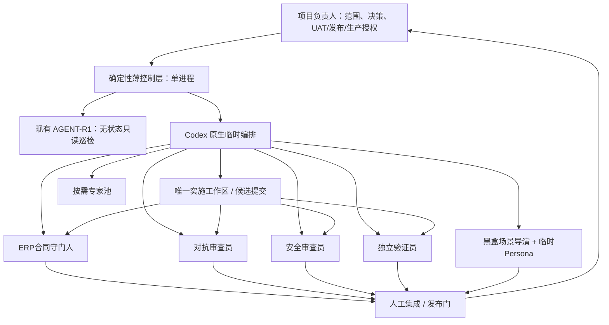

# 系统架构

## 1. 设计原则

1. **人类权威在外层。** 项目负责人决定业务取舍、任务优先级、UAT写、发布和生产动作。
2. **确定性控制在中层。** 状态、权限、租约、资源、证据和恢复由可测试规则处理，不交给模型自由解释。
3. **临时认知在内层。** LLM Agent只为当前有界工作项存在，权限随交付结束而撤销。
4. **一项正式任务、一个产品写者、一个重任务。** 并行只用于无写冲突的只读分析或完全隔离验证。
5. **证据先于结论。** Agent输出不是权威事实；Git对象、测试结果、数据库只读核对、运行指纹和已接受文档才是证据。

## 2. 推荐拓扑

图中的“薄控制层”是未来目标，不代表已实现。当前只有R1观察能力和仓库文档流程存在。

## 3. 四个常驻逻辑职责

这四项职责由同一低资源、非LLM进程中的模块承担，不对应四个常驻容器或四段长期模型会话。

| 逻辑职责 | 输入 | 输出 | 明确不做 |
| --- | --- | --- | --- |
| 流程调度器 `Flow Steward` | 已授权Task Packet、阶段依赖、事件 | 单个下一动作、DAG状态、等待原因 | 不写业务代码，不批准门禁，不自动认领下一任务 |
| 策略与资源哨兵 `Boundary Sentinel` | 身份、能力、路径、命令、环境、资源快照 | ALLOW/DENY、租约、资源停止信号 | 不通过Prompt“提醒”代替强制，不自行放宽政策 |
| 状态与证据登记器 `Evidence Registrar` | Git对象、测试工件、结构化消息、决策引用 | 追加事件、摘要、证据索引 | 不保存秘密/业务正文，不把Agent意见变成事实 |
| 恢复对账器 `Recovery Reconciler` | 检查点、lease/fencing、worktree、TASKS/Git事实 | 可恢复动作、`RESULT_UNKNOWN`或失败关闭 | 不猜测写操作是否成功，不覆盖人工权威文档 |

## 4. 任务期执行平面

任务期角色分成三条独立路径：

- **构建路径：** 计划批准后只有唯一实施者能修改产品候选；按路径租约写入自己的branch/worktree。
- **审查路径：** 领域、对抗和安全角色读取冻结候选SHA，各自产出签名式消息。它们不共享实施者的推理历史，也不能修改候选来“顺手修复”。
- **验证路径：** QA在干净快照自行选择并运行测试；黑盒导演在接口级沙箱创建Persona。验证失败回到构建路径形成新候选SHA，旧签核全部失效。

同一模型供应商可被复用，但“独立身份”至少要求不同Agent会话、不同Context Manifest、不同能力令牌、不同输出消息和冻结输入。高风险任务未来应支持不同模型/人工复核；在没有该能力前必须明确这是剩余的相关性风险。

## 5. 原生编排与自研边界

MVP采用Codex原生能力来完成：临时角色创建、任务分发、只读并行分析、结果收集、会话结束。原因是当前仓库不需要先承担一套新微服务、消息总线和常驻模型集群的运维风险。

只有以下能力值得在R2以后自研为确定性薄层：

- Task Packet与消息Schema验证；
- 唯一active slot、路径/领域/Migration/重任务租约；
- 命令白名单和短时能力代理；
- Git基线、fencing、CAS和幂等保护；
- 追加事件、证据摘要、检查点和恢复对账；
- 资源探针和停止线。

模型不应实现这些安全边界，自研层也不应演变成承载ERP业务规则或D-112候选数据的第二套系统。

## 6. 部署与故障域

| 平面 | 位置建议 | 数据 | 生命周期 |
| --- | --- | --- | --- |
| 设计/协议 | Git中的`docs/ai-engineering/`及Task Packet | 公开于仓库的非敏感合同 | 版本化、审阅、提交 |
| 控制状态（未来） | `/var/lib/chenyida-erp-agent/`下独立本地存储 | task/lease/event/evidence摘要 | R2独立授权后创建；不与产品DB共库 |
| 候选实现 | 独立branch/worktree | 源码和测试 | 每任务创建，收口后清理 |
| 测试 | 临时目录、单个临时容器、独立测试DB | 合成/脱敏测试数据 | 用后清理，不触碰protected volumes |
| UAT/生产 | 现有受控运行面 | 受保护业务事实 | 默认无连接；逐动作人工授权 |

控制面故障不得影响ERP运行面。控制状态丢失时必须停止调度并从Git/检查点只读对账，绝不能让ERP服务依赖Agent控制器才能继续运行。
