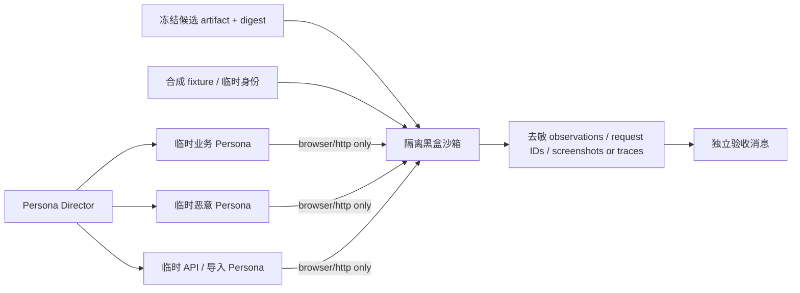

# 真正的黑盒业务模拟

## 1. 合格标准

黑盒不是“读完源码后换成用户口吻”。只有同时满足以下条件才可标为`BLACK_BOX`：

- 使用全新Agent实例，未参与需求设计、实施、代码审查或白盒测试；
- Context Manifest不包含源码、diff、commit历史、内部目录、表结构、Service名、开发者解释或预期断言；
- 沙箱不挂载源码与`.git`，只暴露浏览器页面、公开HTTP契约、合成身份和可观察业务结果；
- 环境由固定artifact digest启动，黑盒角色不能修改artifact或数据库；
- Persona凭据和数据均为临时合成fixture，不能连接UAT/生产；
- 观察通过外部接口、页面、状态码、request ID和经批准的只读业务投影取证。

不能满足时必须诚实标为`GRAY_BOX`或`NOT_RUN`，不能用同一个开发Agent的角色扮演代替。

## 2. 隔离拓扑

未来实现应使用单个临时容器或临时目录，和其他重任务串行；DB是本任务独立测试库。黑盒网络只允许loopback测试端点，容器文件系统不包含Git元数据。若候选无法在此资源预算内形成隔离artifact，黑盒测试延迟到独立环境并将当前门禁标为未完成。

## 3. Persona生成合同

场景导演根据任务涉及的权限、业务交接、误用风险和输入通道动态生成Persona，不使用固定人数。每个Persona至少描述：

| 字段 | 含义 |
| --- | --- |
| `persona_id` | 当前场景唯一，不映射真实员工 |
| `business_role` | 产品实际角色之一或外部API/导入参与者 |
| `authority` | 该角色应能做、只读或不得做的动作 |
| `goal` | 用用户语言描述的任务，不暴露实现 |
| `starting_state` | 合成数据和前置业务状态 |
| `knowledge_limit` | 用户合理知道的信息和明确未知项 |
| `behavior_profile` | 正常、误操作、重复提交、并发、恶意或可访问性需求 |
| `channels` | browser、公开HTTP或文件导入；无shell/DB/source |
| `oracles` | 用户可观察的成功/失败条件 |
| `stop_conditions` | 安全异常、资源线或超出授权时立即停止 |

Persona不获得研发Agent能力。模拟管理员只在合成沙箱拥有fixture中的产品权限，不能获得Git、shell、UAT、生产或控制面管理员权。

## 4. 动态Persona选择

系统以仓库现有11类身份为基础选择最小覆盖：

| 变更领域 | 正常Persona | 反例Persona |
| --- | --- | --- |
| Material Master / Import | engineering、operations、purchase | 数据导入用户重复/冲突上传、无权限员工、AI建议误信用户 |
| Supplier Mapping /采购 | purchase、engineering、manager | 错供应商、过期mapping、越权API调用方、重复提交者 |
| Planning / Production | planning、production、warehouse | 库存变化、并发领料、旧版本操作、跨角色越权 |
| Quality | quality（IQC/IPQC/FQC职责拆分）、warehouse/production | 自己检验自己处置、重复关闭、无凭证放行 |
| Inventory / Finance | warehouse、finance、manager | 过账后原地修改、重复冲销、金额/数量边界、普通员工 |
| Sales / Fulfillment | sales、warehouse、finance | 超可发额度、FQC未放行、重复出货/应收 |
| Auth/API/UI | 受权角色、普通员工 | 恶意内部用户、匿名用户、过期session、CSRF/重放调用方 |
| AI建议 | operations/engineering/purchase/quality | 把建议当事实、查看敏感Evidence、尝试直接提交正式数据 |

“恶意”场景只使用安全合成输入和限速沙箱，不生成破坏性payload、不攻击外部服务。

## 5. 场景生成

每项用户流程至少覆盖：

1. 授权角色的主成功路径；
2. 取消、关闭、ESC、刷新或中断等零副作用路径；
3. 不授权角色的服务端拒绝，而非只看隐藏按钮；
4. 重复提交、幂等重放和冲突版本；
5. 两个Persona的合法并发及CAS结果；
6. 边界数量、金额、日期、单位和空/超长输入；
7. 上游状态变化、过期引用和跨域资格漂移；
8. 失败后可理解的中文提示、稳定错误码与request ID；
9. 桌面及390×844等适用viewport、键盘/可访问性；
10. 审计和下游副作用通过批准的外部只读投影核对。

具体数量由Task Packet风险决定。未涉及UI的纯Service任务可使用HTTP Persona；纯文档任务通常标记`NOT_APPLICABLE`并写理由。

## 6. Oracle与证据

黑盒Oracle来自已接受业务合同、权限矩阵和Task验收，不来自源码分支或测试实现。证据至少绑定artifact digest、环境身份、Persona、前置fixture摘要、动作序列、HTTP状态/request ID、可见结果、后置只读摘要和清理结果。

黑盒发现与白盒测试矛盾时不以任一方自动胜出：冻结环境，形成`FINDING`或`MINORITY_REPORT`，由领域守门人判定Oracle是否正确，再由实施者修复代码或任务合同。场景导演不得修改候选来使测试通过。

## 7. UAT边界

黑盒沙箱验收不等于UAT。连接当前alpha.42/0040并行环境、创建真实Session或执行任何业务POST都需要另立授权；当前冻结的`PHASE4-TASK03`和其holdout/build/deploy也不能由黑盒阶段启动。
