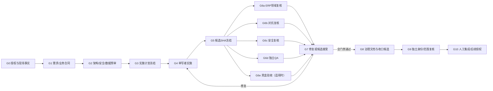

# 编排、门禁与冲突处理

## 1. 正式输入

Orchestrator只接受已存在于`TASKS.md`并具有当前任务文档的正式任务。启动前把以下内容冻结为Task Packet：

- `task_id`、目标、非目标、责任人与人工授权原文引用；
- 基线branch、HEAD、worktree状态和允许路径；
- 运行面、产品版本、Migration head及受保护对象；
- 依赖的DECISION、业务合同和验收条件；
- 必需角色、职责分离、能力上限和资源预算；
- 预期测试、数据分类、网络/UAT/生产默认拒绝项；
- retry/failure预算、deadline、检查点和真BLOCKED条件。

Task Packet与`TASKS.md`冲突时全局失败关闭。当前`AGENT-R1`只做这类只读漂移检查的一部分；它不会创建任务或发放能力。

## 2. 任务DAG

G6中的角色可在资源允许时并行做**只读**工作，但执行测试、临时数据库、容器和build仍受全局重任务锁串行化。任一修复会形成新候选SHA，旧SHA上的全部签核自动失效；只允许对未受影响检查作显式、带摘要的复用，禁止口头沿用。

## 3. 各门禁完成条件

| 门禁 | 必需证据 | 失败去向 |
| --- | --- | --- |
| G0 | 权威文档已读、实际Git/资源/运行面核验、现有改动归属明确 | BLOCKED（若需新授权）或PLANNING修正 |
| G1 | 可测试验收、ERP不变量、排除范围、冲突决策清单 | 返回需求澄清；仅真BLOCKED才问人 |
| G2 | 运行面/数据模型/权限/事务/迁移/安全策略 | 返回计划修正 |
| G3 | DAG、单写者、路径、专家、测试、预算批准 | READY |
| G4 | scope内diff、实现者自测、无未知副作用 | IMPLEMENTED |
| G5 | immutable candidate SHA、tree/diff摘要、工作区声明 | 否则不得审查 |
| G6 | 各身份独立消息、原始证据引用、适用测试 | 对应FAILED或Minority Report |
| G7 | 全部强制问题已处理，无开放veto | ACCEPTED候选 |
| G8 | MASTER/TASKS/CHANGELOG/STATUS同步；重大决定入DECISIONS | CLOSING |
| G9 | 最终tree、范围、敏感扫描、链接、测试与状态一致 | CLOSED候选 |
| G10 | 人工决定commit/push/UAT/release/production | 不自动进入下一任务 |

## 4. 独立验证与批准规则

- Implementation的`tests`只算自测证据，不算QA签核。
- QA从任务风险重新选择命令，不接受“开发者说通过”作为输入；它必须保存命令、退出码、环境指纹和摘要。
- ERP、安全和QA三类门禁必须由不同于实施者的Agent身份完成。对Migration还必须有数据库专家门禁；对用户流程还要黑盒证据。
- Orchestrator只检查签核完整性和冲突，不判定自己协调的方案技术正确。
- 若受当前工具限制无法得到真正独立身份，状态只能是`VERIFICATION_INCOMPLETE`，不得伪装为全门禁通过。

## 5. 冲突与否决

冲突按以下顺序处理：

1. 把意见转换为同一候选SHA上的结构化Claim：规则引用、证据、影响和建议。
2. 判断是否为事实冲突、规则冲突、风险偏好或范围冲突。
3. 事实冲突通过新的只读检查或最小测试解决；不得投票。
4. 规则冲突按`AGENTS.md → MASTER → TASKS → PROJECT_CONTEXT → DECISIONS → 当前Task`权威链解决。
5. 风险偏好或两个已接受决定的不可调和冲突提交负责人，形成新决定；Agent不得自行改写。
6. 修复后产生新SHA并重跑受影响门禁。

### 5.1 否决权

- ERP合同守门人：稳定内部ID、业务状态、交易/审计、权威服务和跨域交接被破坏时否决。
- 安全审查员：认证授权、数据泄漏、秘密、生产隔离、AI数据边界或不可逆风险不合格时否决。
- QA：缺少可复现证据、关键回归失败、测试环境污染或声明超过证据时否决。
- 数据库专家：Schema/Migration、约束、升级/重放/恢复证据不合格时否决。
- 项目负责人：独占范围、重大业务选择、UAT写、发布与生产授权。

否决只能由同类门禁在问题修复后撤销，不能由Orchestrator或多数角色覆盖。

### 5.2 Minority Report

R1.5 Message v1把`MINORITY_REPORT`固定给对抗角色，避免其他门禁替代必需的对抗练习；若未来要允许其他关键角色发出同类报告，必须新增合同版本并保留角色来源，不能在v1中静默扩权。报告必须指出候选SHA、被反对结论、证据、可能损害、可证伪实验和建议。Orchestrator必须选择并记录以下一种处置：

- `RESOLVED_BY_EVIDENCE`：新证据否定担忧；
- `FIX_ACCEPTED`：实施修复并在新SHA复核；
- `RISK_ACCEPTED_BY_OWNER`：仅项目负责人可接受且不违反硬规则；
- `DECISION_REQUIRED`：形成待确认决策并BLOCKED；
- `VETO_CONFIRMED`：按门禁失败处理。

不得以“其他Agent多数同意”关闭Minority Report。R1.5只有新candidate上的最终对抗`PASS/VERIFICATION`可以显式关闭claim，且该消息只能以`FIX_ACCEPTED`或`RESOLVED_BY_EVIDENCE`作为机器处置值，并至少绑定一项`PASS/0`测试报告；空测试、失败或未知测试结果不得结案。`VETO_CONFIRMED`、风险接受、失败消息、其他角色或与最终对抗签核分离的普通消息均无处置权。

## 6. 不自动启动下一任务

`CLOSED`只表示当前任务收口。控制器将active slot清空并返回`IDLE`，下一任务必须由项目负责人明确选择并让`TASKS.md`发生合法状态变化。完成R1.5、R2或任何试点均不自动恢复当前被冻结的`PHASE4-TASK03`。
