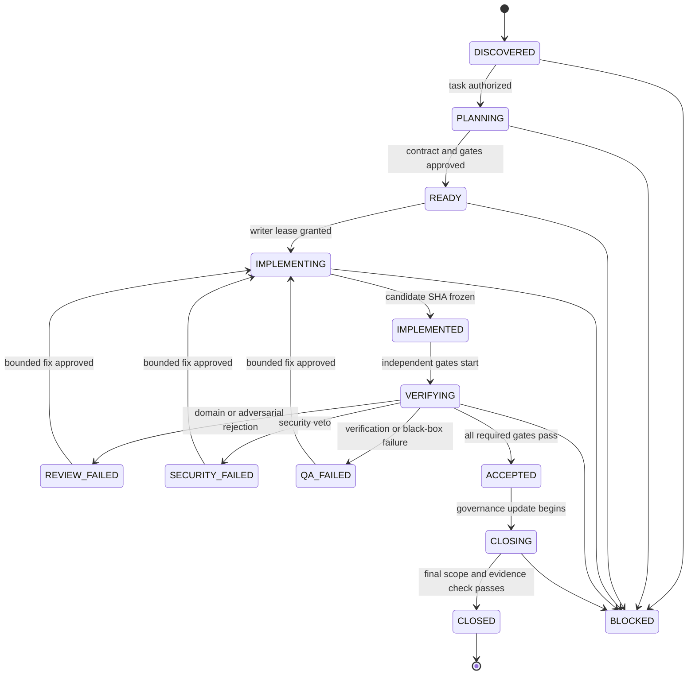

# 状态机与合法迁移

## 1. 三个状态层不得混用

| 层 | 权威载体 | 状态 | 用途 |
| --- | --- | --- | --- |
| 项目任务台账 | `docs/project/TASKS.md` | `TODO / DOING / DONE / BLOCKED` | 人工权威的唯一正式任务状态 |
| 交付阶段 | 未来控制事件；摘要回写任务文档 | 本文第2节 | 表达当前任务经过哪些工程门禁 |
| 单次Agent运行 | Message Contract | `IN_PROGRESS / PASS / FAIL / VETOED / BLOCKED / COMPLETE / RESULT_UNKNOWN` | 一次有界动作结果 |

控制器只能根据权威任务状态派生活动，不得以内部阶段反向把`TASKS.md`改成DONE。`ACCEPTED`也不等于已build、已部署、已发布或生产可用。

## 2. 交付阶段

`REVIEW_FAILED`、`SECURITY_FAILED`和`QA_FAILED`是可恢复阶段，不是向用户求助的同义词。编译、lint、类型、测试、Migration测试、普通冲突或依赖错误也先在当前阶段进行有界诊断和修复。

## 3. 台账与交付阶段映射

| TASKS状态 | 可出现的交付阶段 | 约束 |
| --- | --- | --- |
| TODO | DISCOVERED | 未获启动授权，不创建写租约或执行角色 |
| DOING | PLANNING到CLOSING及失败阶段 | 全仓最多一个正式DOING；每轮一个有界动作 |
| BLOCKED | BLOCKED | 必须写明分类、证据、已尝试动作、解除主体和保留检查点 |
| DONE | CLOSED | 必需文档和独立commit完成；不自动开启下一任务 |

TASKS从TODO进入DOING、从BLOCKED恢复DOING或改为DONE都必须由任务授权和治理提交明确记录。控制器不使用内部“READY”来偷渡正式启动。

## 4. 允许迁移及前置条件

| From → To | 必需条件 |
| --- | --- |
| DISCOVERED → PLANNING | Task Packet存在；唯一DOING槽合法；Git、文档、资源和用户改动已核验 |
| PLANNING → READY | 验收、非目标、业务不变量、DAG、角色、能力、预算和测试计划完整；决策无冲突 |
| READY → IMPLEMENTING | 唯一写者、branch/worktree、允许路径和lease/fencing已建立；资源门通过 |
| IMPLEMENTING → IMPLEMENTED | scope内候选commit冻结；自测记录；未提交/未归属文件清楚 |
| IMPLEMENTED → VERIFYING | Reviewer/QA拿到相同candidate SHA和隔离Context Manifest |
| VERIFYING → ACCEPTED | 所有适用强制门禁PASS；veto和Minority Report均有合法处置；测试声明不超出证据 |
| ACCEPTED → CLOSING | 产品候选不再变化；治理文档允许路径租约发放 |
| CLOSING → CLOSED | MASTER/TASKS/CHANGELOG/STATUS一致，DECISIONS按需更新，最终diff/link/secret/scope检查和独立commit完成 |
| 任意活动阶段 → BLOCKED | 仅满足[真BLOCKED合同](FAILURE_RECOVERY.md#5-真-blocked-合同)，并保存完整检查点 |

## 5. 明确禁止的跳转

- `TODO → IMPLEMENTING`：绕过正式启动与计划。
- `DISCOVERED/PLANNING → DONE`：没有实现/验证/收口证据。
- `IMPLEMENTED → ACCEPTED/CLOSED`：绕过独立验证。
- `REVIEW_FAILED/SECURITY_FAILED/QA_FAILED → ACCEPTED`：未产生新候选并复核。
- `BLOCKED → DOING`：没有项目负责人明确解除和新基线对账。
- `ACCEPTED → DEPLOYED`：部署不是本状态机中的隐含动作，必须另有授权。
- `CLOSED → 下一任务DOING`：禁止自动认领。

## 6. 失败关闭与过期

Task Packet revision、candidate SHA、lease epoch、Migration head、版本、关键文档blob或资源环境任一漂移时，当前执行消息拒绝，阶段保持或回到PLANNING。Agent会话超时不会把任务标为失败；控制器撤销能力并从最后完整检查点恢复。无法证明副作用的动作进入`RESULT_UNKNOWN`，只读对账完成前不得重放。

## 7. CLOSED的精确定义

`CLOSED`只证明任务文档定义的工程交付闭合。源码就绪、隔离测试、UAT接受、发布授权和生产切流是不同事实，必须分别写明。以当前`PHASE4-TASK03`为例，alpha.44/0041源码就绪不能被状态机解释为holdout已重验、已build、已部署或release已授权。
