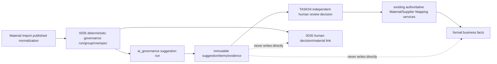

# AI Suggestion/Evidence 关系化候选合同 V1

状态：`ACCEPTED / RELATIONAL CONTRACT ONLY / IMPLEMENTATION NOT STARTED`

任务：`PHASE4-TASK03`

决定：`D-112`

日期：2026-08-10（Asia/Shanghai）

计划 Migration：`0041_ai_governance_suggestion_evidence.sql`（仅计划，本阶段未创建）

## 1. 目的与非目标

本合同为确定性 Material Governance 之后、人工正式决定之前定义一个独立、关系化、可过期且可丢弃的 AI 建议候选层。它保存可复现的 run 身份、`SUGGEST`/`ABSTAIN` 结果、类型化候选项、逐项证据和追加生命周期事件，但不保存任何批准或正式业务事实。

本合同不创建数据库对象，不实现 Service/API/UI/Evaluator，不调用模型，不接触真实数据，不授权试点、发布、部署或生产使用。D-110 的“AI仅建议”和 D-111 的确定性阈值继续是上位门禁。

## 2. 权威顺序与数据流

AI 候选层必须位于已完成的确定性治理之后。它不能成为 Material Import、Material Governance、Material Master 或 Supplier Mapping 的第二套权威。

权威优先级仍为：服务端权限/数据域与法律合同限制 → 确定性冲突和生命周期门禁 → 当前主数据/映射版本 → 人工决定 → AI 建议。任何高优先级阻断都使建议不可消费。

## 3. 既有关系结构审计

### 3.1 Migration 0035 九表职责

| 表 | 当前职责 | 分类 |
| --- | --- | --- |
| `material_governance_runs` | 将已发布 Normalization、规则/配置快照、摘要、数量和请求绑定为一次不可变确定性运行 | 确定性规则事实 |
| `material_governance_groups` | 保存严格身份/兼容分组、就绪度、来源数量；只允许 `PENDING v1` 到唯一人工终态 `v2` | 确定性事实 + 人工终态投影 |
| `material_governance_rows` | 保存 Normalized Row/Source Row 的不可变来源谱系和安全快照摘要 | 确定性来源事实 |
| `material_governance_specs` | 保存逐来源行的类型化规范组件及规则证据 | 确定性规格事实 |
| `material_governance_material_candidates` | 保存确定性 `EXACT_IDENTITY`/`COMPATIBILITY_REVIEW` ACTIVE Material 候选 | 确定性候选事实 |
| `material_governance_alternative_candidates` | 保存同 run 分组间、仅供复核的确定性兼容候选 | 确定性候选事实 |
| `material_governance_decisions` | 保存一组一次、由人工作出的绑定/建稿/排除决定和幂等/CAS事实 | 人工治理决定 |
| `material_governance_material_links` | 保存人工决定到 ACTIVE Material 或受控 DRAFT Material 的正式衔接 | 正式业务衔接 |
| `material_governance_events` | 保存该人工决定导致的唯一终态转换 | 人工治理事件 |

0035 的事实表由数据库拒绝 UPDATE/DELETE，并只允许服务事务写入；group 只允许一次受控终态更新。AI 具有不同的来源身份、版本、放弃、过期和失效语义，写入这些表会让“确定性规则生成”“人工决定”和“模型/规则建议”无法区分，也会破坏现有测试证明。因此 AI 不能直接写入或冒充 `material_governance_material_candidates`、`material_governance_alternative_candidates` 或 `material_governance_decisions`。

### 3.2 Material Import 可复用边界

现有导入模型已经提供 Batch、Parse Run、Mapping Version/Digest、Normalization Run、Normalized Row、Field/Attribute Candidate、Issue 和 Lineage 的稳定关系。TASK03 不复制：

- 原始文件、文件正文、`raw_values`、完整 `normalized_payload` 或 `mapped_values`；
- Batch/Parse/Mapping/Normalization 的当前状态投影；
- 已有 Field/Attribute Candidate 值、Issue 正文或 Lineage JSON；
- 导入审批、Review Session、人工 override、finalization 或 Draft link 事实。

AI run 的输入只保存已批准 canonical input version 和 SHA-256。证据通过 0035 row/spec 或现有 normalization lineage 的稳定 ID、版本和摘要定位；需要展示时由未来服务按原权限实时读取源系统，AI 表不建立第二份正文副本。

### 3.3 Material Master 可复用边界

现有 `material_master`、`material_categories`、`material_attribute_definitions`、`material_attribute_values`、`material_versions` 以稳定 ID、状态、row version、类型和审核链表达正式主数据。AI 可把 ACTIVE category、ACTIVE attribute definition 和 ACTIVE Material 的 ID、观察版本及 canonical digest 作为候选目标快照；不能：

- 创建或修改 Material、正式属性值、内部编码、状态或版本；
- 把 `standard_name`、供应商料号或原始名称当作主键；
- 复制完整 Material/Attribute 正文到无约束 JSON；
- 绕过现有 Draft、Submit、Review、Approve、冻结或停用服务。

### 3.4 Supplier Mapping 可复用边界

现有 Supplier Mapping 以 `mapping_uid`、`mapping_version_no`、row `version`、`content_digest`、稳定 supplier-part claim、`DRAFT → PENDING_REVIEW → ACTIVE/REJECTED`、职责分离和追加事件表达正式映射事实。AI 可引用 ACTIVE Supplier、ACTIVE Material、既有 Mapping Version 的稳定 ID/版本/摘要；不能：

- 写 `supplier_mappings` 或 `supplier_mapping_supplier_part_keys`；
- 创建 Mapping draft、提交或批准 Mapping；
- 占用 supplier part、改变有效期/换算、替代 ACTIVE version；
- 复制 Supplier 联系信息、价格、完整供应商正文或审核事实。

AI 的 `SUPPLIER_MAPPING` item 只是“某受控来源可能对应某 Supplier/Material”的候选目标。TASK04 的人工决定仍须调用现有 Supplier Mapping Service，重新验证 ACTIVE 引用、1:1/单位、稳定占用、有效期、职责分离、CAS、幂等和冲突。

## 4. 独立边界与允许能力

V1 表前缀固定为 `ai_governance_`，不得重载 0035 或正式业务表。仅允许四种 capability/item kind：

| 值 | 建议语义 | 关系目标 |
| --- | --- | --- |
| `CLASSIFICATION` | 建议一个受控品类候选 | `material_categories.id` |
| `ATTRIBUTE_EXTRACTION` | 建议某属性定义下的一个类型化值 | `material_attribute_definitions.id` + 单一类型值列 |
| `MATERIAL_MATCH` | 建议一个既有正式 Material 候选 | `material_master.id` + 观察版本/摘要 |
| `SUPPLIER_MAPPING` | 建议受控 Supplier 来源到既有 Material 的映射候选 | `suppliers.id` + `material_master.id` + supplier-part摘要 |

建议 disposition 只有：

- `SUGGEST`：至少一个满足关系约束、证据完整的 item；
- `ABSTAIN`：零 item，并有稳定 `abstain_reason_code`。它表示安全放弃，不是失败、拒绝或人工结论。

禁止出现 `APPROVED`、`BOUND`、`MERGED`、`CREATED`、`ACTIVE` 等正式语义。运行异常、非法 Schema 或不完整输出不允许留下部分 suggestion；只写失败审计。证据不足的有效结果只能整体 `ABSTAIN`，或让不完整 item 在事务提交前失败。

## 5. 五表关系概览

| 表 | 基数 | 职责 |
| --- | --- | --- |
| `ai_governance_suggestion_runs` | 一个治理 group/能力/输入/完整合同可有一个确定性 run | 固定主体、版本合同、输入、操作者、过期和 run/result 摘要 |
| `ai_governance_suggestions` | 每个完整 run 恰好一个 | 保存 `SUGGEST`/`ABSTAIN`、版本链和完整 payload 摘要 |
| `ai_governance_suggestion_items` | 一个 `SUGGEST` 有一到多个；`ABSTAIN` 为零 | 保存四类显式、类型化关系目标和可空分数 |
| `ai_governance_suggestion_evidence` | 每个 item 至少一条 | 保存安全定位、稳定 FK、观察版本和摘要 |
| `ai_governance_suggestion_events` | 每个 suggestion 一条 `CREATED`，最多一条终止事件 | 追加记录 `INVALIDATED`、`DISCARDED`、`SUPERSEDED` |

所有外键默认 `ON DELETE RESTRICT`。所有五表都由数据库守卫拒绝 UPDATE/DELETE，并只允许未来 AI Suggestion Service 在单一事务中 INSERT；本任务不设计物理删除例外。

## 6. 共同字段与摘要规则

### 6.1 稳定身份

- 数据库主键使用 `bigserial id`，只供关系连接。
- 对外稳定标识使用不可复用 UUID：`run_uid`、`suggestion_uid`、`item_uid`、`evidence_uid`、`event_uid`。
- API 和审计不得把数组位置、rank、名称、供应商料号或摘要截断值当作稳定身份。

### 6.2 SHA-256

所有摘要列保存 64 位小写十六进制 SHA-256，并以 CHECK `~ '^[0-9a-f]{64}$'`保护。canonical serialization 必须固定字段集合、UTF-8、Unicode normalization、数值/日期格式和数组排序，不包含数据库自增 ID、随机 UUID、请求时间或展示文案。

- `input_digest`：canonical input references、观察版本和源摘要。
- `contract_digest`：schema/evaluator/rule/config/provider/model/prompt/参数/置信度语义的完整版本合同。
- `run_digest`：主体 + capability + `input_version/input_digest` + `contract_digest`，作为幂等身份。
- `result_digest`：disposition、suggestion version、按稳定顺序排列的 item/evidence digest。
- `suggestion_digest`、`item_digest`、`evidence_digest`、`event_digest`：各层 canonical fact 摘要。

同一主体、输入、能力和完整版本合同必须生成相同 `run_digest`；唯一约束冲突时返回已有完整 run，不产生第二份建议。

### 6.3 版本与时间

- 所有事实行 `row_version=1` 且不可更新；这里的 row version 只用于 CAS/审计，不表示内容可编辑。
- suggestion 的 `suggestion_version_no` 按同一 `(governance_group_id, capability)` 从 1 严格递增；内容变化必须产生新 run 和新 suggestion version。
- 所有时间为 `timestamptz`，数据库/服务端时间是唯一权威。
- `expires_at` 必填，必须 `> created_at` 且 `<= created_at + interval '30 days'`；版本化 config 可设更短 TTL，延长上限必须新合同、新评估和新决定。
- 浏览器倒计时只作展示，不能参与有效性判断。

### 6.4 操作者与审计

- `requested_by`/`created_by`/`actor` 均引用 `app_users.username`。受控自动任务必须使用已登记、可审计、最小权限的专用 principal，不接受任意自由文本系统身份。
- 每次变更事务必须携带一个 `request_id` 和一个 `operation_id`；同一事务写入 run、suggestion、items、evidence、CREATED event、Audit 和幂等结果。
- `idempotency_key_digest`只保存摘要，不保存原 key；审计只保存安全 ID、结果、错误码和摘要，不保存输入/模型正文、凭据或个人信息。

## 7. `ai_governance_suggestion_runs`

### 7.1 建议字段

| 字段 | 类型/空值 | 合同 |
| --- | --- | --- |
| `id` / `run_uid` | `bigserial PK` / `uuid NOT NULL UNIQUE` | 内部关系主键与稳定公开标识 |
| `governance_run_id` | `bigint NOT NULL` | 引用 `material_governance_runs.id` |
| `governance_group_id` | `bigint NOT NULL` | 与 run 组成复合 FK，引用同一 `material_governance_groups(id, governance_run_id)` |
| `group_version` | `integer NOT NULL` | 创建时观察值；V1 必须为 `1` 且 group 为 `PENDING` |
| `group_input_digest` | `text NOT NULL` | 对 group key、row/spec 来源摘要及观察版本的 canonical SHA-256，不复制正文 |
| `capability` | `text NOT NULL` | 四项能力之一 |
| `execution_mode` | `text NOT NULL` | V1 CHECK 只允许 `LOCAL_DETERMINISTIC` |
| `schema_version` / `schema_digest` | `text NOT NULL` / `text NOT NULL` | 输出关系 Schema 身份及 SHA-256 |
| `evaluator_version` | `text NOT NULL` | 当前批准身份为 `ai-governance-evaluator-v1` |
| `rule_version` | `text NOT NULL` | 当前批准身份为 `bom-material-governance-v1` |
| `config_version` / `config_digest` | `text NOT NULL` / `text NOT NULL` | 包括阈值、TTL、候选上限和后处理的版本/摘要 |
| `provider_id` | `text NOT NULL` | V1 固定 `LOCAL_DETERMINISTIC` |
| `model_id` / `model_version` | `text NOT NULL` | 当前均固定 `NONE`，明确表示没有概率模型 |
| `prompt_version` | `text NOT NULL` | 当前固定 `NONE` |
| `prompt_digest` | `text NULL` | 当前没有 prompt 制品所以必须为 NULL；未来非 `NONE` 时必须非空且重评 |
| `parameter_digest` | `text NOT NULL` | 无模型时也记录确定性参数集摘要 |
| `confidence_semantics_version` | `text NULL` | 当前基线不输出置信度所以必须 NULL；未来出现非空 score 时必填 |
| `input_version` / `input_digest` | `text NOT NULL` / `text NOT NULL` | canonical input contract 和 SHA-256 |
| `contract_digest` / `run_digest` / `result_digest` | `text NOT NULL` | 完整版本合同、幂等运行身份和完整结果摘要 |
| `idempotency_key_digest` | `text NOT NULL` | 原 key 的 SHA-256 |
| `operation_id` / `request_id` | `uuid NOT NULL UNIQUE` / `uuid NOT NULL` | 单事务操作和端到端请求关联 |
| `requested_by` | `text NOT NULL FK app_users.username` | 人工或专用受控 principal |
| `created_at` / `expires_at` | `timestamptz NOT NULL` | 服务端生成时间和强制过期时间 |
| `row_version` | `integer NOT NULL DEFAULT 1` | 永久为 1；事实不可更新 |

### 7.2 约束与索引

- UNIQUE `run_uid`、`operation_id`、`run_digest`。
- 复合 UNIQUE `(id, governance_group_id, capability)`供 suggestion 复合 FK 使用。
- 业务唯一约束 `(governance_group_id, group_version, capability, input_version, input_digest, contract_digest)`。
- CHECK 四项 capability；所有版本代码长度 1—160；digest 格式；`row_version=1`；30 日 TTL。
- CHECK 当前准入组合必须同时为 `LOCAL_DETERMINISTIC / LOCAL_DETERMINISTIC / NONE / NONE / NONE`，且 `prompt_digest`、`confidence_semantics_version`为 NULL。
- 索引 `(governance_group_id, capability, created_at DESC, id DESC)`、`(expires_at, id)`、`(request_id, id)`。
- 删除策略：对 group/run/user 全部 RESTRICT；自身 UPDATE/DELETE 由 guard 拒绝。

只有结构、证据和摘要全部验证通过的完整运行才能插入本表。超时、异常、非法 Schema 或部分输出只写失败 Audit，不创建半成品 run。

## 8. `ai_governance_suggestions`

### 8.1 建议字段

| 字段 | 类型/空值 | 合同 |
| --- | --- | --- |
| `id` / `suggestion_uid` | `bigserial PK` / `uuid NOT NULL UNIQUE` | 内部与公开稳定身份 |
| `suggestion_run_id` | `bigint NOT NULL UNIQUE` | 每个 run 恰好一个 suggestion |
| `governance_group_id` / `capability` | `bigint/text NOT NULL` | 与 run 的三列复合 FK 保证主体/能力一致 |
| `suggestion_version_no` | `integer NOT NULL` | 同 group/capability 严格递增 |
| `supersedes_suggestion_id` | `bigint NULL FK self` | 第一版为空；后续版指向直接前一版，不能跳链或自指 |
| `disposition` | `text NOT NULL` | 仅 `SUGGEST` 或 `ABSTAIN` |
| `abstain_reason_code` | `text NULL` | `ABSTAIN`必填、`SUGGEST`必须 NULL；受控大写代码，不保存正文 |
| `overall_confidence` | `numeric(9,8) NULL` | 允许为空；非空必须 0—1 且 run 有 confidence semantics |
| `payload_digest` / `suggestion_digest` | `text NOT NULL` | 关系化 payload 和 suggestion header 的 SHA-256 |
| `created_by` / `request_id` | `text NOT NULL FK app_users` / `uuid NOT NULL` | 必须与 run 事务身份相同 |
| `created_at` | `timestamptz NOT NULL` | 服务端时间 |
| `row_version` | `integer NOT NULL DEFAULT 1` | 永久为 1 |

### 8.2 约束与索引

- UNIQUE `suggestion_uid`、`suggestion_run_id`、`(governance_group_id, capability, suggestion_version_no)`、`supersedes_suggestion_id WHERE NOT NULL`。
- 复合 FK `(suggestion_run_id, governance_group_id, capability)`引用 run 的同名身份。
- CHECK `suggestion_version_no>0`、`row_version=1`、摘要格式、reason code 格式。
- CHECK 第一版 `supersedes_suggestion_id IS NULL`；后续版非空。延迟约束触发器验证被替代者同 group/capability、version 恰好减 1。
- CHECK disposition/abstain reason/overall confidence 的空值组合。
- 延迟约束触发器在事务提交前保证：`SUGGEST`至少一个 item 且每 item 至少一条合法 evidence；`ABSTAIN`恰好零 item。
- 索引 `(governance_group_id, capability, suggestion_version_no DESC)`、未来审核队列所需的 `disposition='SUGGEST'`部分索引。
- 无可变 `status`。当前有效性只能按第 12 节服务端实时派生。

## 9. `ai_governance_suggestion_items`

### 9.1 公共字段

| 字段 | 类型/空值 | 合同 |
| --- | --- | --- |
| `id` / `item_uid` | `bigserial PK` / `uuid NOT NULL UNIQUE` | 稳定关系/公开身份 |
| `suggestion_id` | `bigint NOT NULL FK` | 只属于一个 suggestion |
| `item_kind` | `text NOT NULL` | 四项能力之一，且必须与 suggestion capability 相同 |
| `item_ordinal` / `candidate_rank` | `integer NOT NULL` | 稳定输出顺序与候选 rank，均大于 0 |
| `score` | `numeric(9,8) NULL` | 可空；非空为 0—1，且 run 的 confidence semantics 必须非空 |
| `item_digest` | `text NOT NULL` | 类型、目标、观察版本、值、rank 和 score 的 SHA-256 |
| `created_by` / `request_id` / `created_at` | 非空 | 与 run/suggestion 同一事务和操作者 |
| `row_version` | `integer NOT NULL DEFAULT 1` | 永久为 1 |

### 9.2 显式目标字段

| 目标组 | 字段 | 空值规则 |
| --- | --- | --- |
| Classification | `category_id` FK、`category_version_snapshot`、`category_status_snapshot`、`category_digest` | 仅 `CLASSIFICATION`非空；status snapshot 必须 `ACTIVE` |
| Attribute | `attribute_definition_id` FK、`attribute_definition_version_snapshot`、`attribute_status_snapshot`、`attribute_value_type`、`value_text`、`value_integer`、`value_decimal numeric(38,18)`、`value_boolean`、`value_date`、`value_unit_code`、`attribute_value_digest` | 仅 `ATTRIBUTE_EXTRACTION`使用；definition 必须 ACTIVE；按 value type 恰好一个值列非空。`value_unit_code`只在定义允许/要求单位时非空 |
| Material | `material_id` FK、`material_version_snapshot`、`material_status_snapshot`、`material_digest` | `MATERIAL_MATCH`和`SUPPLIER_MAPPING`使用；必须观察到 ACTIVE 正式 Material |
| Supplier Mapping | `supplier_id` FK、`supplier_version_snapshot`、`supplier_status_snapshot`、`supplier_digest`、`supplier_part_key_digest`、可选 `purchase_unit_id` FK、`conversion_numerator`、`conversion_denominator` | 仅 `SUPPLIER_MAPPING`使用；Supplier 必须 ACTIVE；不保存 supplier part 正文。Unit/换算三字段要么全空，要么一起非空且正数 |

### 9.3 kind-specific CHECK

- `CLASSIFICATION`：只有 Classification 目标组非空，Attribute/Material/Supplier Mapping 目标组全部为空。
- `ATTRIBUTE_EXTRACTION`：只有 Attribute 目标组非空；`TEXT/ENUM`使用 `value_text`，`INTEGER`使用 `value_integer`，`DECIMAL`使用 `value_decimal`，`BOOLEAN`使用 `value_boolean`，`DATE`使用 `value_date`，其他值列必须为空。
- `MATERIAL_MATCH`：只有 Material 目标组非空，其他目标组全部为空。
- `SUPPLIER_MAPPING`：Material 与 Supplier Mapping 目标组非空，Classification/Attribute 为空；supplier-part只保存 canonical key SHA-256。
- 禁止 `target_type + target_id` 形式的任意 polymorphic ID；每类目标均由真实 FK 和数据库 CHECK 提供引用完整性。

### 9.4 唯一与查询索引

- UNIQUE `(suggestion_id, item_ordinal)`、`(suggestion_id, item_digest)`。
- 部分唯一：Classification `(suggestion_id, category_id)`；Attribute `(suggestion_id, attribute_definition_id, candidate_rank)`；Material Match `(suggestion_id, material_id)`；Supplier Mapping `(suggestion_id, supplier_id, supplier_part_key_digest, material_id)`。
- 索引 `(suggestion_id, item_kind, candidate_rank, id)`、`material_id`、`supplier_id`、`category_id`、`attribute_definition_id`。
- 所有引用 RESTRICT；UPDATE/DELETE 由不可变 guard 拒绝。

## 10. `ai_governance_suggestion_evidence`

### 10.1 安全证据合同

Evidence 只保存安全定位信息、稳定内部引用、观察版本和摘要，不保存：原始供应商文件、原始行正文、完整模型输入/输出、价格、联系人、邮箱、电话、地址、Cookie、Token、凭据、数据库 URL、客户专用正文或未授权个人信息。

| 字段 | 类型/空值 | 合同 |
| --- | --- | --- |
| `id` / `evidence_uid` | `bigserial PK` / `uuid NOT NULL UNIQUE` | 稳定身份 |
| `suggestion_item_id` | `bigint NOT NULL FK` | 每条 evidence 只证明一个 item |
| `evidence_ordinal` | `integer NOT NULL` | 稳定顺序，大于 0 |
| `evidence_kind` | `text NOT NULL` | 下列受控类型之一 |
| 各类专用 FK | `bigint NULL` | 按 kind 恰好一个专用引用非空 |
| `observed_version_no` | `integer NULL` | 只有具有 row version 的 Material/Supplier/Mapping 证据必填；0035不可变事实可为空 |
| `safe_field_path` | `text NOT NULL` | 受控 namespace/code 或组件路径，1—200字符；不是任意 JSONPath/文件路径 |
| `source_digest` / `locator_digest` / `evidence_digest` | `text NOT NULL` | 源事实、定位组合和证据事实 SHA-256 |
| `rule_trace_code` / `rule_trace_version` | `text NULL` | 仅 `RULE_TRACE`非空，受控代码和版本 |
| `created_by` / `request_id` / `created_at` | 非空 | 与父级同一事务/身份 |
| `row_version` | `integer NOT NULL DEFAULT 1` | 永久为 1 |

受控 evidence kind 及专用引用：

| `evidence_kind` | 唯一允许的引用 |
| --- | --- |
| `GOVERNANCE_ROW` | `governance_row_id → material_governance_rows.id` |
| `GOVERNANCE_SPEC` | `governance_spec_id → material_governance_specs.id` |
| `DETERMINISTIC_MATERIAL_CANDIDATE` | `governance_material_candidate_id → material_governance_material_candidates.id` |
| `DETERMINISTIC_ALTERNATIVE_CANDIDATE` | `governance_alternative_candidate_id → material_governance_alternative_candidates.id` |
| `NORMALIZATION_LINEAGE` | `normalization_lineage_id → material_import_normalization_lineage.id` |
| `MATERIAL_VERSION` | `material_id → material_master.id` + `observed_version_no` |
| `SUPPLIER_VERSION` | `supplier_id → suppliers.id` + `observed_version_no` |
| `SUPPLIER_MAPPING_VERSION` | `supplier_mapping_version_id → supplier_mappings.id` + mapping row/version digest |
| `RULE_TRACE` | `rule_trace_code` + `rule_trace_version`，其他专用 FK 全空 |

CHECK 必须根据 kind 证明恰好一个目标组非空，不能使用任意 `source_type/source_id`。延迟约束触发器还必须验证 GOVERNANCE_ROW/SPEC/确定性候选/Lineage 确实属于父 suggestion 绑定的同一个治理 group/run 或其输入谱系。

### 10.2 唯一与索引

- UNIQUE `evidence_uid`、`(suggestion_item_id, evidence_ordinal)`、`(suggestion_item_id, evidence_digest)`。
- 索引每个非空专用 FK，以及 `(suggestion_item_id, evidence_kind, id)`。
- `source_digest`、`locator_digest`、`evidence_digest`均执行 SHA-256 CHECK；`safe_field_path`和 rule code/version执行长度/字符集 CHECK。
- 父 item 和所有源引用均 RESTRICT；UPDATE/DELETE 由不可变 guard 拒绝。

## 11. `ai_governance_suggestion_events`

### 11.1 事件值与字段

| 值 | 语义 | 后续是否可消费 |
| --- | --- | --- |
| `CREATED` | 完整 suggestion 与证据在同一事务创建 | 仍须通过实时有效性门禁 |
| `INVALIDATED` | 输入、引用资格或已批准版本合同漂移 | 否 |
| `DISCARDED` | 有权限的人工明确丢弃候选 | 否 |
| `SUPERSEDED` | 新 suggestion version 替代旧版本 | 否 |

过期不是可被人工补写的状态事件，而是 `server_now >= expires_at` 的派生事实，因此没有 `EXPIRED`事件。可选的未来观察日志不能改变这一权威判断。

建议字段：

- `id bigserial PK`、`event_uid uuid UNIQUE`；
- `suggestion_id bigint FK RESTRICT`、`event_sequence integer`；
- `event_type`、`reason_code`；
- `superseding_suggestion_id bigint NULL FK RESTRICT`，仅 `SUPERSEDED`必填；
- `expected_suggestion_row_version integer NOT NULL`，V1固定1；
- `expected_previous_event_digest text NULL`：`CREATED`为空，终止事件必须等于当前 `CREATED` event digest；
- `event_digest text NOT NULL`、`operation_id uuid NOT NULL UNIQUE`、`request_id uuid NOT NULL`；
- `actor text NOT NULL FK app_users.username`、`created_at timestamptz NOT NULL`、`row_version=1`。

### 11.2 事件链约束

- UNIQUE `(suggestion_id, event_sequence)`；每个 suggestion 恰好一个 `CREATED`，其 sequence=1、无 previous digest、无 superseding ID。
- 部分 UNIQUE `(suggestion_id) WHERE event_type IN ('INVALIDATED','DISCARDED','SUPERSEDED')`，最多一个终止事件；其 sequence=2、previous digest 指向 CREATED。
- `SUPERSEDED`必须指向同 group/capability、version 恰好加1的新 suggestion；其他终止事件的 superseding ID 必须为空。
- 服务在锁定 suggestion 后以 `expected_suggestion_row_version + expected_previous_event_digest`执行 CAS；唯一约束/延迟触发器处理并发，失败返回稳定版本冲突。
- 事件只追加，UPDATE/DELETE 一律拒绝。每个事件和 Audit 在同一事务共享 request/operation identity。

## 12. 当前有效性：服务端失败关闭

Suggestion 没有可更新的 `current_status`。未来读取或进入 TASK04 审核前，服务端必须在同一只读快照中重新验证全部条件：

1. run、suggestion、item、evidence 和 CREATED event 完整，摘要可重算且相互匹配；
2. disposition 为 `SUGGEST`；`ABSTAIN`永不进入审核；
3. `server_now < expires_at`，且不得采用浏览器时间；
4. 不存在 `INVALIDATED`、`DISCARDED`或`SUPERSEDED`事件；
5. 绑定的 `material_governance_group`仍属于同一 run，仍为 `PENDING`，group version 和 `group_input_digest`仍匹配；
6. 输入 version/digest 和其 0035 row/spec/Normalization lineage 摘要仍匹配；
7. item 引用的 Category、Attribute Definition、Material、Supplier、Unit或Mapping Version 仍存在、仍具资格，版本/状态/摘要仍与快照匹配；
8. schema、evaluator、rule、config、provider、model、prompt、参数、confidence semantics 和 D-111阈值档案仍在批准 allowlist；
9. 每个 item 有至少一条同主体证据，且没有非法/缺失/跨主体引用；
10. 全局及对应 capability 停用开关允许消费。停用开关的实现和发布验收属于 TASK05，不在本阶段实现。

任一条件不满足都返回稳定失效原因并拒绝消费，不允许使用缓存结果、旧版本、名称匹配、置信度或人工口头确认放行。发现持久漂移时，未来 Service 应以独立事务追加 `INVALIDATED`；即使事件尚未追加，实时重验失败也已足以拒绝。

## 13. 过期、失效、丢弃与替代

- 过期：创建时强制写 `expires_at`；服务端时间达到期限后自动不可消费，不更新 suggestion。
- 失效：输入摘要、主体版本、引用资格或完整版本合同漂移时追加 `INVALIDATED`，原事实保留。
- 丢弃：有未来明确权限的人工作出丢弃时追加 `DISCARDED`，不删除 item/evidence。
- 替代：新 run/新 suggestion version 创建成功后，在同一事务或受控后续事务为旧版本追加 `SUPERSEDED`并引用新版本；旧版本保留。
- 终止事件互斥：同一 suggestion 最多一个 invalidated/discarded/superseded 终止事实；并发由 CAS、锁和部分唯一约束失败关闭。
- 物理清理：不在 TASK03 实现范围。未来只有在无人工审核/审计/正式操作引用、满足法定和项目保留策略、具有可恢复快照及独立迁移/清理任务时才可设计；当前全部 RESTRICT 且不可删除。

## 14. 幂等、并发与事务

### 14.1 创建

未来 Service 必须：

1. 校验权限、must-change、Origin/CSRF、请求大小、字段和稳定错误合同；
2. 计算请求摘要、idempotency key digest、canonical input/contract/run digest；
3. 对 `(group, capability)`和 `run_digest`取稳定顺序事务锁；
4. 锁定并重验 group `PENDING`/expected version、run 和输入摘要；
5. 完整生成并在内存校验 suggestion/items/evidence 和所有摘要；
6. 单一事务插入 run、suggestion、items、evidence、CREATED event、Audit 和幂等响应；
7. 由延迟约束在提交前验证 SUGGEST/evidence 完整性；任一步失败全部回滚。

相同 idempotency key + 相同请求摘要或相同 `run_digest`返回原完整响应；相同 key 不同请求返回冲突。不能留下孤立 run、无 evidence item、部分事件或部分 Audit。

### 14.2 新版本与终止事件

- 内容/输入/版本合同变化必须创建新 run，并在 `(group, capability)`锁内分配 `previous.suggestion_version_no + 1`。
- event mutation 必须携带 expected suggestion row version 和 previous event digest；并发只有一个终止事件成功。
- run/suggestion/item/evidence不接受 PATCH/UPDATE。纠错只能新版本；历史不被“修复”为另一个结果。

## 15. D-111 阈值继承

`deterministic-ai-governance-thresholds-v1`不被 TASK03 降低、转换或重新解释。当前准入完整身份仍为：

- provider=`LOCAL_DETERMINISTIC`；model/prompt=`NONE/NONE`；
- rule=`bom-material-governance-v1`；evaluator=`ai-governance-evaluator-v1`；
- dataset=`synthetic-material-governance-v1@1.0.0`；
- source revision=`d69f6dff795377109244e788c2ffee73ef6194ec`。

| 门禁 | V1 最低要求 |
| --- | --- |
| 通用正确性、证据、稳定复现、coverage内准确率 | `1.000000` |
| 禁止数据、formal action、关键安全违规、错误候选 | `0` |
| Overall coverage | `>= 0.500000` |
| Classification coverage | `>= 0.750000` |
| Attribute record / field coverage | 各 `>= 0.750000` |
| Material Match coverage | `>= 0.250000` |
| Supplier Mapping coverage | `>= 0.250000` |

ABSTAIN继续保留在分母，零support继续为`defined=false`，不能解释为能力通过。模型、prompt、规则、阈值、Schema、证据合同、配置、数据集或参考主数据定义变化都必须新版本并重新评估；D-112不批准外部模型或发布。

## 16. TASK04 衔接边界

TASK04 只能新增与 AI suggestion 分离的人工 review/decision 事实。该人工决定应引用 `suggestion_uid + suggestion_version_no + suggestion_digest`，记录审核人、角色、逐项采用/更正、理由、CAS、request和审计，然后调用既有 Material Workflow 或 Supplier Mapping Service 完成正式写入。

禁止：

- 从 AI 表用 SQL 直写 `material_governance_decisions`、`material_governance_material_links`、`material_master`、`material_attribute_values`、`supplier_mappings`或 supplier-part claim；
- 让正式表在 TASK03 增加指向 AI suggestion 的反向 FK；
- 把“人工查看”“置信度高”或 suggestion event 当作批准；
- 降低既有权限、职责分离、事务、CAS、幂等、状态机和审计。

## 17. 下一实施阶段验收要求

未来 `0041_ai_governance_suggestion_evidence.sql` 实施任务至少应覆盖：

- Migration/schema/snapshot/journal 五表和列一致性；空库升级、0040已有数据升级、重复执行、失败回滚；
- 所有 FK/复合 FK、kind-specific CHECK、typed value CHECK、digest/TTL/score CHECK、部分唯一和查询索引；
- 五表 service-only INSERT、UPDATE/DELETE拒绝、跨主体 evidence 拒绝；
- SUGGEST零item、item零evidence、ABSTAIN有item、非法 polymorphic 组合全部失败；
- `run_digest`并发重放、新版本分配、终止事件互斥、CAS、事务故障回滚和审计一致性；
- server-time过期、输入/版本/资格漂移、停用/未批准合同的失败关闭；
- 不写0035候选/决定/链接、Material Master、Supplier Mapping或其他正式业务表；
- 仅使用隔离 PostgreSQL 和合成数据，不连接 UAT/生产。

实施前还必须再次确认 0035/0040 checksum 未变，并由独立任务明确授权 Migration、代码和测试范围。

## 18. 本版本结论

- 0035 确定性事实、人工决定和正式衔接保持权威且不被重载。
- 五张 `ai_governance_*` 候选表的关系、约束、版本、证据和事件合同已接受。
- 当前只允许本地确定性身份；外部 AI 默认禁用。
- `0041_ai_governance_suggestion_evidence.sql`仅为下一阶段计划，本阶段不存在。
- API、UI、Service、Schema、Migration、模型、数据、试点、发布和部署均未开始。

最终判定：`PHASE4-TASK03 RELATIONAL CONTRACT ACCEPTED — IMPLEMENTATION NOT STARTED`
