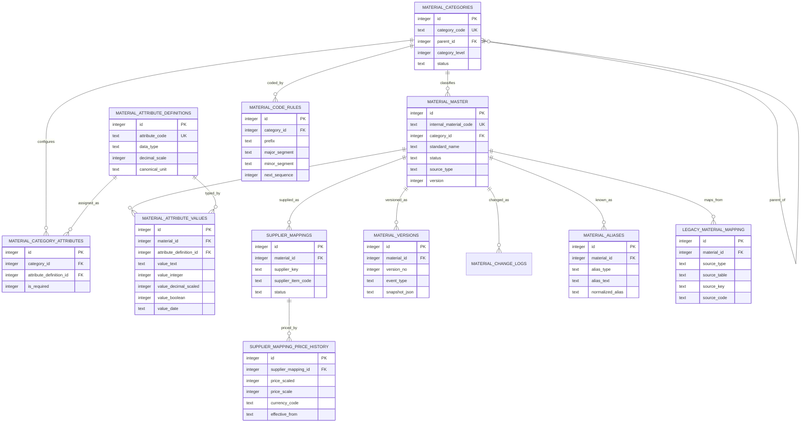

# Material Master V2 数据库模型设计

状态：`APPROVED_AND_IMPLEMENTED`

任务：`PHASE1-TASK01`

日期：2026-07-11

目标数据库：在线 Site / Cloudflare D1（SQLite 方言）

## 1. 决策摘要

本设计采用“在线 D1 新增关系化 V2 表、旧模型保持原样”的扩展方案：

- 在线 Site/D1 是 Material Master V2 的唯一目标数据库。
- 本地 SQLite 的 `items`、`supplier_mappings` 及其下游业务表保持不变，只作为 legacy 数据来源。
- 在线现有 `erp_records`、`inventory_balances` 和 `inventory_transactions` 不删除、不改列、不改读写逻辑。
- V2 通过稳定的整数 `material_id` 建立内部关系；正式业务编码由唯一索引保护，但不作为表间主键。
- 所有 V2 物料必须记录 `source_type` 和 `source_ref`；legacy 来源还必须写入 `legacy_material_mapping`。
- 当前阶段只交付设计，不创建表、不迁移数据、不切换 BOM、采购或库存引用。

### 1.1 已比较方案

| 方案 | 说明 | 优点 | 主要问题 | 结论 |
| --- | --- | --- | --- | --- |
| A. 在线 D1 增量关系模型 | 在现有 8 表旁新增 V2 表，旧读写路径不变 | 符合唯一生产权威源方向；可灰度迁移；关系约束清晰 | 过渡期存在 V1/V2 双模型，需要交叉映射和核对 | **采用** |
| B. 本地 SQLite 先升级再同步 | 先扩展本地 `items`，再同步到 D1 | 可复用本地实体表 | 会继续扩大两套主系统和双写风险，违反当前仓库架构方向 | 不采用 |
| C. 继续扩展 `erp_records.data_json` | 不新增关系表，仅增加 JSON 字段 | 初期改动小 | 无法可靠约束品类、属性类型、版本、映射和唯一性 | 不采用 |

## 2. 范围与边界

### 2.1 本设计包含

- `material_master`
- `material_categories`
- `material_attribute_definitions`
- `material_category_attributes`
- `material_attribute_values`
- `supplier_mappings`
- `supplier_mapping_price_history`
- `material_versions`
- `material_change_logs`
- `material_aliases`
- `material_code_rules`
- `legacy_material_mapping`
- 索引、约束、审计字段、迁移/回滚策略和隔离迁移测试设计

### 2.2 本设计不包含

- AI 分类、匹配或自动建档
- Excel/CSV 导入页面与导入批次实现
- 审核页面或业务 API
- BOM、采购、库存、生产的 V2 引用切换
- 本地 SQLite schema 修改
- 生产 D1 迁移、生产数据回填或部署

## 3. 设计原则

1. **内部标识稳定**：表间使用 `material_master.id`；`internal_material_code` 是受控业务键，不承担外键主键职责。
2. **新增式迁移**：首个迁移只新增对象，不修改或删除 V1 表、列、索引和数据。
3. **核心关系化**：当前有效数据使用明确字段、外键、唯一约束和类型化属性值；JSON 只用于不可变审计快照。
4. **来源可追踪**：每个物料有一个主来源；所有 legacy 身份通过交叉映射保留。
5. **历史不覆盖**：物料版本和供应商价格采用追加记录，不原地覆盖历史。
6. **状态不删除**：品类、物料、别名、映射和规则通过状态停用，历史记录不物理删除。
7. **并发可控制**：可变聚合根保留 `version` 乐观锁；编码序列使用数据库原子更新。
8. **审计完整**：关键表保留操作者、批准人、请求编号和时间；敏感请求正文不入库。

## 4. ER 关系图



关系要点：

- 一个一级到四级的自关联分类树可绑定多个物料。
- 属性定义可复用；`material_category_attributes` 决定某分类允许、必填和参与唯一判定的属性。
- 一个企业物料可对应多个供应商映射；价格是映射的时效历史，不覆盖旧价格。
- `material_versions`、`material_aliases` 和 `legacy_material_mapping` 都只从属于企业物料，不反向成为下游业务主键。

## 5. 公共字段与值约定

### 5.1 标识与时间

- 主键：`INTEGER PRIMARY KEY AUTOINCREMENT`。
- 时间：UTC ISO-8601 文本，格式 `YYYY-MM-DDTHH:mm:ss.SSSZ`；由服务端生成，不接受浏览器任意写入。
- 日期：`YYYY-MM-DD` 文本。
- 布尔：`INTEGER NOT NULL CHECK(value IN (0, 1))`。
- 金额与小数：缩放整数，实际值为 `scaled_value / 10^scale`，避免 `REAL` 精度误差。

### 5.2 来源类型

`material_master.source_type` 必填，合法值固定为：

| 值 | 含义 |
| --- | --- |
| `MANUAL` | 在 V2 受控流程中人工创建 |
| `LEGACY_D1` | 来自在线 V1 `erp_records` |
| `LEGACY_SQLITE` | 来自本地旧版 SQLite |
| `GOVERNANCE_TEMPLATE` | 来自治理模板且经人工确认 |
| `API` | 来自受控系统集成，仍需按未来审核规则生效 |

`source_ref` 必须能定位原记录或受控申请，例如 `erp_records:items:123`、`sqlite:items:CYD-001` 或 `request:MMR-000001`。AI 未来只能生成建议或变更申请，不作为可直接写正式物料的 `source_type`。

### 5.3 删除与外键策略

- 业务表不提供级联删除。
- 物料、品类、别名、映射和规则均通过状态停用。
- 外键使用 `ON UPDATE RESTRICT ON DELETE RESTRICT`。
- 分类父节点可为空；其他业务外键原则上不为空。

## 6. 表与字段说明

### 6.1 `material_categories`

四级分类树。一级节点 `parent_id` 为空，二至四级节点必须指向前一级父节点。

| 字段 | 类型/约束 | 说明 |
| --- | --- | --- |
| `id` | INTEGER PK | 稳定内部标识 |
| `category_code` | TEXT NOT NULL UNIQUE | 分类代码，如 `PCB`、`FR4`、`EL`、`RES` |
| `category_name_cn` | TEXT NOT NULL | 中文名称 |
| `category_name_en` | TEXT NOT NULL DEFAULT `''` | 英文名称 |
| `parent_id` | INTEGER NULL FK | 父分类；一级为空 |
| `category_level` | INTEGER NOT NULL CHECK 1..4 | 分类级别 |
| `status` | TEXT NOT NULL CHECK `ACTIVE`,`INACTIVE` | 启用/停用 |
| `sort_order` | INTEGER NOT NULL DEFAULT 0 | 同级排序 |
| `description` | TEXT NOT NULL DEFAULT `''` | 分类说明 |
| `version` | INTEGER NOT NULL DEFAULT 1 | 乐观锁版本 |
| `created_by` | TEXT NOT NULL | 创建账号 |
| `created_at` | TEXT NOT NULL | 创建时间 |
| `updated_by` | TEXT NOT NULL | 最后修改账号 |
| `updated_at` | TEXT NOT NULL | 最后修改时间 |
| `request_id` | TEXT NOT NULL | 创建/最近修改请求编号 |

约束与索引：

- 唯一索引：`category_code`。
- 索引：`(parent_id, status, sort_order)`、`(category_level, status)`。
- 数据库可约束层级范围和父键存在；“父级必须比子级小 1”及“禁止循环”由同一事务中的服务校验和迁移测试保证。

### 6.2 `material_master`

企业物料聚合根。品类差异属性不放入此表；这里只保存跨品类稳定字段和业务控制策略。

| 字段 | 类型/约束 | 说明 |
| --- | --- | --- |
| `id` | INTEGER PK | 物料稳定内部标识，V2 表间引用键 |
| `internal_material_code` | TEXT NULL UNIQUE | 正式内部编码，如 `CYD-EL-RES-000001`；允许草稿/审核中暂为空 |
| `standard_name` | TEXT NOT NULL | 标准名称 |
| `category_id` | INTEGER NOT NULL FK | 最具体适用分类，通常为三级或四级 |
| `brand` | TEXT NOT NULL DEFAULT `''` | 品牌 |
| `manufacturer` | TEXT NOT NULL DEFAULT `''` | 制造商 |
| `manufacturer_part_number` | TEXT NOT NULL DEFAULT `''` | 制造商型号/MPN |
| `base_uom` | TEXT NOT NULL | 基础库存单位代码 |
| `material_status` | TEXT NOT NULL | 生命周期：`DRAFT`,`PENDING_APPROVAL`,`ACTIVE`,`FROZEN`,`INACTIVE` |
| `procurement_type` | TEXT NOT NULL | `PURCHASE`,`OUTSOURCE`,`SELF_MADE`,`NON_PURCHASABLE` |
| `inventory_type` | TEXT NOT NULL | `STOCKED`,`NON_STOCKED`,`CONSIGNMENT` |
| `lot_control_required` | INTEGER NOT NULL DEFAULT 0 | 是否批次管理 |
| `shelf_life_days` | INTEGER NULL CHECK >= 0 | 保质期天数；无要求为空 |
| `inspection_type` | TEXT NOT NULL | `NONE`,`NORMAL`,`TIGHTENED`,`REDUCED`,`FULL` |
| `environmental_requirement` | TEXT NOT NULL | `UNSPECIFIED`,`ROHS`,`ROHS_REACH`,`HALOGEN_FREE`,`CUSTOMER_SPECIFIC` |
| `source_type` | TEXT NOT NULL | 主来源，见 5.2 |
| `source_ref` | TEXT NOT NULL | 主来源记录或申请引用 |
| `version` | INTEGER NOT NULL DEFAULT 1 | 乐观锁及版本号 |
| `created_by` | TEXT NOT NULL | 创建账号 |
| `created_at` | TEXT NOT NULL | 创建时间 |
| `updated_by` | TEXT NOT NULL | 最后修改账号 |
| `updated_at` | TEXT NOT NULL | 最后修改时间 |
| `approved_by` | TEXT NOT NULL DEFAULT `''` | 最近批准账号 |
| `approved_at` | TEXT NULL | 最近批准时间 |
| `request_id` | TEXT NOT NULL | 最近关键写入请求编号 |

约束与索引：

- 部分唯一索引：`internal_material_code IS NOT NULL` 时唯一。
- 候选去重索引：`(category_id, manufacturer, manufacturer_part_number)`；不设全局唯一，避免错误合并不同规格或客户范围物料。
- 队列索引：`(status, updated_at)`；查询索引：`(category_id, status)`、`standard_name`。
- `DRAFT`、`PENDING_APPROVAL` 不得生成正式编码；审核通过进入 `ACTIVE` 时生成编码。`ACTIVE`、`FROZEN`、`INACTIVE` 必须已有正式编码和批准信息。编码与生命周期的一致性由 `CHECK` 约束，跨表完整性由未来服务事务保证，不用触发器隐藏业务逻辑。

### 6.3 `material_attribute_definitions`

可复用属性字典，定义类型、精度、单位和规范化方式。

| 字段 | 类型/约束 | 说明 |
| --- | --- | --- |
| `id` | INTEGER PK | 属性定义标识 |
| `attribute_code` | TEXT NOT NULL UNIQUE | 稳定代码，如 `RESISTANCE`,`BOARD_THICKNESS`,`TG` |
| `attribute_name_cn` | TEXT NOT NULL | 中文名 |
| `attribute_name_en` | TEXT NOT NULL DEFAULT `''` | 英文名 |
| `data_type` | TEXT NOT NULL | `TEXT`,`INTEGER`,`DECIMAL`,`BOOLEAN`,`DATE`,`ENUM` |
| `decimal_scale` | INTEGER NOT NULL DEFAULT 0 CHECK 0..9 | `DECIMAL` 的固定小数位 |
| `canonical_unit` | TEXT NOT NULL DEFAULT `''` | 标准单位；非单位属性为空 |
| `allowed_values_json` | TEXT NOT NULL DEFAULT `[]` | 仅用于 `ENUM` 的受控值数组，必须是 JSON 数组 |
| `normalization_rule` | TEXT NOT NULL | `NONE`,`TRIM_UPPER`,`DECIMAL_SCALE`,`ENUM_CODE`,`DATE_ISO` |
| `status` | TEXT NOT NULL CHECK `ACTIVE`,`INACTIVE` | 属性定义状态 |
| `version` | INTEGER NOT NULL DEFAULT 1 | 乐观锁版本 |
| `created_by` | TEXT NOT NULL | 创建账号 |
| `created_at` | TEXT NOT NULL | 创建时间 |
| `updated_by` | TEXT NOT NULL | 最后修改账号 |
| `updated_at` | TEXT NOT NULL | 最后修改时间 |
| `approved_by` | TEXT NOT NULL DEFAULT `''` | 批准账号 |
| `approved_at` | TEXT NULL | 批准时间 |
| `request_id` | TEXT NOT NULL | 请求编号 |

`allowed_values_json` 是受控定义元数据，不承载物料当前值；当前值仍使用类型化列。

### 6.4 `material_category_attributes`

分类与属性定义的多对多配置。

| 字段 | 类型/约束 | 说明 |
| --- | --- | --- |
| `id` | INTEGER PK | 配置标识 |
| `category_id` | INTEGER NOT NULL FK | 分类 |
| `attribute_definition_id` | INTEGER NOT NULL FK | 属性定义 |
| `is_required` | INTEGER NOT NULL DEFAULT 0 | 是否必填 |
| `is_unique_key_component` | INTEGER NOT NULL DEFAULT 0 | 是否参与该分类的同物判定键 |
| `is_searchable` | INTEGER NOT NULL DEFAULT 1 | 是否进入规范化检索 |
| `sort_order` | INTEGER NOT NULL DEFAULT 0 | 展示/校验顺序 |
| `status` | TEXT NOT NULL CHECK `ACTIVE`,`INACTIVE` | 配置状态 |
| `created_by` | TEXT NOT NULL | 创建账号 |
| `created_at` | TEXT NOT NULL | 创建时间 |
| `updated_by` | TEXT NOT NULL | 修改账号 |
| `updated_at` | TEXT NOT NULL | 修改时间 |
| `request_id` | TEXT NOT NULL | 请求编号 |

唯一约束：`(category_id, attribute_definition_id)`。索引：`(category_id, status, sort_order)`。

### 6.5 `material_attribute_values`

保存当前有效的类型化物料属性值。每行只能使用与定义类型匹配的一个值列。

| 字段 | 类型/约束 | 说明 |
| --- | --- | --- |
| `id` | INTEGER PK | 属性值标识 |
| `material_id` | INTEGER NOT NULL FK | 物料 |
| `attribute_definition_id` | INTEGER NOT NULL FK | 属性定义 |
| `value_text` | TEXT NULL | `TEXT`/`ENUM` 值；枚举保存代码 |
| `value_integer` | INTEGER NULL | `INTEGER` 值 |
| `value_decimal_scaled` | INTEGER NULL | `DECIMAL` 缩放整数 |
| `value_boolean` | INTEGER NULL CHECK 0/1 | `BOOLEAN` 值 |
| `value_date` | TEXT NULL | `DATE` 值，`YYYY-MM-DD` |
| `normalized_value` | TEXT NOT NULL | 可重复生成的检索/匹配值 |
| `unit_code` | TEXT NOT NULL DEFAULT `''` | 数值属性单位；必须与定义维度兼容 |
| `source_type` | TEXT NOT NULL | 值来源，使用 5.2 值集 |
| `source_ref` | TEXT NOT NULL | 来源引用 |
| `created_by` | TEXT NOT NULL | 创建账号 |
| `created_at` | TEXT NOT NULL | 创建时间 |
| `updated_by` | TEXT NOT NULL | 修改账号 |
| `updated_at` | TEXT NOT NULL | 修改时间 |
| `request_id` | TEXT NOT NULL | 请求编号 |

唯一约束：`(material_id, attribute_definition_id)`。索引：`(attribute_definition_id, normalized_value)`。服务端必须验证属性已分配给物料分类、类型列唯一、单位兼容和必填完整性。

### 6.6 `supplier_mappings`

供应商外部物料与企业标准物料的多对一映射。暂不依赖 V1 `suppliers` JSON 记录，使用规范化供应商键确保迁移稳定。

| 字段 | 类型/约束 | 说明 |
| --- | --- | --- |
| `id` | INTEGER PK | 映射标识 |
| `material_id` | INTEGER NOT NULL FK | 标准物料 |
| `supplier_name` | TEXT NOT NULL | 供应商显示名称 |
| `supplier_key` | TEXT NOT NULL | 规范化供应商唯一键 |
| `supplier_item_code` | TEXT NOT NULL | 供应商料号 |
| `supplier_item_name` | TEXT NOT NULL DEFAULT `''` | 供应商叫法 |
| `supplier_specification` | TEXT NOT NULL DEFAULT `''` | 供应商规格描述 |
| `manufacturer` | TEXT NOT NULL DEFAULT `''` | 制造商规范值 |
| `mpn` | TEXT NOT NULL DEFAULT `''` | 制造商料号规范值 |
| `revision` | TEXT NOT NULL DEFAULT `''` | 版本/修订号规范值 |
| `purchase_uom` | TEXT NOT NULL | 采购单位 |
| `uom_conversion_numerator` | INTEGER NOT NULL DEFAULT 1 CHECK > 0 | 转为基础单位的分子 |
| `uom_conversion_denominator` | INTEGER NOT NULL DEFAULT 1 CHECK > 0 | 转为基础单位的分母 |
| `minimum_order_qty_scaled` | INTEGER NULL CHECK >= 0 | MOQ 缩放整数 |
| `quantity_scale` | INTEGER NOT NULL DEFAULT 0 CHECK 0..6 | 数量精度 |
| `status` | TEXT NOT NULL | `PENDING`,`ACTIVE`,`INACTIVE`,`REJECTED` |
| `supersedes_mapping_id` | INTEGER NULL FK | 被本记录替代的旧映射 |
| `valid_from` | TEXT NOT NULL | 映射有效起始时间 |
| `valid_to` | TEXT NULL | 映射失效时间；当前映射为空 |
| `source_type` | TEXT NOT NULL | 映射来源 |
| `source_ref` | TEXT NOT NULL | 来源记录 |
| `version` | INTEGER NOT NULL DEFAULT 1 | 乐观锁版本 |
| `created_by` | TEXT NOT NULL | 创建账号 |
| `created_at` | TEXT NOT NULL | 创建时间 |
| `updated_by` | TEXT NOT NULL | 修改账号 |
| `updated_at` | TEXT NOT NULL | 修改时间 |
| `approved_by` | TEXT NOT NULL DEFAULT `''` | 批准账号 |
| `approved_at` | TEXT NULL | 批准时间 |
| `request_id` | TEXT NOT NULL | 请求编号 |

映射关键字段在批准后不可原地改写；变更时停用旧行并插入带 `supersedes_mapping_id` 的新行。唯一性身份为 `(supplier_key, supplier_item_code, manufacturer, mpn, revision)`：部分唯一索引保证每个身份最多一条 `valid_to IS NULL` 当前行，历史唯一索引再包含 `valid_from`；任意两段历史有效期不可重叠由应用层事务校验。索引：`material_id`、`supersedes_mapping_id`、`(mpn, manufacturer)`、`(status, updated_at)`。

### 6.7 `supplier_mapping_price_history`

供应商价格的不可变时效历史。新增价格用插入记录实现，禁止覆盖旧行。

| 字段 | 类型/约束 | 说明 |
| --- | --- | --- |
| `id` | INTEGER PK | 价格记录标识 |
| `supplier_mapping_id` | INTEGER NOT NULL FK | 供应商映射 |
| `price_scaled` | INTEGER NOT NULL CHECK >= 0 | 缩放后的单价 |
| `price_scale` | INTEGER NOT NULL CHECK 0..6 | 价格小数位 |
| `currency_code` | TEXT NOT NULL | ISO 4217 货币代码，如 `CNY` |
| `price_uom` | TEXT NOT NULL | 报价单位 |
| `minimum_order_qty_scaled` | INTEGER NULL CHECK >= 0 | 此价格适用 MOQ |
| `quantity_scale` | INTEGER NOT NULL DEFAULT 0 CHECK 0..6 | 数量精度 |
| `effective_from` | TEXT NOT NULL | 生效日期 |
| `effective_to` | TEXT NULL | 失效日期；当前价格为空 |
| `source_document_ref` | TEXT NOT NULL DEFAULT `''` | 报价单/合同引用，不保存敏感正文 |
| `created_by` | TEXT NOT NULL | 记录账号 |
| `created_at` | TEXT NOT NULL | 创建时间 |
| `request_id` | TEXT NOT NULL | 请求编号 |

索引：`(supplier_mapping_id, effective_from DESC)`、`(supplier_mapping_id, effective_to)`。价格可见性和保留期属于后续权限任务。

### 6.8 `material_versions`

物料核心字段的不可变版本快照。当前有效状态仍以 `material_master` 和关系表为准。

| 字段 | 类型/约束 | 说明 |
| --- | --- | --- |
| `id` | INTEGER PK | 版本记录标识 |
| `material_id` | INTEGER NOT NULL FK | 物料 |
| `version_no` | INTEGER NOT NULL CHECK > 0 | 与聚合根版本对应 |
| `event_type` | TEXT NOT NULL | `CREATE`,`UPDATE`,`SUBMIT`,`APPROVE`,`REJECT`,`FREEZE`,`DEACTIVATE` |
| `change_reason` | TEXT NOT NULL DEFAULT `''` | 变更原因 |
| `changed_fields_json` | TEXT NOT NULL DEFAULT `[]` | 变更字段名数组 |
| `snapshot_json` | TEXT NOT NULL | 核心字段及当时属性值的不可变审计快照 |
| `changed_by` | TEXT NOT NULL | 操作者 |
| `reviewed_by` | TEXT NOT NULL DEFAULT `''` | 审核人 |
| `reviewed_at` | TEXT NULL | 审核时间 |
| `created_at` | TEXT NOT NULL | 版本创建时间 |
| `request_id` | TEXT NOT NULL | 请求编号 |

唯一约束：`(material_id, version_no)`。索引：`(material_id, created_at DESC)`、`(event_type, created_at)`。`snapshot_json` 只用于历史审计和恢复比对，不作为当前查询、约束或匹配来源。

### 6.9 `material_change_logs`

物料逐字段变更审计日志，记录 `material_id`、`change_type`、`field_name`、变更前后 JSON 值、原因、操作者、时间和 `request_id`。它与 `material_versions` 分工：版本表保存完整快照，变更日志提供可检索的字段级差异。索引为 `(material_id, created_at)` 和 `request_id`。

### 6.10 `material_aliases`

保存中文名、英文名、供应商叫法、历史旧名称、内部简称和旧编码。

| 字段 | 类型/约束 | 说明 |
| --- | --- | --- |
| `id` | INTEGER PK | 别名标识 |
| `material_id` | INTEGER NOT NULL FK | 标准物料 |
| `alias_type` | TEXT NOT NULL | `CHINESE_NAME`,`ENGLISH_NAME`,`SUPPLIER_NAME`,`LEGACY_NAME`,`INTERNAL_SHORT_NAME`,`LEGACY_CODE` |
| `alias_text` | TEXT NOT NULL | 原始别名，如 `TYPE C` |
| `normalized_alias` | TEXT NOT NULL | 规范化检索值，如 `TYPEC` |
| `language_code` | TEXT NOT NULL DEFAULT `''` | 可选语言代码，如 `zh-CN`,`en` |
| `is_primary` | INTEGER NOT NULL DEFAULT 0 | 该类型是否主显示别名 |
| `status` | TEXT NOT NULL CHECK `ACTIVE`,`INACTIVE` | 状态 |
| `source_type` | TEXT NOT NULL | 来源 |
| `source_ref` | TEXT NOT NULL | 来源引用 |
| `created_by` | TEXT NOT NULL | 创建账号 |
| `created_at` | TEXT NOT NULL | 创建时间 |
| `updated_by` | TEXT NOT NULL | 修改账号 |
| `updated_at` | TEXT NOT NULL | 修改时间 |
| `request_id` | TEXT NOT NULL | 请求编号 |

唯一约束：`(material_id, alias_type, normalized_alias)`。不设置 `normalized_alias` 全局唯一，因为相同简称可能对应多个物料；匹配服务必须显式处理歧义。

### 6.11 `material_code_rules`

独立保存编码格式和原子序列状态。规则绑定最具体分类；大类段和小类段在规则启用后不可原地修改，只能停用旧规则并新增规则。

| 字段 | 类型/约束 | 说明 |
| --- | --- | --- |
| `id` | INTEGER PK | 规则标识 |
| `rule_code` | TEXT NOT NULL UNIQUE | 规则业务代码 |
| `rule_name` | TEXT NOT NULL | 规则名称 |
| `category_id` | INTEGER NOT NULL FK | 适用最具体分类 |
| `prefix` | TEXT NOT NULL DEFAULT `CYD` | 企业前缀 |
| `major_segment` | TEXT NOT NULL | 大类段，如 `PCB`,`EL`,`FPC` |
| `minor_segment` | TEXT NOT NULL | 小类/叶子段，如 `FR4`,`RES`,`CVL` |
| `separator` | TEXT NOT NULL DEFAULT `-` | 分隔符 |
| `sequence_width` | INTEGER NOT NULL DEFAULT 6 CHECK 4..12 | 流水号宽度 |
| `next_sequence` | INTEGER NOT NULL DEFAULT 1 CHECK > 0 | 下一候选序号，只递增不回收 |
| `status` | TEXT NOT NULL CHECK `ACTIVE`,`INACTIVE` | 规则状态 |
| `effective_from` | TEXT NOT NULL | 生效日期 |
| `effective_to` | TEXT NULL | 失效日期 |
| `version` | INTEGER NOT NULL DEFAULT 1 | 乐观锁版本 |
| `created_by` | TEXT NOT NULL | 创建账号 |
| `created_at` | TEXT NOT NULL | 创建时间 |
| `updated_by` | TEXT NOT NULL | 修改账号 |
| `updated_at` | TEXT NOT NULL | 修改时间 |
| `approved_by` | TEXT NOT NULL DEFAULT `''` | 批准账号 |
| `approved_at` | TEXT NULL | 批准时间 |
| `request_id` | TEXT NOT NULL | 请求编号 |

生成规则：`prefix + separator + major_segment + separator + minor_segment + separator + zeroPad(sequence, width)`。例如 `CYD-EL-RES-000001`。未来编码服务必须在一个数据库事务中原子领取并递增序号、插入物料和版本/审计记录；领取后序号不复用。当前任务不实现该服务，也不决定正式编码生成时点。

### 6.12 `legacy_material_mapping`

保存 legacy 身份到 V2 物料的经批准交叉映射。它不是导入暂存表；未决冲突留在未来迁移批次/冲突表，不得写入本表。

| 字段 | 类型/约束 | 说明 |
| --- | --- | --- |
| `id` | INTEGER PK | 交叉映射标识 |
| `material_id` | INTEGER NOT NULL FK | V2 标准物料 |
| `source_type` | TEXT NOT NULL | `LEGACY_D1`,`LEGACY_SQLITE`,`GOVERNANCE_TEMPLATE` |
| `source_table` | TEXT NOT NULL | 如 `erp_records.items`、`items` |
| `source_key` | TEXT NOT NULL | 原记录稳定键，如 D1 行 ID 或 SQLite 主键 |
| `source_code` | TEXT NOT NULL DEFAULT `''` | 原物料编码快照 |
| `source_name` | TEXT NOT NULL DEFAULT `''` | 原名称快照 |
| `source_snapshot_hash` | TEXT NOT NULL | 规范化源行摘要，用于检测来源漂移 |
| `mapping_method` | TEXT NOT NULL | `MANUAL`,`EXACT_CODE`,`APPROVED_MERGE` |
| `status` | TEXT NOT NULL CHECK `ACTIVE`,`SUPERSEDED` | 映射状态 |
| `mapped_by` | TEXT NOT NULL | 建立映射账号 |
| `approved_by` | TEXT NOT NULL | 批准账号 |
| `approved_at` | TEXT NOT NULL | 批准时间 |
| `created_at` | TEXT NOT NULL | 创建时间 |
| `updated_at` | TEXT NOT NULL | 最近状态更新时间 |
| `request_id` | TEXT NOT NULL | 请求编号 |

唯一约束：`(source_type, source_table, source_key)`；一个 legacy 身份只能指向一个当前 V2 物料。索引：`material_id`、`(source_type, source_code)`、`source_snapshot_hash`。

`material_master.source_type/source_ref` 表示该主记录的主要创建来源；`legacy_material_mapping` 则保留所有被合并或关联的 legacy 身份，两者不能互相替代。

## 7. 关键事务边界（后续实现约束）

本任务不实现写服务，但 schema 按以下事务边界设计：

1. **创建物料**：编码序列递增、`material_master`、必填属性值、首个 `material_versions`、审计日志必须在一个事务中成功或全部失败。
2. **修改物料**：按 `version` 乐观锁更新主表/属性，追加版本快照和审计；并发版本不一致返回冲突，不覆盖他人修改。
3. **审核/停用**：状态改变、批准信息、版本记录和审计必须同事务提交。
4. **供应商价格变更**：只插入价格历史；关闭旧有效期和插入新价格必须同事务完成。
5. **供应商映射变更**：关闭旧行、插入新行、写价格历史和审计必须在同一事务完成；批准后的关键字段不得原地覆盖。
6. **legacy 映射**：只有人工批准后的确定映射可以写入；未决或冲突数据不得以空外键占位。

## 8. 迁移方案

### 8.1 迁移阶段

本设计遵循“扩展、回填、切换、收缩”四步法：

| 阶段 | 内容 | 本任务状态 |
| --- | --- | --- |
| 扩展 | 新增 12 张 V2 表、约束和索引；同步 Drizzle schema | 已由 PHASE1-TASK02 实现并在隔离 D1 验证 |
| 回填 | 只读导出 legacy，规范化、冲突审查、写入 V2 和交叉映射 | 不执行 |
| 切换 | 分别切换只读查询，再按 BOM/采购/库存/生产切换写引用 | 不执行 |
| 收缩 | 停止旧写路径；稳定期后另案评估旧结构 | 不执行，禁止删除旧表 |

### 8.2 计划迁移文件

下一实施任务建议新增：

```text
chenyida_erp_site/drizzle/0001_material_master_v2.sql
chenyida_erp_site/drizzle/rollback/0001_material_master_v2.down.sql
chenyida_erp_site/drizzle/meta/0001_snapshot.json
```

同时更新 `chenyida_erp_site/db/schema.ts` 和 Drizzle journal。已执行的 `0000_far_nightmare.sql` 不修改、不重排。

### 8.3 Up 迁移顺序

1. `material_categories`
2. `material_attribute_definitions`
3. `material_master`
4. `material_category_attributes`
5. `material_attribute_values`
6. `supplier_mappings`
7. `supplier_mapping_price_history`
8. `material_versions`
9. `material_change_logs`
10. `material_aliases`
11. `material_code_rules`
12. `legacy_material_mapping`
13. 创建唯一索引和查询索引
14. 执行结构与约束核对

首个 Up 迁移不包含 `INSERT ... SELECT`、不扫描生产业务数据、不创建默认编码规则、不更改运行时 API 建表语句。

### 8.4 回滚与恢复

- **开发/隔离测试回滚**：仅当 V2 尚无保留数据时，使用对应 Down 文件按依赖逆序删除 12 张新增表；V1 表和数据不受影响。
- **迁移执行失败**：隔离测试中整个迁移事务回滚；不得留下部分表或部分索引。
- **生产尚未切换时**：若已产生 V2 数据，优先停用新写路径并执行前向修复；不得直接 Down 丢弃数据。
- **生产切换后**：回退必须依赖迁移前 D1 可恢复快照、交叉映射和逐表核对报告，Down SQL 不再作为数据恢复手段。
- 任何生产迁移、快照、回退或部署都需要单独授权；本文档不构成执行授权。

### 8.5 迁移前后核对

迁移前记录：现有表清单、`erp_records` 各 `kind` 数量、V1 items/mappings 数量、BOM 行数、采购明细数、库存余额物料数和库存数量汇总。

扩展迁移后必须满足：

- 上述 V1 数量和汇总完全不变。
- V1 items、mappings、BOM、采购和库存 API 查询结果不变。
- 12 张 V2 表为空。
- schema、Drizzle snapshot、迁移 SQL 的表名、列、约束和索引一致。

## 9. 隔离迁移测试设计

所有测试使用 `ERP_ENV=test` 和本机一次性 Miniflare D1；禁止远程绑定和公开 URL。

| 测试 | 准备 | 验证 |
| --- | --- | --- |
| 空库升级 | 执行 `0000` 后执行 `0001` | 12 张表、基础外键、检查约束和索引存在 |
| 已有数据升级 | 在 V1 写入合成 items、mappings、BOM、采购明细、库存 | 执行 `0001` 后旧记录和汇总逐项相同 |
| 迁移防重 | 通过迁移 journal 再次调用迁移器 | `0001` 不重复执行，schema 不变 |
| 失败回滚 | 在事务中的测试副本注入中途失败 | 不存在部分 V2 表，V1 数据不变 |
| Down 回滚 | 空 V2 库执行 Down | 仅 12 张 V2 表消失；V1 仍可读 |
| 回滚后重升 | Down 后重新执行 Up | 结构与首次升级完全一致 |
| 约束测试 | 写入非法状态、重复编码、非法父键、错类型属性 | 数据库或服务校验明确拒绝 |
| 来源必填 | 写入缺少 `source_type/source_ref` 的物料 | 数据库拒绝 |
| legacy 唯一性 | 同一 source identity 指向两个物料 | 唯一约束拒绝 |
| BOM 兼容 | 比较升级前后合成 BOM 读取 | 结果完全一致 |
| 采购兼容 | 比较采购单/建议读取 | 结果完全一致 |
| 库存兼容 | 比较余额、流水和汇总 | 结果完全一致 |

实现阶段还需运行在线基线：`npm run lint`、`npm test`、隔离环境 `tests/erp-api-smoke.mjs`，并执行 `git diff --check` 和凭证检查。

## 10. 后续 AI 接入位置

AI 不直接写 `material_master`、`material_attribute_values`、`supplier_mappings` 或 `legacy_material_mapping`。未来 AI 只能接入尚未设计实现的“候选/变更申请层”，输出：

- 建议分类和属性值
- 候选标准物料及逐字段证据
- 供应商映射建议
- 置信度、规则/模型版本和输入摘要

人工审核通过后，由服务端受控事务写入正式 V2 表、版本和审计。AI 原始提示、完整供应商文件或敏感正文不得写入正式主数据表。

## 11. 风险分析

| 风险 | 影响 | 当前控制 | 后续动作 |
| --- | --- | --- | --- |
| V1 JSON 与 V2 关系模型并存 | 可能出现双写差异 | 首个迁移只建空表，不接业务 | 后续先只读核对，再设计单一写入边界 |
| 业务值集尚可能调整 | 状态/环保/检验代码可能需变更 | 设计采用显式代码并保留版本 | 实施前由业务负责人审批本字段字典 |
| 分类循环/层级错位 | 属性继承和编码规则错误 | 外键 + 层级范围；服务事务校验 | 增加循环、跨级父子测试 |
| 动态属性被滥用 | 关键数据退化为自由文本 | 类型化值列、分类分配和规范化索引 | 实施类型/单位/枚举校验服务 |
| 编码并发冲突或序号复用 | 一物多码或一码多物 | 唯一索引、原子序列、序号不回收 | 后续编码服务并发测试 |
| 供应商价格敏感 | 越权查看或日志泄露 | 独立价格历史，不存报价正文 | 后续权限、保留期和脱敏策略 |
| legacy 自动合并错误 | BOM/库存可能关联错误物料 | 交叉映射只接受已批准结果 | 迁移冲突必须人工处置并留审计 |
| Down 回滚误删 V2 数据 | 数据丢失 | Down 仅限空 V2/隔离测试 | 生产使用快照恢复或前向修复 |
| D1 外键配置未启用 | 引用约束可能未执行 | 迁移测试显式检查 `foreign_keys` 和孤儿写入 | 实施时确认 Wrangler/D1 行为 |
| 现有运行时建表与迁移并存 | schema 漂移 | 本次不改运行时行为 | 后续迁移基线任务统一权威来源 |

## 12. 设计审批结果

以下内容已于 PHASE1-TASK02 开始前获人工明确批准并吸收调整：

1. 12 张表的边界、命名和关系，包括新增 `material_change_logs`。
2. `material_master` 状态、采购、库存、检验和环保值集。
3. 属性数据类型、缩放整数和枚举定义方式。
4. 供应商映射唯一键和价格历史拆表方案。
5. `CYD-大类-小类-流水号` 的规则模型；当前模型允许草稿/审核中不分配正式编码，最终生成时点仍需另行确认。
6. `source_type` 值集以及 `legacy_material_mapping` 只保存已批准映射的原则。
7. Up/Down 文件、生产前向修复和快照恢复的边界。

审批前禁止生成或执行生产迁移、修改现有业务 API、迁移真实数据或切换任何下游引用。
