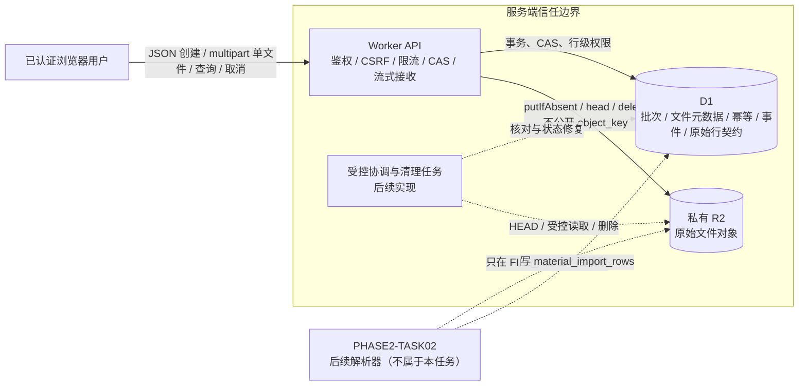
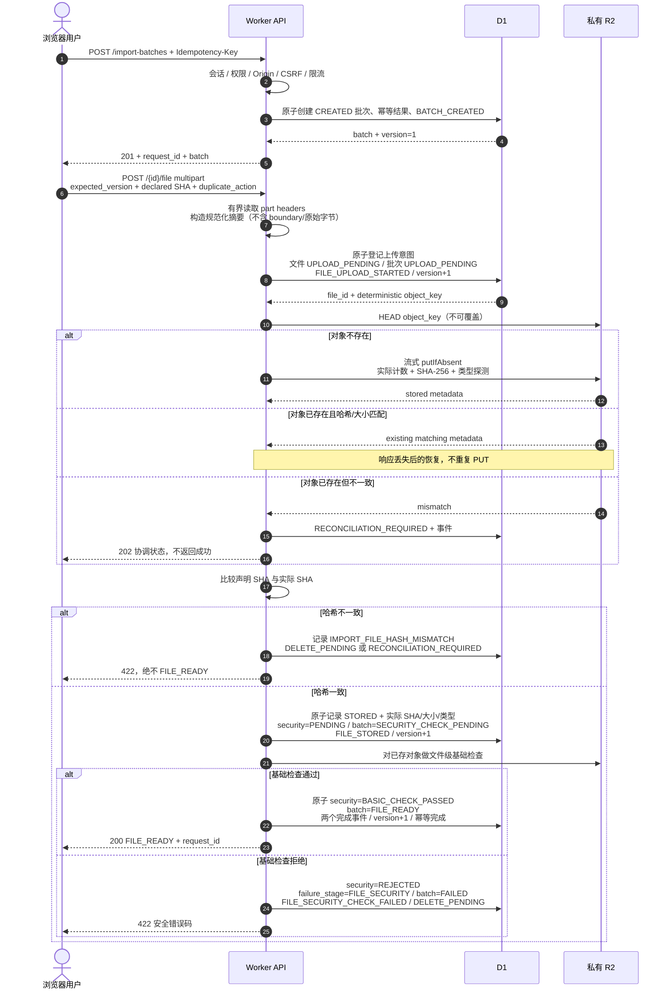
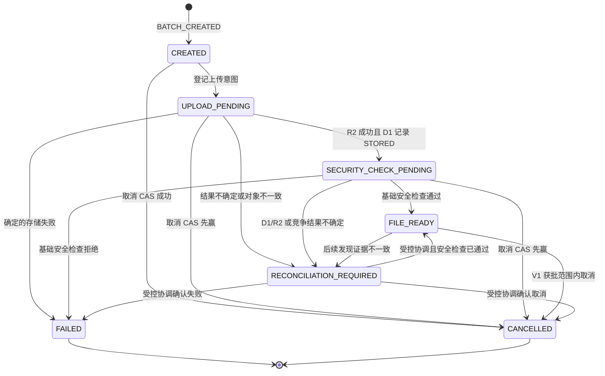
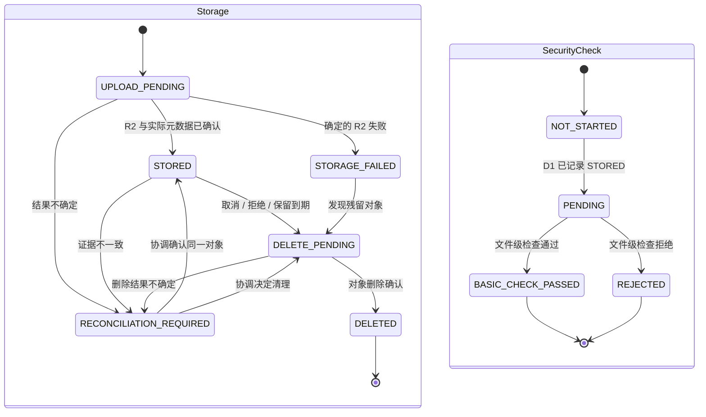
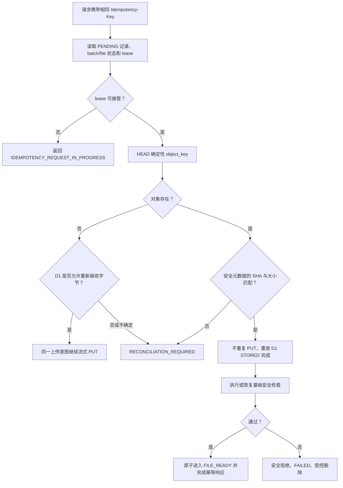
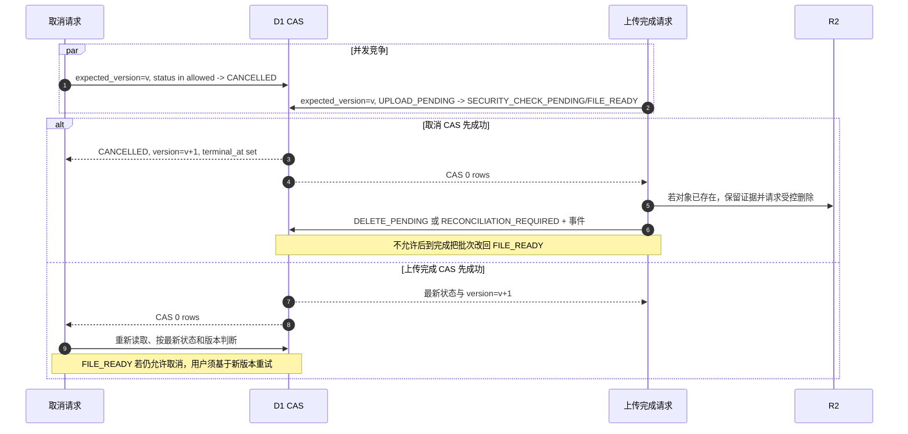
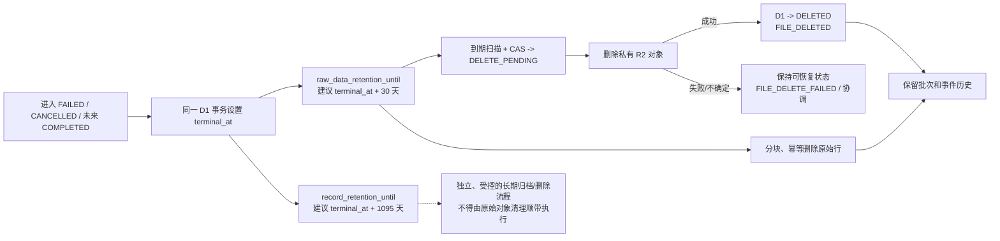

# Material Import Batch Foundation V1 数据流与状态图

- 任务编号：`PHASE2-TASK01`
- Status: `PROPOSED`
- 实施状态：未实施

本文件是 `material-import-batch-v1.md` 的图形化补充。图中所有组件、状态与迁移均为待审阅设计，不表示仓库已经具备 R2 或上传能力。

## 1. 组件与信任边界



约束：

- 浏览器永远不获取 R2 凭证、公开 URL 或可直接访问的 object key。
- D1 与 R2 没有分布式事务；虚线任务代表未来受控后台能力，不在本任务创建。
- 测试以可注入的内存/隔离对象存储替身代替 R2，不连接生产 binding。

## 2. 正常上传数据流



`R2 stored`、`D1 STORED` 与 `BASIC_CHECK_PASSED` 是不同事实。只有三者全部满足相关不变量，批次才可进入 `FILE_READY`。

## 3. 批次状态机



终态规则：

- `FAILED`、`CANCELLED` 进入时设置 `terminal_at`，以后不得恢复或清空。
- 失败重试创建新批次，并设置 `retry_of_batch_id`；旧批次保持不变。
- `CANCELLED` 不是“对象已删除”的同义词。
- `QUEUED_FOR_PARSING` 至 `COMPLETED` 等状态仅为路线图，不加入 V1 CHECK。

## 4. 文件双状态机



批次 `FILE_READY` 不变量：

```text
storage_status == STORED
AND security_check_status == BASIC_CHECK_PASSED
AND actual_sha256 IS NOT NULL
AND actual_size_bytes > 0
AND detected_file_type IN ('XLSX', 'CSV')
```

## 5. R2 成功、D1 完成失败的恢复



禁止行为：

- 看到同 key 就盲目重新 PUT。
- 对已存在、元数据不一致的 object key 执行覆盖。
- 因 D1 完成失败就把已经存储的对象当作永久丢失。
- 在安全检查未通过时通过协调直接进入 `FILE_READY`。

## 6. 取消与上传完成竞争



## 7. 终态、保留与清理



两个保留期限均为 `PROPOSED`；图示不代表已经配置生命周期规则或清理任务。

## 8. 实施前验证门槛

- 12 项决定逐项由用户选择，并收到统一回复“规格确认”。
- 另行审阅版本化 Migration、R2 环境隔离、binding 和生产创建计划。
- 使用脱敏 PCB/FPC/SMT 历史文件样本验证 10 MiB 上限、编码、ZIP 展开边界和解析成本。
- 使用隔离 D1 与对象存储替身覆盖全部 Saga、取消、孤立对象和清理故障。
- 任何生产 bucket、binding、密钥、迁移或部署都需要新的显式授权。
