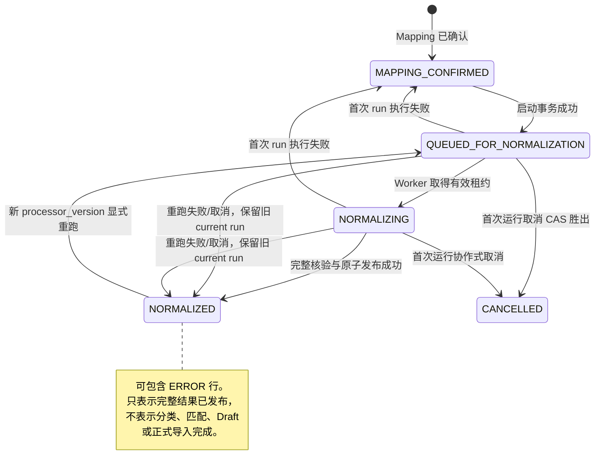
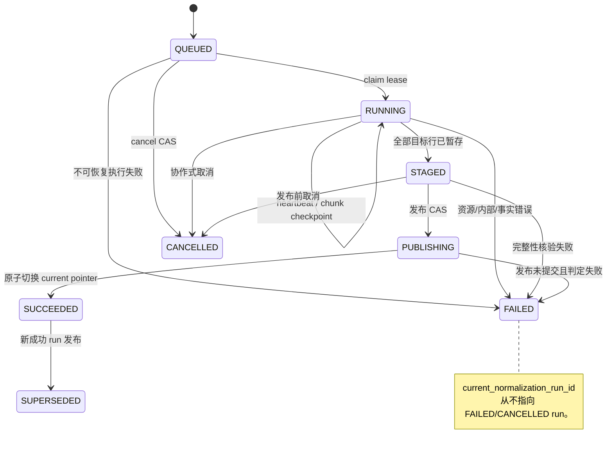
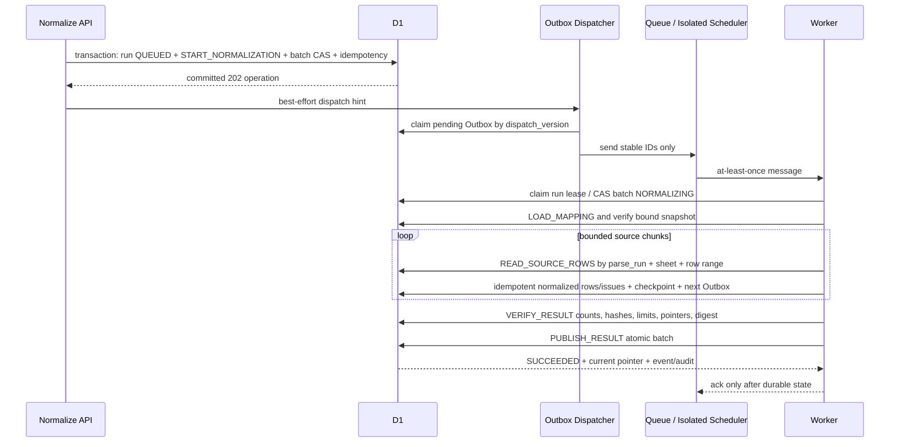
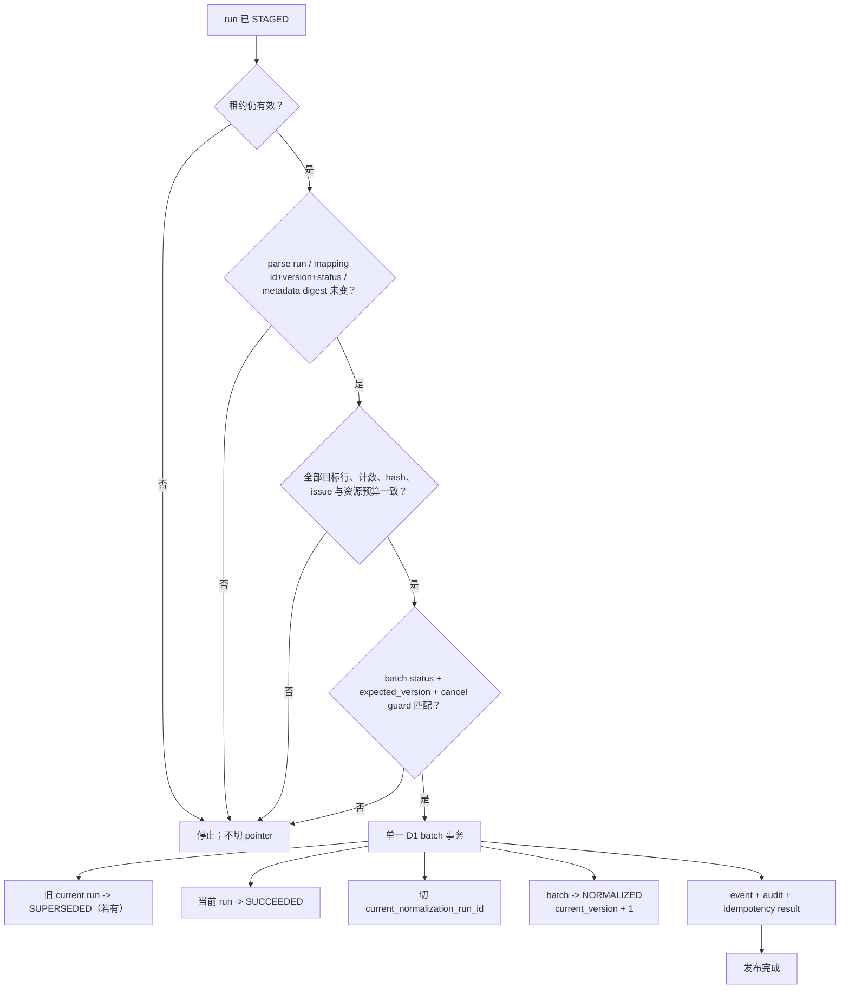

# Material Import Normalization V1 数据流与状态图

> 任务：`PHASE3-TASK02`
> 状态：`APPROVED / IMPLEMENTED (NON-PRODUCTION)`；对应运行时、`0006` 与隔离测试，不代表生产已迁移或部署。

## 1. 端到端数据流

```mermaid
flowchart LR
    U["有 normalize 能力的操作者"] -->|"POST normalize\nexpected_version + processor_version\nIdempotency-Key + CSRF"| API["Normalization API"]
    API --> AUTH["认证、能力、行级可见性、限流"]
    AUTH --> SNAP["锁定事实快照\nbatch/current parse run\nconfirmed mapping/version\nmetadata digest"]
    SNAP --> TX1["D1 启动事务\ncreate normalization run\nwrite Outbox/event/audit/idempotency\nCAS batch"]
    TX1 --> DISP["可注入 Outbox dispatcher"]
    DISP --> Q["Queue 或隔离调度器\nat-least-once"]
    Q --> W["Normalization worker\n租约 + heartbeat + CAS"]

    MAP[("material_import_mappings\n+ mapping_items")] --> W
    RAW[("current material_import_rows\n不可变原始 cell")] --> W
    META[("Mapping Target Registry\nMetadata Snapshot") ] --> W

    W --> STAGE[("run-scoped normalized_rows\nrun-scoped issues\n处理中隔离")]
    STAGE --> VERIFY["完整性与资源核验\n行数/计数/hash/pointers/digest/lease"]
    VERIFY -->|"失败、取消或事实漂移"| KEEP["run FAILED/CANCELLED\n不切 current pointer"]
    VERIFY -->|"全部通过"| TX2["D1 原子发布事务"]
    TX2 --> CUR[("batch.current_normalization_run_id\n指向 SUCCEEDED run")]
    TX2 --> EVT[("业务事件 + API/系统审计\n幂等结果")]
    CUR --> GET["GET summary / rows / row detail / issues\n只读 current published run"]

    GET -.-> FUTURE["后续分类、匹配、Draft 任务\n本任务不实施"]
```

## 2. 批次状态机



批次不新增 `NORMALIZATION_FAILED`。执行失败属于 normalization run；行级业务错误属于 normalized row。这样不会把可重试执行故障误当作批次终态 `FAILED`，也不会触发错误的清理/保留语义。

## 3. Normalization run 状态机



## 4. 持久阶段与 Outbox



逻辑阶段为 `LOAD_MAPPING`、`READ_SOURCE_ROWS`、`NORMALIZE_ROWS`、`VERIFY_RESULT`、`PUBLISH_RESULT`。Outbox job type 可以合并读行与规范化为 `NORMALIZE_ROW_CHUNK`；run 的 `current_stage` 仍保存业务阶段。一个逻辑 100 行块不等于单条 100 行 INSERT，实际语句必须按 D1 绑定参数和字节预算拆分。

## 5. 原子发布边界



事务中的任一步失败时全部回滚。处理中的 run-scoped 行与 issue 可以保留供安全诊断/重试或由受控清理删除，但公共查询永远不会把它们当成 current 结果。

## 6. 取消竞争

```mermaid
sequenceDiagram
    participant U as User
    participant API as Cancel API
    participant DB as D1
    participant W as Worker

    par cancel
        U->>API: cancel + expected_version + idempotency
        API->>DB: CAS batch/run and revoke lease
    and publish
        W->>DB: publish with lease + expected_version + all bindings
    end
    alt cancel CAS wins
        DB-->>API: CANCELLED or restore prior NORMALIZED
        DB-->>W: publish CAS fails
    else publish CAS wins
        DB-->>W: NORMALIZED committed
        DB-->>API: state conflict; no false cancellation
    end
```

取消是协作式的：不能承诺立即终止正在运行的 isolate 或已投递 Queue 消息。安全保证是取消 CAS 胜出后，旧租约和旧消息不能发布。

## 7. 下游边界

Normalization 输出是候选快照，不是物料主数据：

```text
normalized row
  -> future category proposal/confirmation
  -> future candidate matching/dedup review
  -> future Material Draft construction
  -> existing Material Validation with real category_id
  -> existing Draft/Review write service
```

任何后续阶段都必须保留 `normalization_run_id + normalized_row_id + payload_hash` lineage。不得把 `category_hint` 当 `category_id`，不得绕过 Material Validation、Draft/Review 或正式编码事务。
