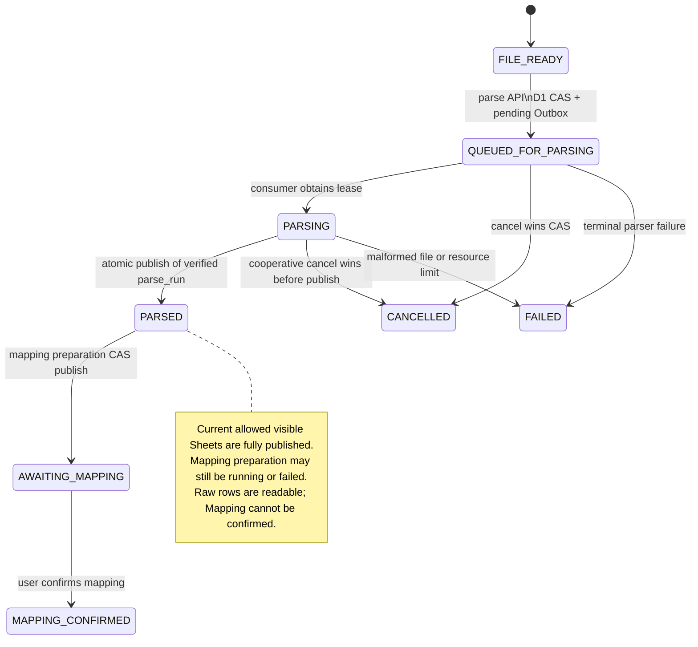
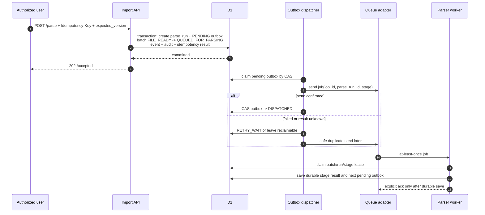
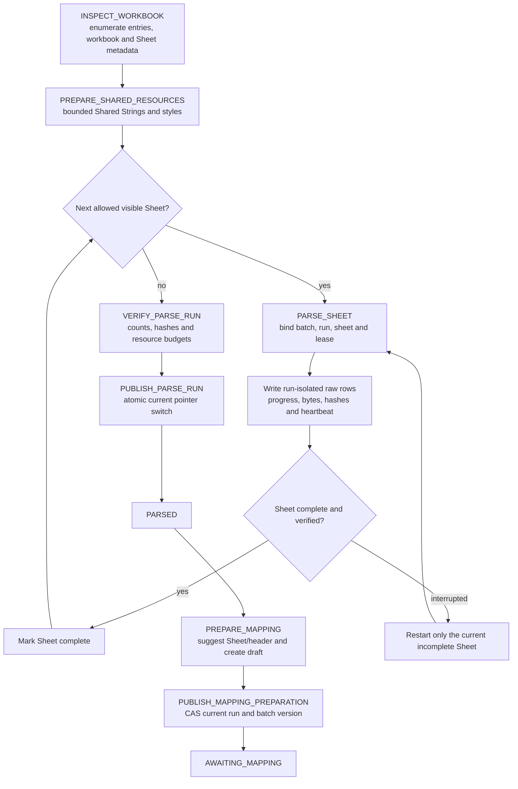
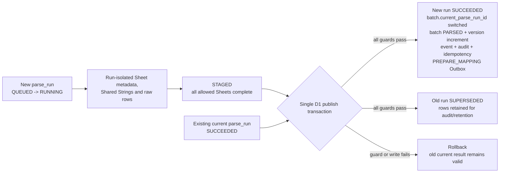
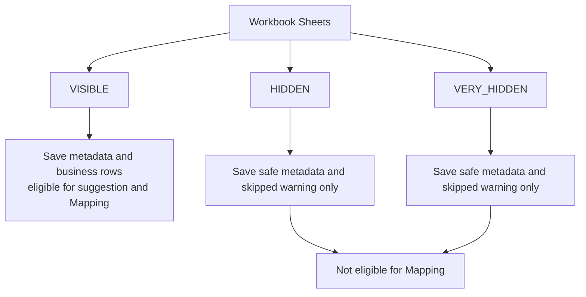
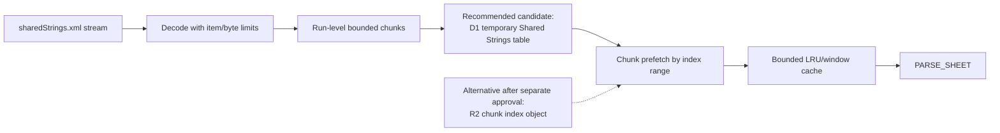
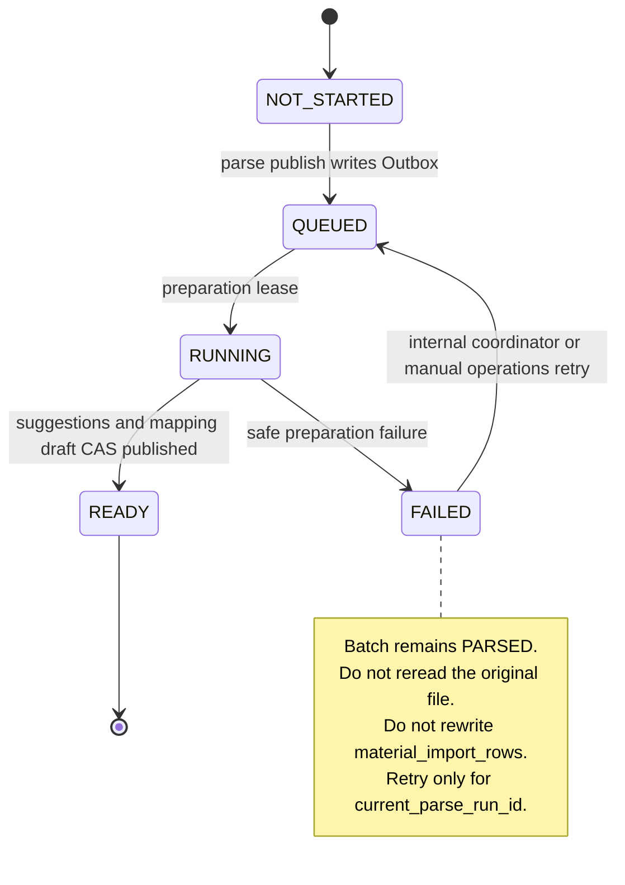
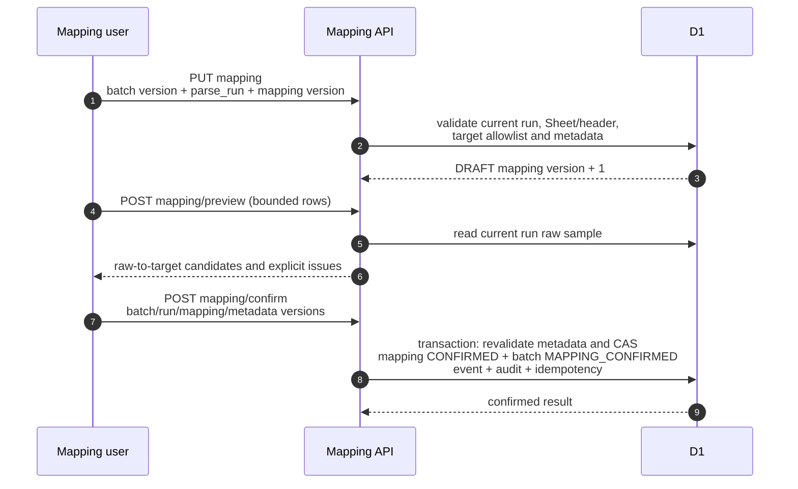
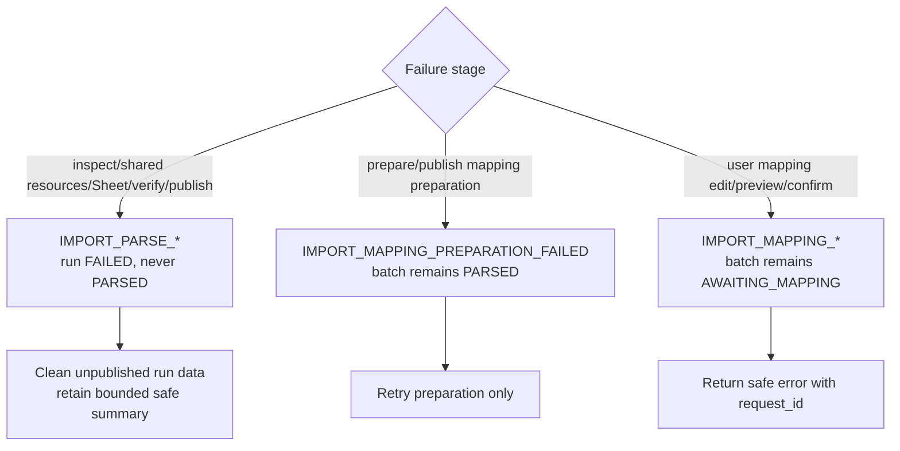
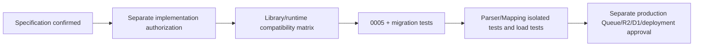

# Material Import Parser 与 Mapping V1 流程图

状态：`APPROVED / PHASE2-TASK04 IMPLEMENTED IN NON-PRODUCTION`

业务与资源决定：`Status: APPROVED`

本图是 `PHASE2-TASK04` 非生产实施契约；生产 Queue、binding、migration 和部署仍未授权。

## 1. 业务状态

## 2. D1、Outbox 与 Queue 边界

不存在“D1 创建 run 与 Queue 发送原子完成”的分布式事务。发送结果未知时允许重复消息，消费者以 `job_id + parse_run_id + stage` 幂等吸收。

## 3. Parser 持久阶段

每 500 行或约 10 秒保存的是观测、预算、心跳和幂等写入进度，不是可序列化 SAX/ZIP 游标。任务中断时从头重跑当前未完成 Sheet；已完成 Sheet 不重写。

## 4. 原始行隔离与发布

发布事务核验允许的可见 Sheet、行数、哈希、总规范化字节、总解码文本、Shared Strings、warning/error 预算、租约、批次状态与版本。失败 run 不切换 current pointer，也不得删除已成功发布的旧 run。

## 5. 隐藏 Sheet 与 PARSED 范围

`PARSED` 汇总分别记录 workbook、visible、hidden、very-hidden、parsed、skipped Sheet 数以及 parsed rows 和 skipped warnings。

## 6. Shared Strings 有界读取

禁止为每个单元格单独查询 D1，也禁止默认将 200,000 项全部作为 JavaScript 字符串常驻内存。

## 7. Mapping 准备失败与恢复

`PUBLISH_MAPPING_PREPARATION` 只有在 `parse_run_id == batch.current_parse_run_id` 且批次版本匹配时才能把批次推进到 `AWAITING_MAPPING`。

## 8. Mapping 编辑、确认与重新解析

新 parse run 只允许从 `PARSED` 或 `AWAITING_MAPPING` 的后续显式操作开始。新 run 发布后，旧 Mapping 转 `STALE` 或 `SUPERSEDED` 并保留审计；历史 Mapping 和其绑定旧 run 的预览能力只供受控审计 Repository/运维使用，V1 不新增公开历史枚举端点。`MAPPING_CONFIRMED` 在 V1 禁止重新解析。

## 9. 失败分类

所有错误响应都必须截断并脱敏，不包含堆栈、SQL、ZIP/XML 内部路径、对象凭证、Token、完整公式或恶意单元格内容。

## 10. 实施与生产门禁

`PHASE2-TASK04` 已完成到隔离 Parser/Mapping 测试节点；生产 Queue/R2/D1 migration 和部署审批节点未开始。
