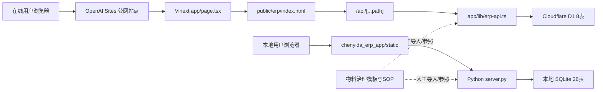
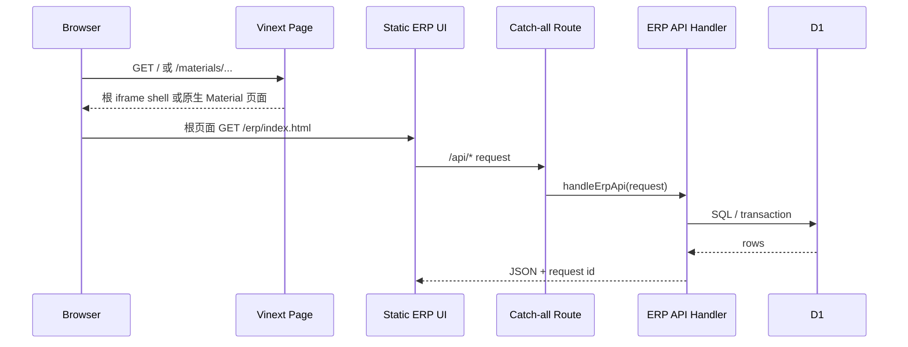
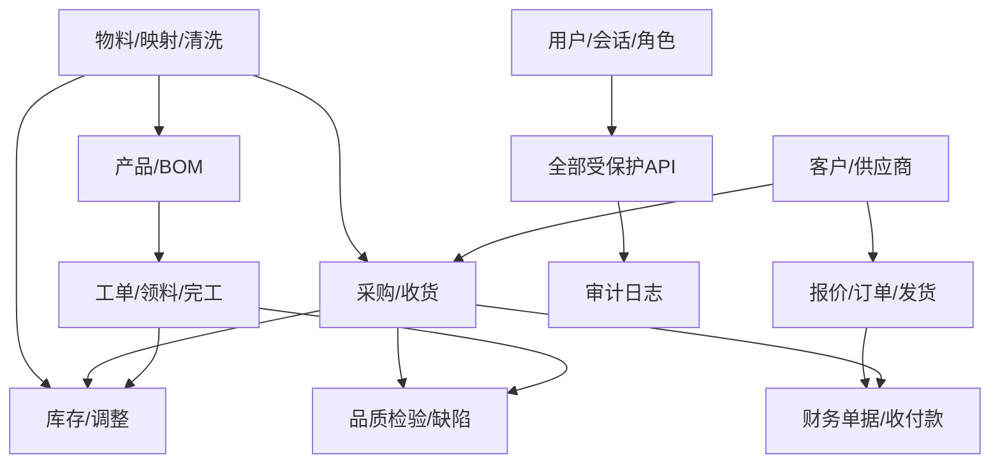
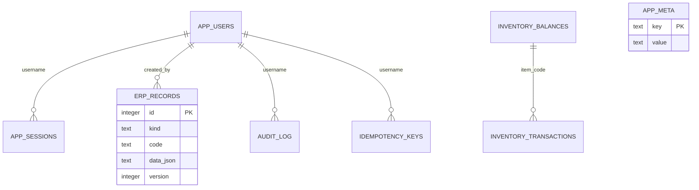
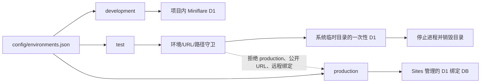
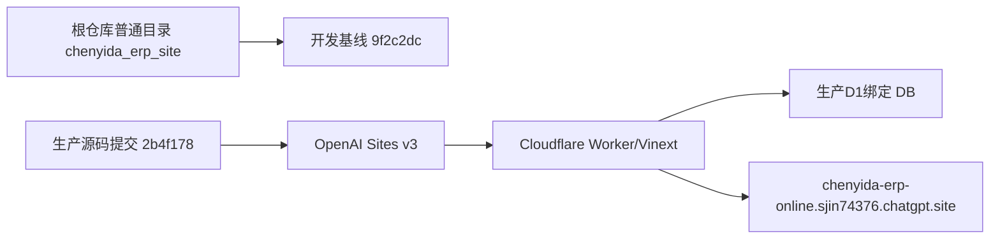

# 晨亿达ERP当前架构

本文只描述 2026-07-11 从当前代码、Git 和 Sites 状态核验到的事实；V2 目标架构参见 `docs/material-master/phased-implementation-plan.md`。

## 系统架构图



本地 ERP 与在线 Site 当前没有代码级共享服务或数据库同步层。两者各自实现接口和业务规则。

## 仓库与源码结构

```text
D:/erp
├── chenyida_erp_app/       本地 Python ERP，普通根仓库目录
├── chenyida_erp_site/      在线 Site，普通根仓库目录
├── 物料主数据治理落地包/   模板、规则、SOP、工具和生成物
├── docs/                   审计、V2 计划、项目管理文档
├── README.md
└── AGENTS.md
```

`PHASE0-TASK01-B` 已把原来指向 `9f2c2dc`、且没有 `.gitmodules` 的 gitlink 转换为 77 个普通跟踪文件。当前生产 Site `v3` 对应提交 `2b4f178`，纳管前开发 Site 为 `9f2c2dc`；两者的运行时代码一致。根仓库新克隆现在可以直接恢复两个应用，无需初始化子模块。

## 在线 Site 请求路径



- `app/page.tsx` 保留根页面 iframe；`app/materials/` 新增列表、详情、版本和变更日志四条原生只读路由。
- `app/api/[...path]/route.ts` 是统一 API 路由入口。
- `app/lib/erp-api.ts` 继续处理 legacy 认证和业务；`/api/material-master/*` 在默认权限回退前进入独立 `app/lib/material-api/`，复用同一会话并调用现有 Material Validation/Draft/Review 服务。
- 代码中识别到 54 个具体 `/api/...` 路径；多种 CRUD 由同一路径按 HTTP 方法区分。

## 模块关系



上述关系由 API 处理逻辑和业务字段实现，当前在线模型并非全部通过数据库外键强制。

## 数据库关系

### 在线 D1



图中的连线表达代码层引用；当前 Drizzle schema 没有声明外键。`erp_records(kind, code)` 有唯一索引，库存余额以 `item_code` 为主键。

### 本地 SQLite

本地 26 张表按领域分为：

- 身份与审计：`app_users`、`app_sessions`、`activity_log`
- 物料治理：`items`、`supplier_mappings`、`cleaning_rows`
- 主数据与工程：`customers`、`suppliers`、`products`、`product_boms`、`bom_lines`
- 采购与库存：`purchase_orders`、`purchase_order_lines`、`inventory_balances`、`inventory_transactions`、`inventory_adjustments`
- 生产：`work_orders`、`work_order_materials`、`production_reports`
- 销售：`quotations`、`sales_orders`、`shipments`
- 品质与财务：`quality_inspections`、`quality_defects`、`financial_documents`、`financial_payments`

表间关系主要由服务端代码和文本/整数引用维护，当前建表语句未声明外键。

## Backend 与 Frontend

当前命名与目标目录尚未统一：

- Backend（服务器默认交付面）：`chenyida_erp_app/server.py` 同时承担 HTTP、API、业务规则、建表和数据库访问，默认监听 `127.0.0.1:18888`。
- Frontend（本地运行面）：`chenyida_erp_app/static/` 原生页面直接调用本地 API。
- Backend（历史在线参考面）：`chenyida_erp_site/app/lib/erp-api.ts` 与 Worker/D1；后续新功能不以该运行面作为默认交付目标。
- Frontend（在线运行面）：根 legacy 使用 `app/page.tsx` + `public/erp/`；Material 只读页面使用 `app/materials/`，两者共同委托 `public/erp/api-client.js`。

在线与本地前端文件存在复制关系，不是共享构建产物。后续源码结构任务只能搬迁和修复路径，不得借机改业务行为。

## 环境与测试隔离



- `development`、`test`、`production` 的数据库、API、Site、日志级别和调试模式由统一非敏感清单描述。
- 测试运行器在网络请求前要求 `ERP_ENV=test`、HTTP 回环目标和系统临时 D1 路径；Vite 本地 Cloudflare 插件设置 `remoteBindings: false`。
- 测试成功或失败都销毁 D1；失败日志去敏且不保存请求/响应正文或数据库文件。
- 本地 Python 测试通过临时 `CYD_ERP_DATA_DIR` 和 `CYD_ERP_DB` 隔离 SQLite 与备份。
- 远程 Test D1 尚未创建，未来必须使用独立资源、权限、凭证、保留期和明确测试主机允许列表。

## 部署结构



- `.openai/hosting.json` 绑定现有 Sites 项目和逻辑 D1 名称 `DB`。
- Site 当前为公开访问、状态 active、版本 v3。
- `2b4f178` 是 `9f2c2dc` 的祖先；源码纳管提交保留这条历史关系，但没有创建新生产版本。
- `PHASE0-TASK01-B` 和 `PHASE0-TASK02` 均没有保存新生产版本、修改访问策略或部署生产。

## 已知架构债务

1. 两套运行面存在重复业务逻辑和不同数据库模型。
2. legacy 在线单文件 API 处理器职责仍然过多；Material namespace 已建立独立边界，但其他领域尚未拆分。
3. 在线业务主体为 JSON，缺少 V2 所需关系约束。
4. schema、迁移和运行时建表同时存在，需建立单一迁移权威。
5. 本地数据库缺少迁移历史和外键。
