# 晨亿达ERP当前架构

本文主体保留 2026-07-11 的历史架构快照，不再代表当前发布状态。2026-07-24 起，运行面、版本、migration、部署和回退的当前权威记录为 `MASTER.md`、`PROJECT_CONTEXT.md` 与 `RELEASES.md`：Python/SQLite 是实际常驻开发运行面，Sites/D1 是历史运行面，Node/PostgreSQL 是尚未生产部署的未来唯一生产方向。

## 2026-07-27 工序 IPQC 质量门禁与受控 WIP 放行边界

`SELFHOST-PHASE5-TASK04` 不增加第二套 Quality 或 WIP。Routing Operation 的 `quality_gate_mode` 只允许 `NONE/IPQC`，进入发布 digest 并固化到 Work Order Snapshot Operation。IPQC 工序的 Run Report good 先全部进入 Quality Hold；既有 Quality Service 显式建立稳定 `production_operation_run_report_id` Inspection，经 Result、异人 Disposition 与 Close 后，`CLOSED/RELEASED` 数量才成为下游可消费额度。


```mermaid
flowchart LR
    R[Released Routing Operation IPQC] --> S[Work Order Snapshot Operation]
    S --> G[Run Report good 4 / 6]
    G --> H[Quality Hold 10]
    H -->|quality explicit Inspection| I[Stable Run Report IPQC 4 / 6]
    I -->|Result + Disposition + Close| L[Released 4 / 6]
    L -->|exact Run Input Allocation| N[Next Snapshot Operation]
    N --> F[TASK03 Final Output / Report / Completion]
    F --> B[Finished Goods Balance 10]
```

`0028` 的互斥来源、同工单/同快照外键校验、numeric 上限、不可变 guard 与 deferred reconciliation 阻止非 IPQC 伪造、跨来源、inspected/released 超量和绕过投影放行。下游已消费后禁止 reopen 或减少放行；存在 IPQC 后禁止来源 Run 冲销。NONE 工序继续使用 TASK02/TASK03 原 good 直通规则，历史 `production_report_id` IPQC 不改写。

## 2026-07-27 末工序稳定产出到正式报工与成品入库边界

`SELFHOST-PHASE5-TASK03` 在 TASK02 的 Snapshot Operation/Run/Run Report/WIP 与 TASK07 的 Production Report/Completion/Inventory 之间只增加稳定 `production_report_operation_allocations`。结构化 Work Order 的服务端以最后 Snapshot Operation 的具体 Run Report good 为唯一最终报工来源；Report 字段由服务端生成，浏览器不提交 final-output 投影或自由工序/操作员字段。无 Routing Snapshot 的历史工单继续走清晰标记的兼容路径。

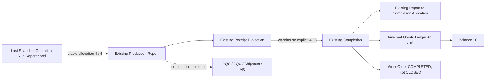
```mermaid
flowchart LR
    S[Last Snapshot Operation Run Report good] -->|stable allocation 4 / 6| R[Existing Production Report]
    R --> P[Existing Receipt Projection]
    P -->|warehouse explicit 4 / 6| C[Existing Completion]
    C --> A[Existing Report to Completion Allocation]
    C --> L[Finished Goods Ledger +4 / +6]
    L --> B[Balance 10]
    C --> W[Work Order COMPLETED, not CLOSED]
    R -. no automatic creation .-> Q[IPQC / FQC / Shipment / AR]
```

`0027` 的外键、numeric、唯一索引、不可变 trigger 和 deferred reconciliation 同时核对同工单、末工序、有效来源、来源累计量、Report 数量与 WIP 投影；应用事务再叠加权限、CSRF、正文/速率限制、幂等、CAS 和稳定锁顺序。Report 无下游时追加冲销恢复 final output；已有 Completion 时禁止，Run 被有效 Report 消费后同样禁止冲销。最终报工本身不写 MAIN 库存，只有显式 warehouse Completion 复用 Inventory Service 入库。

## 2026-07-26 FQC 放行到发货与应收交接边界

`SELFHOST-PHASE4-TASK10` 继续复用唯一 Finance Document/Settlement/Reversal 权威，以 expand-only `0024` 保存 Sales/Purchase Financial Source 行到 Business Project 或 `UNATTRIBUTED` 的不可变归属。来源行数量、单价、金额、Project 与 digest 均由服务端沿稳定外键链计算，浏览器不能提交 Project 或分配金额；项目查询只按 Currency 分组，不做跨币种汇总。

`net_cash` 只等于实际客户收款减供应商付款；`transaction_contribution` 只等于销售来源减采购来源。二者均不是会计利润，未包含人工、制造/公司费用、税、折旧、汇率或库存成本。`account_name` 只是内部记账标签，不表示银行连接或余额核验。

`SELFHOST-PHASE4-TASK09` 在既有 Sales 权威内增加 Delivery Instruction 编排，以 expand-only `0023` 保存指令/行/事件、执行行和 Shipment Line→FQC Release Allocation；不复制 SO、Shipment、Inventory Ledger/Balance、Sales Financial Source 或 Finance Document。指令只占用订单未发量和 FQC 可发额度，不产生下游事实。

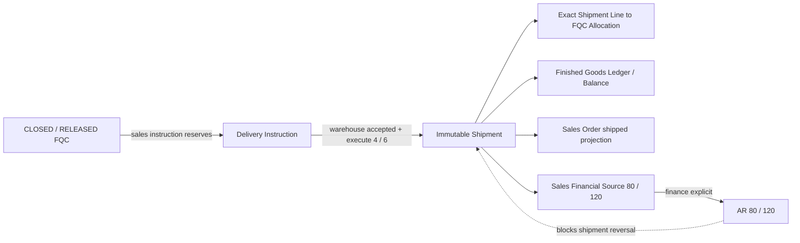
```mermaid
flowchart LR
    F[CLOSED / RELEASED FQC] -->|sales instruction reserves| D[Delivery Instruction]
    D -->|warehouse accepted + execute 4 / 6| S[Immutable Shipment]
    S --> A[Exact Shipment Line to FQC Allocation]
    S --> I[Finished Goods Ledger / Balance]
    S --> O[Sales Order shipped projection]
    S --> X[Sales Financial Source 80 / 120]
    X -->|finance explicit| AR[AR 80 / 120]
    AR -. blocks shipment reversal .-> S
```

warehouse 执行时以稳定锁顺序在同一 PostgreSQL 事务核对 Instruction、SO/Line、FQC 和库存，随后提交 Shipment/FQC/Inventory/SO/Instruction/Source/Event/Audit/Idempotency。FQC 净消费支持多来源拼批和单来源跨批，数据库 guard 防止超 released 或 reopen；无 AR 的全额 Shipment 冲销恢复原分配和全部投影，有 AR 时 fail closed。AR 由既有 Finance Service 显式创建，本层不执行 Settlement、收款、银行、总账、税票或收入确认。

## 2026-07-26 定标到收货与应付交接边界

`procurement-fulfillment-selfhost` 只做跨既有服务的事务编排：采购显式把有效 Award 按 Supplier/Currency 确定性转为 PO，关系表固定 Award Line→PO Line；到货计划与待入库记录不增加库存或创建应付；仓库收货在同一 PostgreSQL 事务内调用既有 Procurement Receipt/Inventory Ledger/Balance/Financial Source；财务仍通过既有 Finance Service 显式消费来源生成 AP。

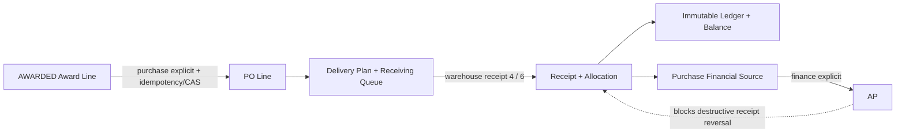
```mermaid
flowchart LR
    A[AWARDED Award Line] -->|purchase explicit + idempotency/CAS| P[PO Line]
    P --> D[Delivery Plan + Receiving Queue]
    D -->|warehouse receipt 4 / 6| R[Receipt + Allocation]
    R --> I[Immutable Ledger + Balance]
    R --> S[Purchase Financial Source]
    S -->|finance explicit| AP[AP]
    AP -. blocks destructive receipt reversal .-> R
```

`0019` 只新增来源/计划/队列/分配/事件关系，不复制 PO、Receipt、Ledger、Balance、Financial Source 或 AP 权威表。服务端权限、持久幂等、行锁、CAS、数据库 guard、状态事件和 Audit 共同 fail closed；已过账事实只能使用既有冲销，已有 AP 时阻止破坏来源。TASK05 并行运行面基线为 alpha.19/`0001—0019`，验收数据已恢复清空。

`SELFHOST-PHASE4-TASK06` 新增独立 `production-handoff-selfhost` 编排边界和 expand-only `0020`。交接表只固化当前 ACCEPTED Planning Package 来源、版本/事件及 Handoff Item→既有 Work Order 唯一链接；不复制 `production_work_orders`、BOM Snapshot、Material Requirement、Material Issue/Return、Inventory Ledger/Balance。释放工单在既有 Production 事务中锁定来源和库存，以 PostgreSQL `numeric(24,6)` 计算需求和 `on_hand-reserved-frozen`，写 Reservation/Event 来源事实后更新 Balance。仓库领退料继续调用既有 Inventory Service，并在同一事务消费或恢复预留。

`SELFHOST-PHASE4-TASK07` 继续复用既有 Production/Inventory 权威，expand-only `0021` 只增加 Report→Completion Allocation、Report/Completion reversal、事件和投影/version guard。Report 的累计量受 BOM Snapshot 与净领料共同支持量约束且不写库存；warehouse Completion 必须消费 Report 未分配 good，并在同一事务写既有 Completion/Line、成品 Ledger/Balance、Work Order 状态、事件、审计和幂等。Report/Completion 更正均为追加式全额冲销，下游 IPQC/FQC/Shipment 或库存不足时 fail closed，不创建品质、销售或财务事实。

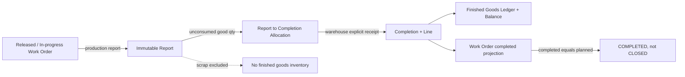
```mermaid
flowchart LR
    W[Released / In-progress Work Order] -->|production report| R[Immutable Report]
    R -->|unconsumed good qty| A[Report to Completion Allocation]
    A -->|warehouse explicit receipt| C[Completion + Line]
    C --> L[Finished Goods Ledger + Balance]
    C --> P[Work Order completed projection]
    P -->|completed equals planned| D[COMPLETED, not CLOSED]
    R -. scrap excluded .-> X[No finished goods inventory]
```

## 2026-07-26 计划物料需求到采购申请交接边界

`SELFHOST-PHASE4-TASK03` 新增独立 `material-requirement-selfhost` 边界。计划只能消费项目最新 `ACCEPTED` Planning Package 的固化 Material/Unit/BOM gross 快照；浏览器和 Node 不用 JavaScript 浮点数作最终数量判断，PostgreSQL `numeric(24,6)` 在 SUBMIT 锁定事务内聚合并重算。

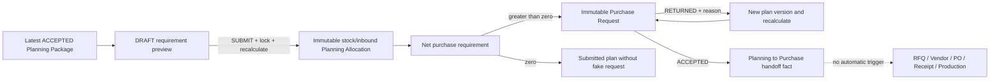
```mermaid
flowchart LR
    P[Latest ACCEPTED Planning Package] --> D[DRAFT requirement preview]
    D -->|SUBMIT + lock + recalculate| A[Immutable stock/inbound Planning Allocation]
    A --> N[Net purchase requirement]
    N -->|greater than zero| R[Immutable Purchase Request]
    N -->|zero| Z[Submitted plan without fake request]
    R -->|RETURNED + reason| V[New plan version and recalculate]
    V --> R
    R -->|ACCEPTED| H[Planning to Purchase handoff fact]
    H -. no automatic trigger .-> X[RFQ / Vendor / PO / Receipt / Production]
```

`0017` 六表保存需求计划/行、库存或 PO Line 分配、采购申请/行和事件。有效分配只来自 `SUBMITTED/ACCEPTED` 计划，采购退回保留不可变历史但使旧分配不再参与扣减；正式 Inventory `reserved_qty` 不变。事务锁顺序复用 Inventory 物料键并锁住采购在途来源，其他计划不能重复占用同一库存或在途。

## 2026-07-25 项目到计划交接边界

`SELFHOST-PHASE4-TASK02` 新增独立 `planning-handoff-selfhost` 边界和正式 `planning` 角色。Project→Planning 不复用或改写 TASK01 MARKET→PROJECT 投影；Requirement Item 必须显式关联稳定 Product/Product Version/BOM Header/BOM Version，服务端验证客户关系、RELEASED 状态和 BOM 全行 Material/Unit 有效性。

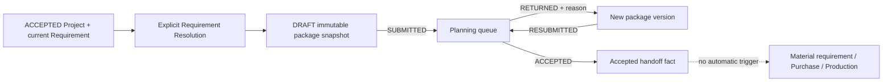
```mermaid
flowchart LR
    P[ACCEPTED Project + current Requirement] --> R[Explicit Requirement Resolution]
    R --> D[DRAFT immutable package snapshot]
    D -->|SUBMITTED| Q[Planning queue]
    Q -->|RETURNED + reason| V[New package version]
    V -->|RESUBMITTED| Q
    Q -->|ACCEPTED| A[Accepted handoff fact]
    A -. no automatic trigger .-> X[Material requirement / Purchase / Production]
```

`0016` 六表分别保存 Resolution、Package、Package Item、BOM Line Snapshot、受控 Document Link 和 immutable Event。Package Service 在单事务内执行行锁、CAS、numeric 毛数量、digest、Audit 与 Idempotency；数据库 trigger 阻止绕过服务修改包快照和事件。浏览器只负责交互，不读取库存、不推荐供应商、不创建下游单据。

## 2026-07-25 市场到项目交接边界

`SELFHOST-PHASE4-TASK01` 在现有 Node/PostgreSQL 权威边界中新增独立 `project-selfhost` 模块。Customer 和受控文件继续复用既有关系，Project Service 是状态转换唯一应用入口；浏览器页面只提交稳定 ID、业务输入、`expected_version`、CSRF 和 Idempotency-Key。

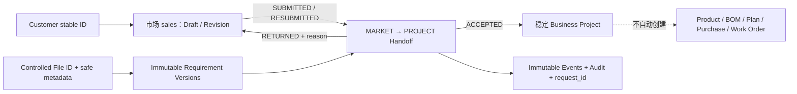
```mermaid
flowchart LR
    C[Customer stable ID] --> M[市场 sales：Draft / Revision]
    M -->|SUBMITTED / RESUBMITTED| H[MARKET → PROJECT Handoff]
    H -->|RETURNED + reason| M
    H -->|ACCEPTED| P[稳定 Business Project]
    R[Immutable Requirement Versions] --> H
    F[Controlled File ID + safe metadata] --> R
    H --> E[Immutable Events + Audit + request_id]
    P -. 不自动创建 .-> X[Product / BOM / Plan / Purchase / Work Order]
```

六张 `0015` 表区分稳定 Project、不可变需求内容、关系化明细、受控文件链接、当前 Handoff 投影和不可变 Event。队列由 `(to_department,status,submitted_at,id)` 索引支撑；Project/Handoff 使用行锁与 CAS，并发接收只能提交一次。该层不复制 Identity、Customer、FileStorage、Idempotency 或 Audit 逻辑，也不改 Python/SQLite 和历史 D1。

## 2026-07-25 同机并行 HTTP 验收运行面

`SELFHOST-PHASE3-TASK05` 首次把 Node/PostgreSQL 基线作为持久的非生产空环境与 Python/SQLite 同机并行运行。Compose 项目固定为 `chenyida-erp-parallel`，只启动 PostgreSQL 17、migrate、Web 和 Worker；Caddy/production profile 不启动。Web 宿主绑定为 `127.0.0.1:3000`，PostgreSQL 只在 Compose 网络暴露 5432，用户经 SSH 隧道访问。

`SELFHOST-PHASE4-TASK01`—`TASK05` 已依次把该环境升级至 alpha.19/`0019`。TASK05 在恢复点保护下完成 Award→PO→到货→分批收货→库存→来源→AP、整体重启与新空库恢复，再恢复为保留 19 个 migration/唯一管理员的空业务状态；网络与 production profile 边界不变。

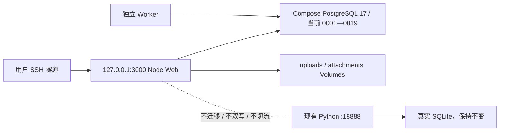
```mermaid
flowchart LR
    SSH["用户 SSH 隧道"] --> WEB["127.0.0.1:3000 Node Web"]
    WEB --> PG["Compose PostgreSQL 17 / 当前 0001—0019"]
    WORKER["独立 Worker"] --> PG
    WEB --> FILES["uploads / attachments Volumes"]
    PY["现有 Python :18888"] --> SQLITE["真实 SQLite，保持不变"]
    WEB -. "不迁移 / 不双写 / 不切流" .- PY
```

环境使用 `ERP_ENV=development` 以支持本机明文 HTTP Cookie，但只允许回环访问并明确标记 `PARALLEL HTTP ACCEPTANCE ONLY`；production Secure Cookie 规则未修改。四个项目隔离 Volume 保存 PostgreSQL、uploads、attachments 和 backup-status。管理员临时凭据与长期 Compose 配置分离，setup token 在初始化后轮换。

部署重启暴露 PostgreSQL 空闲连接 `57P01` 可触发 Worker 未捕获异常；TASK05 在共享 Pool 增加只记录安全 code 的 error handler，并使 Worker 外层轮询对短暂基础设施错误按现有 poll interval 重试。业务 Job 内部租约、幂等和失败状态机不变，PostgreSQL migration 和业务 schema 不变。

## 2026-07-25 本机 SQLite 只读盘点边界

`SELFHOST-PHASE3-TASK04` 为迁移 CLI 新增与 synthetic/production 模式分离的 `REAL_READONLY_INVENTORY`。入口在任何业务行读取前同时校验显式 flag、确认文字、snapshot manifest/SHA、Git commit、tool version、`--no-materialize`、`--no-files`、临时目录权限和无 target URL。它仅能读 SQLite official online backup 产生的获准临时快照，不创建 target adapter、staging、public 记录、Opening 或文件副本。

源以 URI `mode=ro` + `query_only` 打开，快照以 SHA-256、Schema fingerprint 和 source path digest 绑定。快照内的聚合 planner 只执行 allowlist 计数、数量/金额汇总和已确认枚举分组；自由文本不做 `DISTINCT`。问题行只用不持久化 key 的 task-local HMAC opaque reference。临时快照、完整 JSON 报告和 key 在抽取允许聚合后删除。

该层没有修改 PostgreSQL `0001`—`0014`、`db/schema.ts`、Python 运行行为或业务 Service 状态机。它只提供本机源的脱敏证据，不是真实目标试迁移架构。

## 2026-07-25 合成 public 业务表物化与核对层

`SELFHOST-PHASE3-TASK03` 在 staging/Opening 之后增加仅 CLI 可达的 `materializer/`。它把通过验证的 cutover snapshot 按 Identity→Reference→Material→Party→Product/Mapping/BOM→Opening→File/Audit 顺序写入 public 权威关系表，同时在 `migration_tool.public_id_map` 保存 actual target ID、source/target digest、request/operation 和 checkpoint。来源历史活动只记录 `ARCHIVE_ONLY`，不与期初余额重复过账。

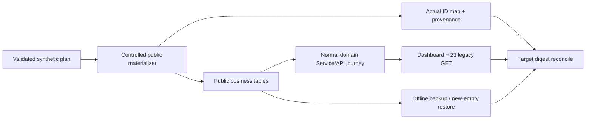
```mermaid
flowchart LR
    PLAN["Validated synthetic plan"] --> MAT["Controlled public materializer"]
    MAT --> PUBLIC["Public business tables"]
    MAT --> MAP["Actual ID map + provenance"]
    PUBLIC --> JOURNEY["Normal domain Service/API journey"]
    JOURNEY --> DASH["Dashboard + 23 legacy GET"]
    PUBLIC --> BACKUP["Offline backup / new-empty restore"]
    MAP --> REC["Target digest reconcile"]
    DASH --> REC
    BACKUP --> REC
```

每个聚合事务独立，code/引用/单位/有效期/文件或 digest 冲突 fail closed；不同 manifest 不能复用非空目标，同 manifest/run 可从 public ID map 与 checkpoint 恢复。Post-cutover 采购、生产、销售、品质和财务事实只由正常领域 Service/API 创建。该层不新增 HTTP migration route、不写 `erp_records`、不改变 `0001`—`0014` public schema，只证明完全合成物化与恢复。

## 2026-07-25 迁移期初受控物化层

`SELFHOST-PHASE3-TASK02` 在 TASK01 staging 之后增加显式、类型化的合成期初 command 和内部 `MigrationOpeningService`。服务只在 `ERP_ENV=test`、回环 `_migration_test`、已初始化迁移工具目标中运行；Web/API 不暴露期初写路由。`0014` 新增去正文的关系来源、库存/财务期初及冲销表，复用库存 Ledger/Balance 与财务 Document/Event/Settlement，不创建第二套余额。

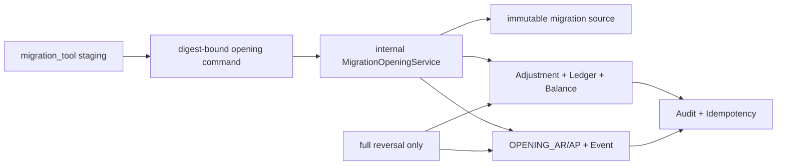
```mermaid
flowchart LR
    STAGE["migration_tool staging"] --> CMD["digest-bound opening command"]
    CMD --> SVC["internal MigrationOpeningService"]
    SVC --> SRC["immutable migration source"]
    SVC --> INV["Adjustment + Ledger + Balance"]
    SVC --> FIN["OPENING_AR/AP + Event"]
    INV --> AUDIT["Audit + Idempotency"]
    FIN --> AUDIT
    REV["full reversal only"] --> INV
    REV --> FIN
```

数据库 trigger 同时要求既有 Inventory/Finance Service GUC 与 migration-opening 内部 GUC；来源和过账事实 UPDATE/DELETE 永远拒绝。该层只在合成环境验证，真实数据与生产仍为 NO-GO。

## 2026-07-25 生产前合成迁移准备层

`SELFHOST-PHASE3-TASK01` 在 Web/API 启动路径之外新增显式 CLI。环境守卫先于任何 source read 或 target connect，SQLite/D1 export adapter 只接受临时目录与合成 marker；计划经 mapping registry、稳定 ID、checkpoint 和 manifest 进入回环 `_migration_test` PostgreSQL 的独立 `migration_tool` schema。dry-run 不写目标，synthetic commit 只写 staging，最终必须 Reconcile 才能成为 `RECONCILED`。

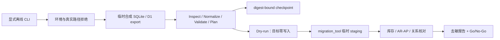
```mermaid
flowchart LR
    CLI["显式离线 CLI"] --> GUARD["环境与真实路径拒绝"]
    GUARD --> SRC["临时合成 SQLite / D1 export"]
    SRC --> PLAN["Inspect / Normalize / Validate / Plan"]
    PLAN --> CP["digest-bound checkpoint"]
    PLAN --> DRY["Dry-run：目标零写入"]
    DRY --> STAGE["migration_tool 临时 staging"]
    STAGE --> REC["库存 / AR-AP / 关系核对"]
    REC --> REPORT["去敏报告 + Go/No-Go"]
```

该层不接 Web API、不在启动时运行、不修改 `public` 业务 schema，也不迁移真实文件或账号。后续真实业务表物化必须按领域调用权威 Service/事务或新增经审批的迁移适配，不得把 staging 表变成第二套业务权威。

## 2026-07-25 自托管完整 ERP 迁移覆盖层

`SELFHOST-PHASE2-TASK01` 从源码确认 Python `AppHandler` 共 64 个 HTTP 操作（GET 34、POST 30），并在当时基线记录等价覆盖 4、部分覆盖 9、未覆盖 51。TASK02—TASK09 依次补齐身份、主数据/BOM、不可变库存、采购、生产、销售、品质和财务；TASK10 增加实时权限裁剪 Dashboard、离线备份恢复治理和原生根工作台。64 个操作和登录后 23 个 legacy GET 现在均有自托管实现或明确退役合同，但真实数据和生产切换尚未执行。

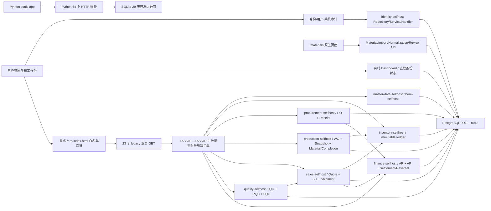
```mermaid
flowchart LR
    ROOT["自托管原生根工作台"] --> AUTH["身份/用户/系统审计"]
    ROOT --> DASH["实时 Dashboard / 去敏备份状态"]
    ROOT --> LEGACY["显式 /erp/index.html 白名单深链"]
    LEGACY --> BATCH["23 个 legacy 业务 GET"]
    BATCH --> M9["TASK03—TASK09 主数据至财务结算子集"]
    DASH --> PG

    NATIVE["/materials 原生页面"] --> MM["Material/Import/Normalization/Review API"]
    AUTH --> ID["identity-selfhost Repository/Service/Handler"]
    ID --> PG["PostgreSQL 0001—0013"]
    MM --> PG
    M9 --> MDB["master-data-selfhost / bom-selfhost"]
    MDB --> PG
    M9 --> INV["inventory-selfhost / immutable ledger"]
    INV --> PG
    M9 --> PROC["procurement-selfhost / PO + Receipt"]
    PROC --> PG
    M9 --> PROD["production-selfhost / WO + Snapshot + Material/Completion"]
    PROD --> INV
    PROD --> PG
    M9 --> SALES["sales-selfhost / Quote + SO + Shipment"]
    SALES --> INV
    SALES --> PG
    M9 --> QUALITY["quality-selfhost / IQC + IPQC + FQC"]
    QUALITY --> SALES
    QUALITY --> PG
    M9 --> FINANCE["finance-selfhost / AR + AP + Settlement/Reversal"]
    SALES --> FINANCE
    PROC --> FINANCE
    FINANCE --> PG

    PYUI["Python static app"] --> PYAPI["Python 64 个 HTTP 操作"]
    PYAPI --> SQLITE["SQLite 29 表开发运行面"]
```

根页面不再执行 legacy iframe 的 `refreshAll()`。显式 legacy 工作区仍可请求原有 23 个 GET；TASK03—TASK10 已提供实现或明确退役行为。`management-dashboard` 与备份治理状态已接通，但创建/恢复保持离线，真实数据仍未迁移，因此不能描述为已生产切换。

身份请求先进入 `identity-selfhost/handler.ts`，再由 Service 执行业务规则、Repository 执行 PostgreSQL 事务。非身份受保护请求在进入 Material/Import 模块前统一解析服务端 session actor 并执行 active/must-change 门禁；浏览器不能提交 permissions。会话只保存 token SHA-256 摘要，身份审计、限流和幂等均持久化到 PostgreSQL。

PostgreSQL 的 `erp_records(kind,code,data JSONB)` 只是历史兼容占位，不是未来各域关系模型；`0001` 的文本库存表也只作迁移证据。TASK04 Ledger/Balance 是库存数量权威；TASK05 PO/Receipt/Financial Source、TASK06 WO/Snapshot/Material/Report/Completion、TASK07 Quote/SO/Shipment/Financial Source、TASK08 Inspection/Result/Defect/Event 与 TASK09 Finance Document/Settlement/Event 均通过稳定外键和受控事务联动，不回写 legacy 表。TASK09 只覆盖稳定来源 AR/AP、单据级核销和全额冲销，不包含发票、税务、汇率、总账或银行接入。完整逐项清单见 `docs/audits/SELFHOST-PHASE2-TASK01-api-inventory.md`，依赖顺序见 `docs/self-hosting/full-erp-api-migration-plan.md`。

## 系统架构图

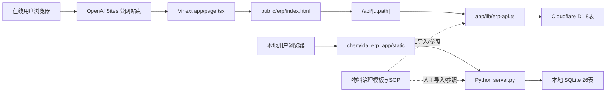
```mermaid
flowchart LR
    U1["本地用户浏览器"] --> LUI["chenyida_erp_app/static"]
    LUI --> PY["Python server.py"]
    PY --> SQL["本地 SQLite 26表"]

    U2["在线用户浏览器"] --> SITE["OpenAI Sites 公网站点"]
    SITE --> PAGE["Vinext app/page.tsx"]
    PAGE --> IFRAME["public/erp/index.html"]
    IFRAME --> API["/api/[...path]"]
    API --> HANDLER["app/lib/erp-api.ts"]
    HANDLER --> D1["Cloudflare D1 8表"]

    GOV["物料治理模板与SOP"] -. 人工导入/参照 .-> PY
    GOV -. 人工导入/参照 .-> HANDLER
```

本地 ERP 与在线 Site 当前没有代码级共享服务或数据库同步层。两者各自实现接口和业务规则。

## 仓库与源码结构

```text
D:/erp
├── chenyida_erp_app/       本地 Python ERP，普通根仓库目录
├── chenyida_erp_site/      在线 Site，普通根仓库目录
├── 物料主数据治理落地包/   模板、规则、SOP、工具和生成物
├── docs/                   审计、V2 计划、项目管理文档
├── README.md
└── AGENTS.md
```

`PHASE0-TASK01-B` 已把原来指向 `9f2c2dc`、且没有 `.gitmodules` 的 gitlink 转换为 77 个普通跟踪文件。当前生产 Site `v3` 对应提交 `2b4f178`，纳管前开发 Site 为 `9f2c2dc`；两者的运行时代码一致。根仓库新克隆现在可以直接恢复两个应用，无需初始化子模块。

## 在线 Site 请求路径

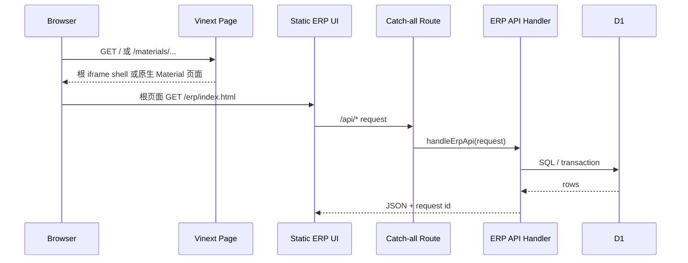
```mermaid
sequenceDiagram
    participant B as Browser
    participant P as Vinext Page
    participant S as Static ERP UI
    participant R as Catch-all Route
    participant H as ERP API Handler
    participant D as D1
    B->>P: GET / 或 /materials/...
    P-->>B: 根 iframe shell 或原生 Material 页面
    B->>S: 根页面 GET /erp/index.html
    S->>R: /api/* request
    R->>H: handleErpApi(request)
    H->>D: SQL / transaction
    D-->>H: rows
    H-->>S: JSON + request id
```

- `app/page.tsx` 保留根页面 iframe；`app/materials/` 新增列表、详情、版本和变更日志四条原生只读路由。
- `app/api/[...path]/route.ts` 是统一 API 路由入口。
- `app/lib/erp-api.ts` 继续处理 legacy 认证和业务；`/api/material-master/*` 在默认权限回退前进入独立 `app/lib/material-api/`，复用同一会话并调用现有 Material Validation/Draft/Review 服务。
- 代码中识别到 54 个具体 `/api/...` 路径；多种 CRUD 由同一路径按 HTTP 方法区分。

## 模块关系

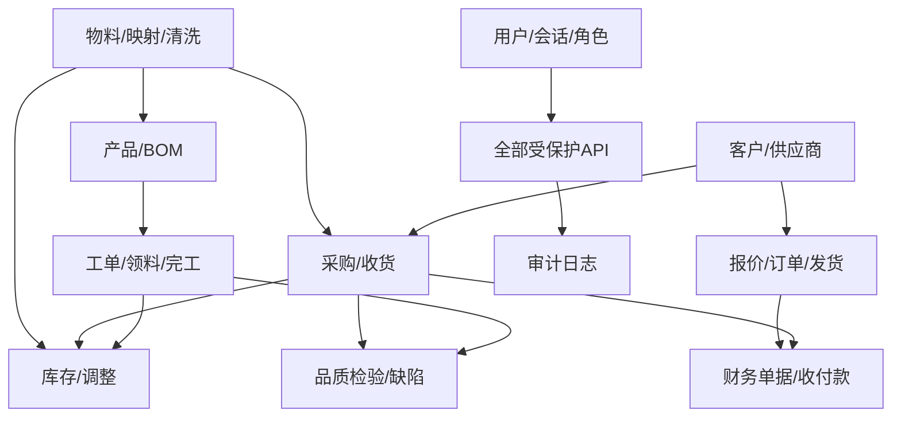
```mermaid
flowchart TB
    AUTH["用户/会话/角色"] --> ALL["全部受保护API"]
    MATERIAL["物料/映射/清洗"] --> BOM["产品/BOM"]
    MATERIAL --> PUR["采购/收货"]
    MATERIAL --> INV["库存/调整"]
    BOM --> PROD["工单/领料/完工"]
    PUR --> INV
    PROD --> INV
    CUSTOMER["客户/供应商"] --> PUR
    CUSTOMER --> SALES["报价/订单/发货"]
    SALES --> FIN["财务单据/收付款"]
    PUR --> FIN
    PUR --> QUALITY["品质检验/缺陷"]
    PROD --> QUALITY
    ALL --> AUDIT["审计日志"]
```

上述关系由 API 处理逻辑和业务字段实现，当前在线模型并非全部通过数据库外键强制。

## 数据库关系

### 在线 D1

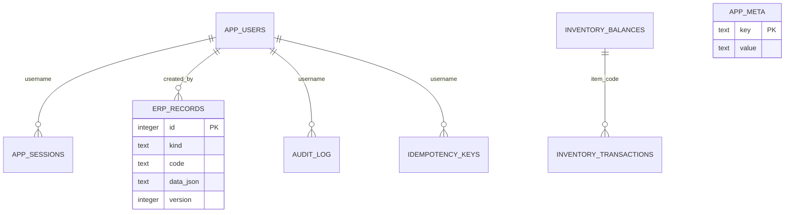
```mermaid
erDiagram
    APP_USERS ||--o{ APP_SESSIONS : username
    APP_USERS ||--o{ ERP_RECORDS : created_by
    APP_USERS ||--o{ AUDIT_LOG : username
    ERP_RECORDS {
      integer id PK
      text kind
      text code
      text data_json
      integer version
    }
    INVENTORY_BALANCES ||--o{ INVENTORY_TRANSACTIONS : item_code
    APP_USERS ||--o{ IDEMPOTENCY_KEYS : username
    APP_META {
      text key PK
      text value
    }
```

图中的连线表达代码层引用；当前 Drizzle schema 没有声明外键。`erp_records(kind, code)` 有唯一索引，库存余额以 `item_code` 为主键。

### 本地 SQLite

本地 26 张表按领域分为：

- 身份与审计：`app_users`、`app_sessions`、`activity_log`
- 物料治理：`items`、`supplier_mappings`、`cleaning_rows`
- 主数据与工程：`customers`、`suppliers`、`products`、`product_boms`、`bom_lines`
- 采购与库存：`purchase_orders`、`purchase_order_lines`、`inventory_balances`、`inventory_transactions`、`inventory_adjustments`
- 生产：`work_orders`、`work_order_materials`、`production_reports`
- 销售：`quotations`、`sales_orders`、`shipments`
- 品质与财务：`quality_inspections`、`quality_defects`、`financial_documents`、`financial_payments`

表间关系主要由服务端代码和文本/整数引用维护，当前建表语句未声明外键。

## Backend 与 Frontend

当前命名与目标目录尚未统一：

- Backend（服务器默认交付面）：`chenyida_erp_app/server.py` 同时承担 HTTP、API、业务规则、建表和数据库访问；公网验证期间监听 `0.0.0.0:18888`。
- Frontend（本地运行面）：`chenyida_erp_app/static/` 原生页面直接调用本地 API。
- Backend（历史在线参考面）：`chenyida_erp_site/app/lib/erp-api.ts` 与 Worker/D1；后续新功能不以该运行面作为默认交付目标。
- Frontend（在线运行面）：根 legacy 使用 `app/page.tsx` + `public/erp/`；Material 只读页面使用 `app/materials/`，两者共同委托 `public/erp/api-client.js`。

在线与本地前端文件存在复制关系，不是共享构建产物。后续源码结构任务只能搬迁和修复路径，不得借机改业务行为。

## 环境与测试隔离

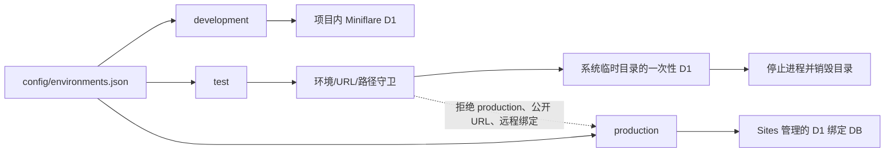
```mermaid
flowchart LR
    CFG["config/environments.json"] --> DEV["development"]
    CFG --> TEST["test"]
    CFG --> PROD["production"]
    DEV --> D1L["项目内 Miniflare D1"]
    TEST --> GUARD["环境/URL/路径守卫"]
    GUARD --> D1T["系统临时目录的一次性 D1"]
    D1T --> DESTROY["停止进程并销毁目录"]
    PROD --> D1P["Sites 管理的 D1 绑定 DB"]
    GUARD -. "拒绝 production、公开 URL、远程绑定" .-> PROD
```

- `development`、`test`、`production` 的数据库、API、Site、日志级别和调试模式由统一非敏感清单描述。
- 测试运行器在网络请求前要求 `ERP_ENV=test`、HTTP 回环目标和系统临时 D1 路径；Vite 本地 Cloudflare 插件设置 `remoteBindings: false`。
- 测试成功或失败都销毁 D1；失败日志去敏且不保存请求/响应正文或数据库文件。
- 本地 Python 测试通过临时 `CYD_ERP_DATA_DIR` 和 `CYD_ERP_DB` 隔离 SQLite 与备份。
- 远程 Test D1 尚未创建，未来必须使用独立资源、权限、凭证、保留期和明确测试主机允许列表。

## 部署结构

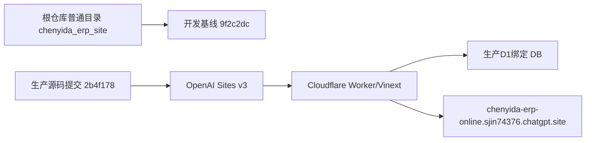
```mermaid
flowchart LR
    ROOT["根仓库普通目录 chenyida_erp_site"] --> DEV["开发基线 9f2c2dc"]
    PROD["生产源码提交 2b4f178"] --> SITES["OpenAI Sites v3"]
    SITES --> WORKER["Cloudflare Worker/Vinext"]
    WORKER --> D1P["生产D1绑定 DB"]
    WORKER --> URL["chenyida-erp-online.sjin74376.chatgpt.site"]
```

- `.openai/hosting.json` 绑定现有 Sites 项目和逻辑 D1 名称 `DB`。
- Site 当前为公开访问、状态 active、版本 v3。
- `2b4f178` 是 `9f2c2dc` 的祖先；源码纳管提交保留这条历史关系，但没有创建新生产版本。
- `PHASE0-TASK01-B` 和 `PHASE0-TASK02` 均没有保存新生产版本、修改访问策略或部署生产。

## 已知架构债务

1. 两套运行面存在重复业务逻辑和不同数据库模型。
2. legacy 在线单文件 API 处理器职责仍然过多；Material namespace 已建立独立边界，但其他领域尚未拆分。
3. 在线业务主体为 JSON，缺少 V2 所需关系约束。
4. schema、迁移和运行时建表同时存在，需建立单一迁移权威。
5. 本地数据库缺少迁移历史和外键。
6. TASK10 已使自托管根页退出 legacy iframe，并接入实时 Dashboard 与只读备份治理；`/erp/index.html` 仍作为显式兼容业务台。当前债务是业务页面尚未全部原生化，且真实数据试迁移、生产恢复演练、容量/安全门禁和切换均未执行。
7. Python 关键写操作缺少通用 request ID、CSRF、幂等、乐观锁、失败审计和不可变冲销；迁移必须重新建立服务端边界，不能机械翻译旧 handler。
8. Quote 转 Sales Order 的旧 Python 路径跨两个 commit；收货、领料、完工、发货和收付款虽在 SQLite 单事务内联动，但都缺并发锁/幂等/版本和反向记录，是后续迁移的最高风险区。
