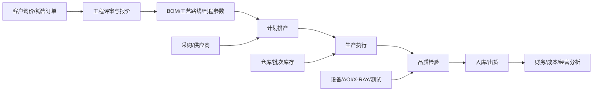
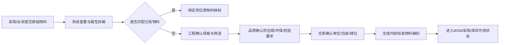

# 深圳市晨亿达电子有限公司 ERP 系统设计方案

版本：v0.1  
日期：2026-07-08  
依据：当前文件夹内《深圳市晨亿达电子有限公司简介.pptx》及开源 ERP 项目调研

## 1. 设计结论

晨亿达是一家 PCB、FPC、SMT 一体化的电子制造企业，ERP 不应只做进销存和财务，而应围绕“报价接单、工程评审、BOM 与工艺、计划排产、生产流转、品质检验、仓储批次、采购协同、成本核算、交付追踪”建立制造闭环。

推荐方案是：

> 以 ERPNext 作为主 ERP 底座，定制晨亿达 PCB/FPC/SMT 行业扩展模块。

原因：

- 公司规模约 120 人、3000 平方米厂房、月产能约 8000 平方米，适合采用成熟开源 ERP 快速落地。
- 业务包含 PCB、FPC、SMT 三条核心线，ERPNext 已有销售、采购、库存、制造、会计、项目、质量等基础能力，可以减少从零开发成本。
- PCB/FPC/SMT 的工程参数、工序流转、品质追溯、交期承诺和制程能力属于行业特有部分，应作为独立扩展模块开发。

## 2. 公司业务画像

### 2.1 基本情况

| 项目 | 信息 |
| --- | --- |
| 公司 | 深圳市晨亿达电子有限公司 |
| 成立时间 | 2011 年 |
| 地点 | 深圳市宝安区沙井镇 |
| 员工规模 | 约 120 人 |
| 厂房规模 | 约 3000 平方米 |
| 产能 | 约 8000 平方米/月 |
| 主营产品 | PCB、FPC、SMT |
| 应用行业 | 手机、平板、笔电、穿戴、蓝牙、工控、POS 机、安防、车载等 |

### 2.2 核心业务线

| 业务线 | 业务特点 | ERP 关注重点 |
| --- | --- | --- |
| FPC 柔性线路板 | 多层、弯折、覆盖膜、补强、精密线宽线距 | 工程参数、材料批次、工序卡、贴合/压合/电测/外形追溯 |
| PCB 刚性线路板 | 单双面、多层、软硬结合、高精密加工 | 拼版、层数、板厚、孔径、表面处理、交期与成本核算 |
| SMT 贴片 | 0201、BGA、QFN、连接器、X-RAY、AOI | BOM、替代料、上料防错、贴片点数、炉温、AOI/X-RAY 检验 |

### 2.3 组织与岗位

PPT 中的组织架构显示，公司已有明确的业务、市场、项目、工程、计划、生产、品质、采购、仓库、财务、人事、售后等岗位。ERP 应按真实岗位设计权限和流程，而不是只按软件模块划分。

关键角色包括：

- 总经理、副总经理、厂长
- 业务员、跟单员、市场人员
- 项目工程师、样品工程师、CAM 工程师、审核工程师
- PM、PC、生产各工序负责人
- IQC、IPQC、FQC、QA、物测室、成品测试、售后工程师
- 采购员、报价员、成本核算
- 电子仓、材料仓、辅材仓
- 出纳、会计、人事、行政

## 3. 开源 ERP 选型

### 3.1 候选方案

| 方案 | 可采纳内容 | 优点 | 风险 |
| --- | --- | --- | --- |
| ERPNext | 销售、采购、库存、制造、会计、项目、质量、HR、报表 | 开源制造 ERP 基础完整，适合中小制造企业二次开发 | PCB/FPC/SMT 行业细节需要定制 |
| Odoo Community | CRM、销售、采购、库存、制造、会计接口、应用生态 | 生态大、界面成熟、模块多 | 部分高级能力在商业版或第三方模块，二开边界要提前确认 |
| Dolibarr | CRM、销售、采购、库存、BOM、轻量制造 | 部署简单，适合轻量进销存 | 制造、品质、追溯能力较弱 |
| Apache OFBiz | ERP 框架、订单、库存、制造、财务 | 企业级框架能力强 | 实施复杂度高，不适合作为首期快速上线方案 |
| metasfresh | 采购、销售、库存、生产、供应链 | 制造和供应链思路完整 | 中文生态和本地实施资源相对少 |

### 3.2 推荐架构

采用“开源底座 + 行业扩展 + 集成接口”的路线：



系统底座建议：

- 主 ERP：ERPNext
- 技术框架：Frappe Framework
- 数据库：优先采用 ERPNext 常用的 MariaDB；如需其他数据库，先做版本兼容性验证
- 部署方式：本地服务器或私有云优先，后续可迁移云部署
- 行业扩展应用：`chenyida_pcb_erp`
- 报表与看板：ERPNext 内置报表 + 自定义经营驾驶舱

## 4. 总体业务流程

### 4.1 从询价到交付

1. 客户询价：业务录入客户、产品类型、数量、交期、图纸资料、特殊要求。
2. 工程评审：工程、CAM、项目确认层数、板厚、孔径、线宽线距、表面处理、SMT 可制造性。
3. 报价核算：系统按材料、工序、良率、外协、贴片点数、测试费用、管理费用生成报价建议。
4. 销售订单：客户确认后转销售订单，生成项目号或产品号。
5. BOM 与工艺：工程维护 BOM、工艺路线、检验标准、生产参数。
6. 计划排产：PC 根据交期、产能、物料、工序负荷生成生产计划。
7. 采购备料：采购按缺料需求下单，IQC 检验后入库。
8. 生产执行：各工序扫码流转、报工、记录不良、记录关键参数。
9. 品质检验：IQC、IPQC、FQC、QA 分层检验，形成质量记录。
10. 成品入库：合格产品入库，绑定批次、客户、订单、工单。
11. 出货交付：跟单安排出货，系统追踪交期达成。
12. 财务结算：开票、收款、成本归集、毛利分析。

### 4.2 样品与量产双流程

公司既有快速原型、小批量生产，也有量产返单。因此系统应将样品单和量产单分开管理：

| 流程 | 适用场景 | 系统特点 |
| --- | --- | --- |
| 样品流程 | 新客户、新产品、快速打样 | 工程评审更重，允许工艺迭代，交期提醒更强 |
| 首批量产 | 样品确认后的首次批量 | 必须经过 PPAP/首件/过程确认，重点管良率和问题闭环 |
| 返单量产 | 已稳定产品再次下单 | 复用 BOM、工艺、价格、检验标准，减少重复录入 |

## 5. 模块设计

### 5.1 客户与销售模块

功能：

- 客户档案、联系人、账期、价格等级、客户特殊要求。
- 询价单、报价单、销售订单、合同、出货通知。
- 客户图纸、Gerber、BOM、坐标文件、钢网文件、测试要求附件管理。
- 交期承诺与交付达成率统计。
- 客诉、退货、补货、8D 报告追踪。

关键字段：

- 客户料号、晨亿达料号、版本号、产品类型、应用领域。
- 样品交期、量产交期、返单交期。
- 是否含 SMT、是否需测试、是否需外协。

当前可运行版本已实现：

- 销售订单：录入客户、产品、订单数量、交付日期和负责人，生成 `SO-日期-流水号`。
- 成品库存联动：销售订单按 `FG-产品编码` 读取成品库存和可用数量。
- 出货扣库：按销售订单出货时生成 `DN-日期-流水号` 出货记录，并自动扣减成品库存。
- 订单状态：按累计出货数量自动更新为“部分出货”或“已出货”。

### 5.2 工程与项目模块

功能：

- 产品主数据：PCB、FPC、SMT、FPCA、软硬结合板。
- 工程评审：层数、板厚、铜厚、最小孔径、线宽线距、表面处理、阻抗、补强、覆盖膜、弯折次数。
- CAM 审核：文件版本、拼版尺寸、工程变更、可制造性风险。
- 项目进度：从样品到量产的节点、责任人、异常和关闭。
- 工程变更：ECN/ECR 流程，关联旧版本、库存、在制、客户确认。

建议自定义对象：

- 产品工程卡
- 制程能力评审单
- CAM 审核单
- 样品转量产评审单
- 工程变更单

### 5.3 物料主数据治理模块

这个模块是晨亿达 ERP 的关键基础模块。由于公司物料数量大、供应商命名方式不统一、人手不足，系统不能要求员工逐条手工录入。正确方式是把“供应商原始名称”和“公司内部标准物料”分离，用系统完成批量导入、相似匹配、待确认分流和审核建档。

核心原则：

- 一物一码：BOM、库存、采购、生产、成本只使用晨亿达内部标准物料编码。
- 多名归一：同一个物料可以有多个供应商名称、供应商料号、品牌料号和历史叫法。
- 先匹配后建档：任何供应商物料进入系统时，先查重和匹配，无法确认时才进入新物料审核。
- 人工做审核，不做重复录入：系统负责拆字段、比对、提示风险；采购、工程、品质、仓库只处理低置信度结果。
- 高频先治理：先治理常用电子料、PI、铜箔、覆铜板、辅材、连接器、包装材料；低频历史料用到时再清洗。

#### 5.3.1 内部标准物料编码

建议编码结构：

```text
CYD-品类-流水号
```

示例：

| 内部物料编码 | 标准名称 | 关键属性 |
| --- | --- | --- |
| CYD-CAP-000001 | 贴片电容 10uF 16V X5R 0402 | 容值、耐压、材质、封装、精度 |
| CYD-RES-000128 | 贴片电阻 10K 1% 0603 | 阻值、精度、封装、功率 |
| CYD-PI-000018 | PI 基材 25um ED 铜 1/2OZ | 材料类型、厚度、铜厚、铜箔类型 |
| CYD-CON-000233 | FPC 连接器 0.5Pitch 24Pin | Pitch、Pin 数、高度、方向 |
| CYD-AUX-000076 | 覆盖膜 25/25 | 胶厚、膜厚、宽度、供应商等级 |

编码不建议塞入过多规格信息，规格应放在属性字段里。这样后续规格修正、供应商切换、替代料管理更稳定。

#### 5.3.2 供应商物料映射

系统保留供应商原始叫法，但不允许它直接成为内部主物料。

| 内部物料 | 供应商 | 供应商名称 | 供应商料号 | 品牌/MPN | 匹配状态 |
| --- | --- | --- | --- | --- | --- |
| CYD-CAP-000001 | A 供应商 | 0402 10UF 16V | A-104-16V | 厂牌型号 | 已确认 |
| CYD-CAP-000001 | B 供应商 | C0402X5R106M160 | B-CAP-9912 | 厂牌型号 | 已确认 |
| CYD-CAP-000001 | C 供应商 | 10uF/16V/0402 | C-0402-10U | 厂牌型号 | 已确认 |

采购下单和收货时可以录入供应商料号，系统自动反查内部物料；BOM、库存、工单和成本仍然使用内部物料编码。

#### 5.3.3 属性化物料模板

每类物料必须有固定属性模板，减少自由文本。

| 物料类型 | 必填属性 |
| --- | --- |
| 电阻 | 阻值、精度、封装、功率、品牌/MPN、环保等级 |
| 电容 | 容值、耐压、材质、封装、精度、品牌/MPN、环保等级 |
| IC/芯片 | 品牌、MPN、封装、功能类别、温度等级、替代关系 |
| 连接器 | Pitch、Pin 数、高度、方向、镀层、品牌/MPN |
| PI/铜箔/FPC 材料 | 材料类型、厚度、铜厚、铜箔类型、胶系、尺寸、供应商等级 |
| PCB/FPC 辅材 | 材料名称、规格、厚度、宽度、颜色、用途、环保等级 |
| 包装材料 | 类型、尺寸、客户专用标识、环保要求 |

系统根据物料类型显示不同字段，减少录入人员理解成本。

#### 5.3.4 批量导入与自动清洗

供应商 Excel、报价单、送货单、历史采购表进入系统后，先进入“待清洗物料池”。

流程：

1. 上传供应商原始文件。
2. 系统识别供应商、原始名称、供应商料号、品牌、规格、单位、价格、交期。
3. 系统按规则拆解规格字段，例如 `0402 10UF 16V X5R` 拆成封装、容值、耐压、材质。
4. 系统与内部物料库做相似匹配。
5. 高置信度匹配自动建议绑定，低置信度进入人工确认。
6. 确认后写入供应商物料映射表。
7. 找不到匹配项时，发起新物料审核流程。

匹配结果分级：

| 等级 | 条件 | 系统动作 |
| --- | --- | --- |
| 自动匹配 | 供应商料号、品牌/MPN 或关键属性完全一致 | 自动建议绑定，允许批量确认 |
| 疑似匹配 | 关键属性一致但品牌、单位或描述不同 | 进入待确认池 |
| 冲突匹配 | 同一供应商料号指向多个内部物料 | 禁止入库，要求工程/采购确认 |
| 新物料 | 无相似物料 | 发起新物料建档审核 |

#### 5.3.5 新物料审核流程

新物料不能由采购或仓库直接创建正式物料，必须走审核。



审核职责：

| 角色 | 责任 |
| --- | --- |
| 采购 | 提供供应商名称、供应商料号、价格、交期、最小采购量 |
| 工程 | 确认规格、用途、替代关系、是否可用于 BOM |
| 品质 | 确认环保、检验标准、供应商准入状态 |
| 仓库 | 确认单位、包装、储位、批次规则 |
| 财务/成本 | 确认计价单位、成本分类、税率 |

#### 5.3.6 替代料与客户专用料

替代料必须明确替代范围：

- 完全替代：规格、品牌、认证、工艺均满足要求。
- 条件替代：只允许特定客户、特定产品、特定批次或工程确认后使用。
- 禁止替代：客户指定料、安规/车载/特殊认证料、工程锁定料。

客户专用料必须绑定客户和产品，不能被普通 BOM 随意调用。系统在计划、领料、采购时提示客户专用限制。

#### 5.3.7 人手不足下的运营策略

首期不要求一次性清完所有历史物料，按价值和风险分层推进：

| 物料层级 | 策略 |
| --- | --- |
| 高频通用电子料 | 首期重点清洗，建立标准属性和替代料 |
| PCB/FPC 核心材料 | 首期重点清洗，关联 IQC 和批次追溯 |
| 客户专用料 | 单独标记，优先防错 |
| 低频历史料 | 暂存原始数据，用到时再清洗 |
| 新增物料 | 从系统上线日起必须按新规则建档 |

管理指标：

- 自动匹配率
- 待确认物料数量
- 重复物料数量
- 新物料审核周期
- 供应商映射覆盖率
- BOM 物料标准化率

### 5.4 BOM 与工艺路线模块

功能：

- 多版本 BOM：材料、电子元件、辅材、包装材料。
- 替代料管理：SMT 元件、覆铜板、PI、铜箔、胶纸、钢片、FR4 补强等。
- 工艺路线：按 PCB、FPC、SMT 分业务线维护标准路线。
- 工序参数：线宽线距、孔径、铜厚、表面处理、贴片精度、点胶参数。
- 标准工时、良率、损耗率、产能系数。

典型工艺路线：

| 类型 | 工艺路线示例 |
| --- | --- |
| FPC | 开料、钻孔、黑孔/沉铜、电镀、曝光、DES、贴合、压合、补强、外形、电测、FQC、包装 |
| PCB | 开料、钻孔、沉铜、电镀、图形转移、蚀刻、阻焊、丝印、表面处理、V-Cut/锣板、AVI、电测、FQC、包装 |
| SMT | 钢网/锡膏、上板、印刷、SPI、贴片、回流焊、AOI、X-RAY、目检、测试、包装 |

### 5.5 计划排产模块

功能：

- 订单转工单，按交期、产能、物料齐套、设备负荷排产。
- 区分样品、首批量产、返单。
- 支持 PCB 交期规则：样品、首批量产、返单不同周期；SMT 贴片默认叠加交期。
- 工序级产能负荷看板：开料、电镀、DES、贴合、压合、激光、机贴、外形、电测、丝印、SMT。
- 缺料、设备、品质异常导致的计划调整。

核心看板：

- 今日应开工
- 今日应完工
- 即将逾期订单
- 物料未齐套订单
- 工序瓶颈负荷
- 样品急单列表

### 5.6 生产执行模块

功能：

- 工单、派工单、流程卡、工序扫码。
- 工序开始、完成、暂停、返工、报废、转序。
- 工序产出数量、良品、不良品、报废数。
- 关键制程参数记录。
- 设备、人员、班次、工装夹具绑定。
- 在制品 WIP 看板。

重点要求：

- 每批产品必须能追踪到订单、产品版本、BOM、工艺路线、物料批次、生产工序、检验记录。
- 返工不能只改数量，必须记录返工原因、责任工序、处理方式和复检结果。
- SMT 上料要支持物料防错，避免错料、反向、混料。

当前可运行版本已实现：

- 生产工单：选择 BOM 和生产数量后，系统自动生成工单号并关联产品、BOM、负责人和计划日期。
- 工单用料：按 BOM 单件用量和损耗率展开需求数量，显示已领、未领和可用库存。
- 生产领料：按工单一次性领齐未领物料，自动扣减原材料库存并记录库存流水。
- 完工入库：录入良品、报废和操作员后，系统自动生成 `FG-产品编码` 成品物料并增加成品库存。

### 5.7 品质管理模块

功能：

- IQC 来料检验：覆铜板、PI、铜箔、元件、辅材、包装材料。
- IPQC 过程检验：首件、巡检、关键尺寸、镀铜、阻抗、贴合、压合、焊接。
- FQC 成品检验：外观、尺寸、电性、包装。
- QA 出货检验与客户标准确认。
- 物测室记录：盐雾、剥离、阻抗、环保、弯折疲劳、焊锡、推力等。
- AOI、X-RAY、电测、成品测试结果归档。
- 不合格品处理：返工、让步、报废、退供应商、客户确认。
- 客诉与 8D 改善。

质量指标：

- 来料合格率
- 工序直通率
- SMT 直通率
- 客诉率
- 返工率
- 报废率
- 准时交付率
- 问题关闭周期

当前可运行版本已实现：

- IQC/IPQC/FQC 检验记录：支持关联采购明细、生产工单、销售订单。
- 检验判定：录入检验数量、合格数量后，系统自动计算不良数量并判定“合格放行”或异常处置状态。
- 不良明细：当存在不良时，记录不良类型、严重度、数量、责任环节和改善措施。
- 质量看板基础指标：总检验数、待处理质量异常数进入系统总览。

### 5.8 仓储与库存模块

功能：

- 材料仓、电子仓、辅材仓、半成品、成品仓。
- 批次、供应商、入库检验、有效期、储位管理。
- 领料、补料、退料、调拨、盘点。
- SMT 元件盘料管理，支持料盘、批号、余料、MSD 湿敏等级。
- 成品按客户、订单、批次、版本管理。

重点规则：

- 未通过 IQC 的物料不得用于生产。
- 工程变更后，旧版本库存要提示风险。
- 客户专用物料要和通用物料分开。
- 盘点差异要进入审批和成本调整流程。

当前可运行版本已实现：

- 库存余额表：按内部物料编码显示现有库存、已预留、可用库存和更新时间。
- 采购入库流水：采购明细收货后，自动增加库存余额，并记录入库前后数量。
- 与 BOM 齐套检查联动：库存余额直接参与订单数量下的需求、可用库存和缺料计算。

### 5.9 采购与供应商模块

功能：

- 供应商档案、资质、价格、交期、质量评级。
- 采购申请、采购订单、到货、检验、入库、对账。
- 按缺料、最低库存、安全库存、项目需求生成采购建议。
- 外协加工管理：表面处理、特殊工序、测试、外发加工。

当前可运行版本已实现：

- 缺料采购建议：选择 BOM 和订单数量后，系统按缺口数量生成建议采购清单。
- 供应商推荐：优先使用已确认的供应商物料映射、最近价格、采购单位和交期；没有映射时标记为“未指定供应商”。
- 自动生成采购单：按供应商分组生成采购单和采购明细，来源回写 BOM 缺料需求。
- 采购收货：对采购明细录入收货数量，系统同步更新明细状态、采购单状态和库存余额。

指标：

- 供应商准交率
- 来料合格率
- 价格波动
- 采购周期
- 外协异常次数

### 5.10 财务与成本模块

功能：

- 应收、应付、开票、收款、付款。
- 材料成本、人工成本、制造费用、外协费用归集。
- 产品成本核算：按订单、产品、客户、业务线、工序。
- 报价毛利与实际毛利对比。
- 库存金额、在制品金额、报废损失。

成本核算建议：

- 样品单单独核算，不与量产平均成本混在一起。
- SMT 按贴片点数、元件类型、测试要求计费。
- PCB/FPC 按面积、层数、工艺难度、良率、特殊表面处理计费。
- 返工、报废、客诉补货应计入质量成本。

### 5.11 人事与权限模块

功能：

- 员工、部门、岗位、班组、考勤、培训记录。
- 按岗位授权，防止跨部门误操作。
- 工序报工可绑定员工与班次，后续可扩展计件工资。

权限原则：

| 角色 | 权限重点 |
| --- | --- |
| 业务 | 客户、询价、报价、订单、出货进度 |
| 工程 | 产品资料、BOM、工艺、工程变更 |
| 计划 | 工单、排产、齐套、交期预警 |
| 生产 | 派工、报工、转序、异常反馈 |
| 品质 | 检验、判定、不合格处理、客诉 |
| 仓库 | 入库、出库、库存、盘点、批次 |
| 采购 | 供应商、采购订单、到货跟进 |
| 财务 | 应收、应付、成本、报表 |
| 管理层 | 经营看板、审批、关键指标 |

当前可运行版本已实现：

- 登录会话：所有业务 API 需要登录后访问，未登录时自动返回登录提示。
- 默认角色：系统管理员、经营负责人、采购、工程、生产、品质、销售。
- 写入权限：采购、工程、生产、销售、品质各自只能提交对应业务动作；管理员拥有系统运维权限。
- 密码治理：密码以加盐哈希保存，用户可在右上角修改当前密码。
- 系统运维页：提供经营指标、风险提醒、账号清单、近期操作记录、数据库备份与恢复。

## 6. 数据对象设计

### 6.1 主数据

- 客户
- 供应商
- 物料
- 物料属性模板
- 供应商物料映射
- 替代料关系
- 客户专用物料
- 产品
- 设备
- 工序
- 工艺路线
- 检验标准
- 员工
- 仓库与储位

### 6.2 业务单据

- 询价单
- 工程评审单
- 物料清洗导入单
- 新物料申请单
- 物料查重确认单
- 报价单
- 销售订单
- 项目单
- BOM
- 工艺路线
- 生产计划
- 工单
- 派工单
- 领料单
- 报工单
- 检验单
- 不合格处理单
- 采购申请
- 采购订单
- 入库单
- 出库单
- 发货单
- 发票与收付款单

### 6.3 行业扩展字段

| 对象 | 字段示例 |
| --- | --- |
| 产品 | 产品类型、层数、板厚、铜厚、最小孔径、线宽线距、表面处理、阻抗、弯折次数 |
| FPC | PI 类型、ED/RA 铜、覆盖膜、补强材料、插拔手指厚度、动态弯折要求 |
| PCB | 拼版尺寸、V-Cut、沉铜、喷锡、阻焊颜色、丝印颜色、AVI 要求 |
| SMT | 最小封装、BGA/QFN、贴片点数、锡膏、钢网、AOI/X-RAY、炉温曲线 |
| 物料 | 内部编码、物料类型、标准名称、规格属性、品牌/MPN、单位、环保等级、替代规则、客户专用标识 |
| 供应商物料映射 | 供应商、供应商名称、供应商料号、品牌/MPN、匹配置信度、确认人、确认时间、启用状态 |
| 待清洗物料 | 原始文件、原始名称、解析属性、疑似内部物料、匹配等级、处理状态、处理责任人 |
| 工单 | 样品/量产/返单、工艺版本、客户版本、计划交期、齐套状态 |
| 检验 | 检验类型、检验标准、测试设备、缺陷代码、判定结果、复检结果 |

## 7. 报表与驾驶舱

### 7.1 管理层看板

- 当月产值
- 销售订单金额
- 准时交付率
- 毛利率
- 在制品金额
- 库存金额
- 客诉数量
- 返工报废损失
- 产能利用率

### 7.2 生产看板

- 今日计划与实际完成
- 各工序 WIP
- 瓶颈工序
- 逾期工单
- 异常停滞工单
- SMT 日贴片点数
- PCB/FPC 月产面积

### 7.3 品质看板

- IQC 合格率
- IPQC 异常分布
- FQC 一次合格率
- SMT 直通率
- AOI/X-RAY 缺陷分布
- 客诉趋势
- 8D 关闭进度

### 7.4 业务与交付看板

- 样品交期达成
- 首批量产交期达成
- 返单交期达成
- 客户订单排行
- 产品类型排行
- 报价转化率

## 8. 集成设计

### 8.1 首期可暂不集成的设备

首期建议先通过人工录入、扫码、Excel 导入方式把主流程跑通，避免设备集成拉长周期。

### 8.2 二期建议集成

- AOI 检测结果导入
- X-RAY 检测结果导入
- 电测机结果导入
- SMT 贴片机上料与产量数据
- 条码打印机、PDA、扫码枪
- 财务开票接口

### 8.3 文件管理

产品相关工程文件要纳入系统归档：

- Gerber 文件
- BOM 文件
- 坐标文件
- 钢网文件
- 客户图纸
- 检验标准
- 承认书
- 8D 报告

文件必须绑定客户、产品、版本、订单或项目，避免错版生产。

## 9. 实施路线

### 阶段 0：物料主数据快速治理

周期建议：2 到 4 周，可与阶段 1 并行

范围：

- 收集历史物料 Excel、供应商报价单、采购记录、送货单、BOM。
- 建立物料分类、属性模板、内部编码规则。
- 清洗高频电子料、PCB/FPC 核心材料、客户专用料。
- 建立供应商物料映射表和待清洗物料池。
- 定义新物料审核流程和责任人。

目标：

- 首期上线前先控制物料入口，避免新系统继承旧物料混乱。
- 让采购、仓库、BOM、生产统一使用内部标准物料编码。
- 把人工工作量从逐条录入转为批量确认和异常审核。

### 阶段 1：基础 ERP 与主数据

周期建议：4 到 6 周

范围：

- 客户、供应商、物料、产品、员工、仓库、工序主数据
- 物料属性模板、供应商物料映射、替代料关系、客户专用料标识
- 销售、采购、库存、财务基础流程
- 基础权限

目标：

- 不再依赖分散 Excel 管理客户、物料、订单和库存。
- 新增物料必须经过查重、匹配和审核后才能进入采购、BOM 和库存。

### 阶段 2：制造闭环

周期建议：6 到 8 周

范围：

- BOM、工艺路线、工单、派工、报工、领料、入库
- 样品、首批量产、返单流程
- 工序 WIP 看板

目标：

- 订单能从接单自动流转到生产和入库，管理层能看到真实在制状态。

### 阶段 3：品质与追溯

周期建议：4 到 6 周

范围：

- IQC、IPQC、FQC、QA
- 不合格处理、返工、报废、客诉、8D
- 批次追溯

目标：

- 能从出货批次反查物料、工单、工序、检验、责任人和设备。

### 阶段 4：成本与经营分析

周期建议：4 到 6 周

范围：

- 报价成本模型
- 订单成本归集
- 实际毛利分析
- 质量成本分析
- 经营驾驶舱

目标：

- 能知道每个客户、产品、订单是否赚钱，以及亏损原因。

### 阶段 5：设备与自动化集成

周期建议：按设备接口条件分批推进

范围：

- AOI、X-RAY、电测、SMT、扫码、PDA
- 自动采集关键设备数据

目标：

- 降低人工录入，提高数据实时性和准确性。

## 10. 首期最小可用版本

为了快速产生价值，首期不建议一次性做完整大系统。建议先上线以下最小版本：

1. 客户、供应商、物料、产品、仓库、工序主数据。
2. 物料属性模板、供应商物料映射、待清洗物料池、新物料审核。
3. 询价、报价、销售订单。
4. 工程评审、BOM、工艺路线。
5. 采购、入库、IQC。
6. 工单、派工、领料、报工、完工入库。
7. IPQC、FQC、成品检验。
8. 出货与应收。
9. 订单进度、库存、WIP、交期、质量基础看板。

首期暂缓：

- 复杂设备自动采集
- 精细计件工资
- 高级 APS 自动排程
- 深度财务成本分摊
- 客户门户和供应商门户
- 全量历史物料一次性清洗；首期只强制治理高频料、核心材料、客户专用料和新增物料

## 11. 风险与控制

| 风险 | 表现 | 控制方式 |
| --- | --- | --- |
| 主数据不准 | BOM、物料、工艺混乱 | 上线前做主数据清理，设数据负责人 |
| 供应商命名混乱 | 同一物料出现多个名称、多个料号 | 内部物料编码与供应商名称分离，建立供应商物料映射 |
| 人手不足导致录入慢 | 物料数量大，逐条录入不可持续 | 批量导入、自动拆解属性、相似匹配、人工只审核异常 |
| 重复建料 | 采购、工程、仓库各自建物料 | 新物料必须先查重，再走工程、品质、仓库审核 |
| 现场不愿报工 | 系统状态不真实 | 使用扫码和简单界面，先抓关键工序 |
| 工程版本失控 | 错版生产、错料 | 产品版本、BOM 版本、工艺版本强绑定 |
| 质量记录不完整 | 出货后无法追溯 | 检验单与工单、批次强关联 |
| 一期范围过大 | 周期拖长、上线失败 | 先跑通订单到交付闭环，再做高级功能 |
| 二开过度 | 失去开源系统升级能力 | 行业扩展独立成应用，尽量不改 ERPNext 核心 |

## 12. 推荐技术落地方式

### 12.1 系统组成

| 层级 | 建议 |
| --- | --- |
| ERP 底座 | ERPNext |
| 二开框架 | Frappe Framework |
| 数据库 | 优先采用 MariaDB |
| 行业扩展 | 晨亿达 PCB/FPC/SMT 扩展应用 |
| 部署 | 本地服务器或私有云 |
| 终端 | PC 浏览器、车间平板、PDA/扫码枪 |

### 12.2 自定义应用边界

自定义应用只处理晨亿达行业特有内容：

- PCB/FPC/SMT 产品参数
- 工程评审
- CAM 审核
- 工艺路线模板
- 物料属性模板
- 供应商物料映射
- 待清洗物料池
- 新物料审核流程
- 替代料和客户专用料规则
- 工序流转规则
- 制程能力校验
- 品质缺陷代码
- 追溯报表
- 交期规则
- 报价成本模型

ERPNext 原有模块继续负责：

- 客户
- 供应商
- 销售
- 采购
- 库存
- 会计
- 人事
- 基础制造
- 基础质量

这样可以降低开发量，也便于后续升级。

## 13. 可采纳的 GitHub 项目

| 项目 | 地址 | 用法 |
| --- | --- | --- |
| ERPNext | https://github.com/frappe/erpnext | 推荐主 ERP 底座 |
| Frappe Framework | https://github.com/frappe/frappe | ERPNext 二次开发框架 |
| Odoo | https://github.com/odoo/odoo | 备选 ERP 底座和模块参考 |
| Dolibarr | https://github.com/Dolibarr/dolibarr | 轻量 CRM/ERP 参考 |
| Apache OFBiz | https://github.com/apache/ofbiz-framework | 企业级 ERP 框架参考 |
| metasfresh | https://github.com/metasfresh/metasfresh | 供应链和制造 ERP 参考 |

## 14. 验收标准

首期上线成功的判断标准：

- 业务可以在系统内完成询价、报价、接单、出货跟进。
- 工程可以维护产品参数、BOM、工艺路线和版本。
- 采购导入供应商物料清单后，系统可以自动匹配已有内部物料或进入待确认池。
- 新物料必须完成查重、工程确认、品质确认、仓库确认后才能进入正式物料库。
- BOM、采购、库存、工单、成本使用统一内部物料编码，不直接使用供应商原始名称。
- 计划可以看到订单齐套、工单状态、工序进度和逾期风险。
- 生产可以扫码报工，系统能看到 WIP。
- 品质可以记录 IQC、IPQC、FQC、QA 和不合格处理。
- 仓库可以按批次管理材料、半成品和成品。
- 财务可以看到应收、应付、库存金额和基础成本。
- 管理层可以查看订单、交付、产能、质量、库存和毛利看板。
- 任意出货批次可以追溯到客户订单、产品版本、工单、物料批次、工序记录和检验记录。

## 15. 下一步建议

建议下一步先确认首期范围，然后进入原型和实施计划：

1. 确认是否采用 ERPNext 作为底座。
2. 确认首期是否以“订单到交付闭环”为目标。
3. 收集现有 Excel 表、报价单、BOM、工艺卡、检验表、出货单。
4. 单独收集 3 到 5 家核心供应商的物料清单、报价表、送货单，用来验证物料清洗和映射规则。
5. 梳理 3 个真实订单案例：样品单、首批量产单、返单。
6. 基于真实订单做 ERP 原型页面和流程演示。
7. 再决定是否进入开发部署。

## 16. 已生成的执行产物

当前文件夹已生成 `物料主数据治理落地包`，用于先执行阶段 0 的物料主数据快速治理。

核心文件：

- `物料主数据治理落地包/README.md`：执行说明和首周步骤。
- `物料主数据治理落地包/01-编码规则.md`：内部物料编码和命名规则。
- `物料主数据治理落地包/02-字段字典.md`：物料、供应商映射、待清洗池、新物料审核字段。
- `物料主数据治理落地包/03-导入清洗流程.md`：供应商物料导入、自动匹配、人工确认流程。
- `物料主数据治理落地包/04-岗位分工与审核SOP.md`：采购、工程、品质、仓库、财务职责。
- `物料主数据治理落地包/templates/`：可直接填写的 CSV 模板。
- `物料主数据治理落地包/tools/material_cleaner.py`：本地物料清洗和匹配样例工具。
- `物料主数据治理落地包/output/物料主数据治理模板.xlsx`：给现场人员使用的 Excel 工作簿。
- `chenyida_erp_app/`：已开始开发的本地 Web 应用，当前覆盖物料主数据治理、产品工程卡、BOM 管理、齐套检查、缺料采购建议、采购单、采购收货入库、生产工单、工单领料、完工入库、IQC/IPQC/FQC 品质检验、销售订单和成品出货。

当前应用启动入口：

```powershell
powershell -ExecutionPolicy Bypass -File D:\erp\chenyida_erp_app\run_server.ps1
```
